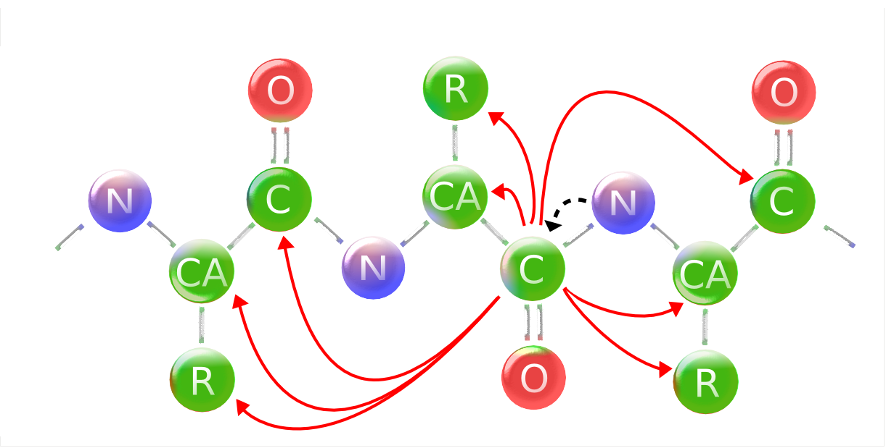

Introduction
============

This thesis is about 'assignment methods for large proteins in solid state nuclear magnetic resonance spectroscopy ...'. Before bombarding you with details I would like to give a short introduction into the context of this research.

Nuclear magnetic resonance, or NMR, spectroscopy is a very standard method for the analysis of chemical substances. The general idea behind the technique is, like in any other form of spectroscopy, to measure a difference in energy between different states. In the case of NMR spectroscopy the different states are generated by bringing the sample in a large magnetic field. All atomic nuclei have a quantum mechanical property called 'spin'. In a magnetic field the spin of some atomic nuclei, for example the nucleus of the normal hydrogen 1H isotope, will be either pointed along the magnetic field or against it. The energy of the spins that are aligned with the magnetic field is slightly lower than that of those that are pointed against it. This is the energy difference that is exploited by NMR spectroscopy and leads to a signal in a NMR spectrum. The energy difference is directly related to the strength of the magnetic field. However the magnetic field that is perceived by a given spin is not only only determined by the external field of the magnet. Also the direct chemical environment around the spin influences the local magnetic field. Therefor every nucleus in a molecule that has a slightly different chemical environment gives rise to a peak on a different position in the spectrum. By careful analysis of these spectra, often combined with mass spectrometry, it has been possible for decades to determine the composition and structure of small organic molecules.
The use of NMR spectrometry in structural biology, which this thesis is about, is a little bit different. We generally already know the chemical composition of the bio-molecule of interest. In case of a protein we know its amino acid sequence. In case of RNA or DNA we know the nucleotide sequence. Of course we also know the chemical composition of the amino acids and nucleotides respectively. The only missing information is the shape it adopts in three dimensional space and how this shape changes over time. Structural biology is essentially about reverse-engineering on a bio-molecular level. The dogma in the field is that the structures of bio-molecules such as DNA, RNA and proteins can tell something about their function and how they fulfill this function. Of course this is interesting from a purely scientific point of view. However, understanding.........

Besides this, figures of large molecular structures are very aesthetically pleasing. Recently I saw a bunch of them late at night projected on a wall in a drum and bass club in Berlin.

The energy difference is only very small compared to the thermal energy at biologically relevant temperatures. Therefor NMR is an inherently insensitive method. A measurable signal can only be generated by the measuring millions of molecules at the same time. As will be explained later, in one way or another all difficulties with this method lead back to this fact.

In both liquid and solid samples, every molecule has a different spacial orientation in respect to the magnetic field.     
 The first structure of a protein,... was solved in 19.. by x-ray crystallography.

some **markdown** here.

* list
* list 2

a figure:

and a citation. [@higman2009assigning]

Some thing in between
=====================

blabla2
lalalal
Why is it so that. Blablabla. 

You would now expect. Something else.

Lorem ipsum dolor sit amet, _consectetur_ adipisicing elit, sed do eiusmod tempor incididunt ut labore et dolore magna aliqua. Ut enim ad minim veniam, quis nostrud exercitation ullamco laboris nisi ut aliquip ex ea commodo consequat. Duis aute irure dolor in reprehenderit in voluptate velit esse cillum dolore eu fugiat nulla pariatur. Excepteur sint occaecat cupidatat non proident, sunt in culpa qui officia deserunt mollit anim id est laborum.

Lorem ipsum dolor sit amet, consectetur adipisicing elit, sed do eiusmod tempor incididunt ut labore et dolore magna aliqua. Ut enim ad minim veniam, quis nostrud exercitation ullamco laboris nisi ut aliquip ex ea commodo consequat. Duis aute irure dolor in reprehenderit in voluptate velit esse cillum dolore eu fugiat nulla pariatur. Excepteur sint occaecat cupidatat non proident, sunt in culpa qui officia deserunt mollit anim id est laborum. α-helix

a level 2 header
----------------
Görz.
Lorem ipsum dolor sit amet, consectetur adipisicing elit, sed do eiusmod tempor incididunt ut labore et dolore magna aliqua. Ut enim ad minim veniam, quis nostrud exercitation ullamco laboris nisi ut aliquip ex ea commodo consequat. Duis aute irure dolor in reprehenderit in voluptate velit esse cillum dolore eu fugiat nulla pariatur. Excepteur sint occaecat cupidatat non proident, sunt in culpa qui officia deserunt mollit anim id est laborum    

blabla

Lorem ipsum dolor sit amet, consectetur adipisicing elit, sed do eiusmod tempor incididunt ut labore et dolore magna aliqua. Ut enim ad minim veniam, quis nostrud exercitation ullamco laboris nisi ut aliquip ex ea commodo consequat. Duis aute irure dolor in reprehenderit in voluptate velit esse cillum dolore eu fugiat nulla pariatur. Excepteur sint occaecat cupidatat non proident, sunt in culpa qui officia deserunt mollit anim id est laborum. α-helix

> *This* is a quotation block: Lorem ipsum dolor sit amet, consectetur adipisicing elit, sed do eiusmod tempor incididunt ut labore et dolore magna aliqua. Ut enim ad minim veniam, quis nostrud exercitation ullamco laboris nisi ut aliquip ex ea commodo consequat. Duis aute irure dolor in reprehenderit in voluptate velit esse cillum dolore eu fugiat nulla pariatur. Excepteur sint occaecat cupidatat non proident, sunt in culpa qui officia deserunt mollit anim id est laborum.

