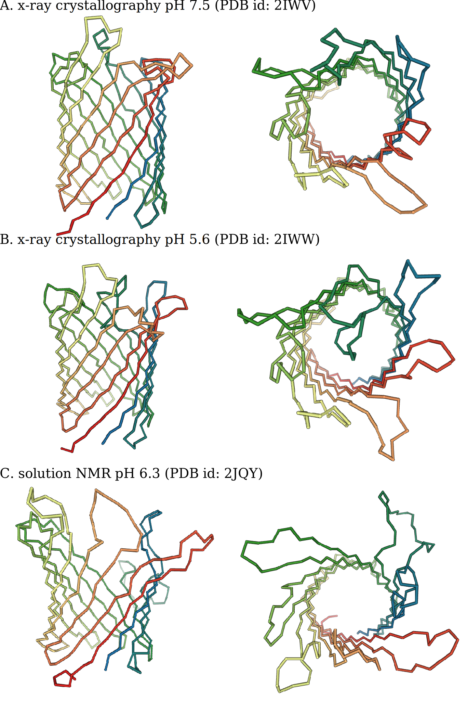

\mainmatter
\fancyhead[RE]{CHAPTER \thechapter}

Introduction: Structural Biology of Membrane Proteins
=====================================================

This thesis revolves around the determination of the three-dimensional structure of the outer membrane protein G (OmpG) from the *E. coli* bacterium using solid-state nuclear magnetic resonance (NMR) spectroscopy. Knowledge about the three-dimensional structure of biomolecules such as nucleic acids and proteins is of great interest for understanding the function and mechanism of these molecules. Therefore the field of structural biology is a central part of biochemistry and molecular biology, and for years almost every single edition of the leading scientific journals features at least one article concerning the structure and function of a biomolecular system.

Detailed knowledge of the function of biomolecules is interesting from a purely scientific point of view. However, there are many examples in which knowledge of specific biomolecular mechanisms can be exploited. For example, understanding the biomolecular mechanisms connected to diseases can lead to the development of therapies. Knowledge of how specific enzymes catalyze reactions can help engineering them to make them more suitable for applications such as the development of renewable energy sources and wastewater treatment.

Here we are interested in the important subclass of proteins that are found in the membranes of cells. Compared to proteins located in the watery environment inside the cell, membrane protein structures are relatively poorly understood even though they are of great importance in many biological mechanisms, play a role in many diseases and are targets of the majority of medicines. The major difficulty is, that two of the most commonly used techniques in structural biology (x-ray crystalography and solution NMR) are of limited use for membrane proteins. One of the big advantages of solid-state NMR is that it can be used to study membrane proteins inside their native environment, the membrane. In this study, OmpG is used to develop new solid-state NMR methods that can be used to study membrane proteins.

## Biological Membranes

Some form of compartmentalization is essential for the existence of life. In a semi-closed off system, energy and organic matter can reach sufficiently high concentrations to support the rise of complex structures. Therefore, every theory on the origin of life in one way or another involves the development of spatial compartments [@deamer_first_1997]. These original compartments are often believed to be of non-biological nature such as mineral surfaces [@cairns-smith_genetic_1982][@koonin_origin_2005]. At some point during the early evolution of life, first biological cells were formed that possessed some kind of lipid membrane so that life could break free from these pre-existing compartments. Whether this happened before or after the last universal common ancestor and what the composition of this early membrane exactly was, is still under some debate [@jekely_did_2006][@mulkidjanian_coevolution_2009]. Fact is that all modern cells have membranes, though.

Membranes form the barrier between the inside and the outside of cells. In eukaryotes, membranes are also present within the cell and divide it in different compartments, such as the nucleus, mitochondria, Golgi apparatus and, in the case of plants and algae, the chloroplasts. Membranes do not only function purely as separators but play an active role determining the cell's shape, locomotion, interaction with other organisms or neighboring cells and the extracellular matrix in the case of multicellular organisms. For example, proton gradients over the membranes of mitochondria and chloroplasts drive the synthesis of ATP and ion gradients over the membranes of our neurons allow them to conduct electric signals.

The lipids in membranes are arranged to form a bilayer. The hydrophobic tails are pointing towards the center of the bilayer while the hydrophilic head groups point towards the aqueous solution. Because of the various different roles that membranes can play, lipid composition in biological membranes is very diverse and varies widely between organisms and cell types [@dowhan_molecular_1997].

In general, the majority of lipids in membranes are phospholipids. In addition, eukaryotic membranes also contain sterols influencing rigidity and permeability [@haines_sterols_2001]. Furthermore, membranes of plant cells contain large amounts of glycolipids. Knowledge about the exact chemical composition of different lipids in cells is mostly obtained by a combination of mass spectroscopy and liquid chromatography and generated its own "omics" field, logically called lipidomics [@dennis_lipidomics_2009][@ivanova_lipidomics_2009]. This is a very complex field since there is no simple basic paradigm like in the study of proteins and nucleic acids, in which case there is a more or less direct transcription/translation between DNA sequences and RNA/proteins. In eukaryotes, thousands of different lipids can be present based on the combination of different head groups and chain lengths [@sud_lmsd_2007][@vanmeer_membrane_2008]. An intriguing difference  exists between the phospholipid composition in the membranes of bacteria and eukaryotes on the one hand, and archea on the other [@kates_phytanyl_1977][@pereto_ancestral_2004]. The most important distinction here is that in archaea the opposite glycerol stereoisomer is used to synthesize the phospholipid backbone as compared to the other two branches of life. The fact that there is such a large number of lipids and that organisms spend expensive resources to maintain this variety, indicates its functional relevance. The mix of lipids making up the membrane directly influences properties such as its flexibility, curvature, permeability and interaction with membrane proteins [@kimura_roles_2016].

The combination of lipids does not only vary between different membranes but also between the two leaflets that compose the lipid bilayer. For instance, for the outer membrane of *E. coli.* the outer leaflet is composed of lipopolysaccharides (LPS), and the inner leaflet of the more usual phospholipids of which the majority is phosphatidylethanolamine (PE) (75%), phosphatidylglycerol (PG) (20%) and cardiolipin [@nikaido_molecular_2003][@gidden_lipid_2009][@garrett_quantification_2012][@sohlenkamp_bacterial_2016].

### Membrane Proteins

Besides lipids, the membrane consists for a large part of membrane proteins. In mouse liver the fraction of protein by weight is about 45% and in *E. coli* this is 75% [@lehninger_lehninger_2008]. Some membrane proteins are outside of membrane and are anchored to the membrane with a covalently bound lipid tag or hydrophobic α-helix. These proteins are known as peripheral or monotopic membrane proteins. Others span the entire bilayer and have parts of the proteins stick out on both sides of the membrane. These proteins are called integral membrane proteins. In turn, there are two large classes of integral membrane proteins: proteins consistent of multiple membrane spanning α-helices and proteins that form β-barrels. The reason that all integral membrane proteins have one of these two topologies is that it minimizes the number of unfulfilled hydrogen bonds. This is very important, because for membrane proteins there is a high energy penalty for unfulfilled hydrogen bonds within the protein, since there are virtually no hydrogen bond partners present in the non-polar part of the membrane [@white_how_2001]. Therefore all CO and NH pairs in the protein backbone should hydrogen bond within the protein itself, leaving only these two basic topologies. β-sheets naturally roll up into closed barrels, otherwise non-hydrogen bonded residues would be present on both extremes of the sheet.

{#fig:membrane_illustration}

In most organisms, 20-30% of the genes code for membrane proteins [@krogh_predicting_2001]. Membrane proteins play a role in numerous important biological events. Receptors transmit information from the outside of the cell to the inside. Transporters enable the flux of molecules and ions. Membrane proteins catalyze reaction such as the before mentioned synthesis of ATP. Almost the entire photosynthesis machinery consists of membrane proteins. The flagellar motor that lets some bacteria swim is membrane embedded. Of course membrane proteins are also active in processes during which the shape of the membrane has to be transformed, such as endocytosis and cell division. Furthermore, over 60% of all approved drugs target a membrane protein [@overington_how_2006][@yildirim_drugtarget_2007].

For these reasons it is important to gather a detailed understanding of how these proteins work. However, the number of unique proteins in the database of membrane proteins of known 3D structure is at the moment (4.5.2016) 612, of which 22 are porins, like OmpG [@membrane-protein-db]. This is only 1.2% of the total number of unique structures in the protein data bank (PDB) [@bernstein_protein_1977]. The reason for this underrepresentation is that the two major workhorses for the structure elucidation at atomic length scales, x-ray crystallography and solution NMR spectroscopy, work very well with soluble protein but less so with large insoluble membrane proteins [@lacapere_determining_2007]. The most used technique to grow crystals for x-ray crystallography is the hanging drop method. This method relies on proteins being free in solution. To accomplish this for membrane proteins, detergents have to be added. As the volume of the drop shrinks and the concentration of both protein and detergent rises, often a phase separation takes place that negatively influences the formation of crystals [@lacapere_determining_2007]. An alternative method to produce crystals specifically designed for the crystallization of membrane proteins is to employ a lipid cubic phase which is a complex but ordered matrix of lipid bilayers [@landau_lipidic_1996][@caffrey_comprehensive_2015]. For solution NMR studies, membrane proteins are often introduced in micelles or nanodisks [@sanders_reconstitution_1995][@gluck_integral_2009]. Although these techniques in crystallography and solution NMR have enabled the structure determination of the majority of membrane proteins in the protein data bank (PDB), see table {@tbl:pdb_count_table}, the growth in the number of deposited membrane protein structures still dramatically lags behind.

|                       | α-helical | β-barrel | monotopic |
|-----------------------|-----------|----------|-----------|
| total unique          | 463       | 133      | 46        |
| x-ray crystallography | 398       | 124      | 46        |
| electron microscopy   | 34        | 5        | 1         |
| solution NMR          | 55        | 16       | 1         |
| solid-state NMR       | 9         | 1        | -         |

Table: Statistics of membrane proteins deposited in the protein data bank (PDB), for four structure determination methods [@bernstein_protein_1977]. To prevent over-representation of the number of protein entries for each method, they have been filtered for 95% sequence similarity. Note that the numbers of structures determined by individual methods do not add up to the total number of unique structures because the structure of several proteins has been determined by more than one method. Also the total number of structures is slightly higher than the number reported in the database of membrane proteins of known 3D structure.{#tbl:pdb_count_table}

Recently, the development of direct electron detectors has allowed impressive progress in single molecule cryo-electron microscopy (cyo-EM) [@milazzo_initial_2011][@li_electron_2013][@li_influence_2013]. It has been shown to be applicable to membrane proteins as well and will likely allow the structure determination of many membrane proteins in the future [@zorzi_singleparticle_2015][@vinothkumar_membrane_2015]. However, cry-EM also has limitations. Because the method is based on aligning thousands of individual noisy images, the protein (complexes) under investigation should be relatively large. Also, the images are taken of a flash frozen solution, which means that, like for solution NMR, membrane proteins have to be reconstituted in some sort of vehicle. Several structures of membrane proteins reconstituted in liposomes have been published [@tilley_structural_2005][@wang_structure_2009]. Liposomes are small vesicles closed off by a lipid bilayer. Therefore, depending on the mixture of lipids they are composed of, they should be a reasonable approximation of a real biological bilayer. However, all high-resolution structures (<10 Å) that have been determined thus far, employ detergents, such as DDM, amphipols and digitonin, or nanodisks. The review of Vinothkumar provides a good listing of the different detergents used in recent cryo-EM microscopy studies [@vinothkumar_membrane_2015].

### Protein-lipid interactions

In order for membrane proteins to be incorporated into the membrane, the residues facing the hydrophobic lipids almost exclusively have hydrophobic side-chains [@white_membrane_1999]. The hydrophobic core of a membrane is roughly 30 Å thick, meaning that there must be around 19 hydrophobic residues to span this distance with an α-helix. For a β-barrel only every second residue points into the lipid bilayer and the length of a stretch spanning the hydrophobic core depends on its shear number but is normally around 10 residues. Another common feature of membrane proteins is that at the interface between the hydrophobic core of the membrane and the head groups of the lipids, often tyrosine and tryptophan residues are found [@yau_preference_1998][@killian_how_2000]. On the basis of these kind of features, algorithms are written to predict from the primary sequence whether a protein is a membrane protein and what its topology is. Because of the larger amount of residues needed to span the membrane and because all residues should be hydrophobic, it is easier to detect α-helical membrane proteins than β-barrels in genome databases [@wimley_genomic_2002].

In recent years, it has become clear though that the interaction between proteins and surrounding lipids is a lot more complex than just aspecific hydrophobic interactions between the protein and the membrane. If the size of the hydrophobic part of the protein is different than the length of the fatty acid chain, there is a hydrophobic mismatch which might cause an incorrect geometry of the protein [@lee_how_2005]. Not only membrane thickness plays a role. Because the relative width of the head groups and fatty acid tails varies between lipids, some of them are cylindrical whether others are conical, which can cause a specific pressure profile within the membrane [@zhou_influences_2013]. Indeed, membrane proteins can be regulated by physical properties such as thickness and the intrinsic curvature of the membrane [@andersen_bilayer_2007]. The thickness of the membrane can even vary locally around the circumference of a protein [@ellena_membrane_2011]. Furthermore, in some very interesting examples, detecting changes in the physical properties of the membrane is the sole purpose of a membrane protein, as is for instance the case for mechanosensing channels [@battle_lipidprotein_2015].

Besides from bulk mechanical properties induced by the lipids composition of the membrane specific lipids might be needed in close proximity to the protein. It might be useful to divide these protein-lipid interactions into three classes of interaction modes [@bechara_different_2015]. The first class consists of lipids that form an annular shell that directly surrounds the membrane protein but are not tightly bound to the protein. A second class of lipids is bound more specifically to structural features of the protein. Lipids that act as substrates of membrane proteins form the third class. The identity of the first class of lipids is the most problematic to retrieve since they are often removed by the use of harsh detergents in extraction protocols. However, by extracting membrane proteins from membranes in a more controlled manner, the identity of these lipids can be analyzed by mass spectrometry to various extends [@barrera_role_2013][@bechara_different_2015]. More information is available about the more tightly bound lipids in the last two groups. To obtain crystals for x-ray crystallography, these specific lipids often have to be present. In a number of crystal structures, these lipids could be observed tightly bound to the protein. Multiple reviews have been written summarizing all observed lipids in crystal structures [@lee_lipidprotein_2003][@palsdottir_lipids_2004][@hunte_specific_2005]. A recent review by Yeagle lists more than a hundred crystal structures with bound lipids such as cholesterol, cardiolipin, phosphatidylethanolamine (PE) and phosphatidylglycerol (PG) [@yeagle_noncovalent_2014]. Many of these lipids were not specifically added during crystallization but were so tightly bound to the protein that they were not removed during the purification. There does not seem to be one general principle as to how these lipids interact with membrane proteins. In some structures, binding is mediated by the head groups, in others by the tails or by both head group and tails. Furthermore, in many structures detergents are found, most likely occupying a place of a removed lipid. Although some information became available in recent years, our real understanding of protein-lipid interactions is still very limited.

## Outer membrane protein G

Outer membrane protein G (OmpG) is a 34 kDa β-barrel protein found in the outer membrane of *E. coli.* Besides Gram-negative bacteria like *E. coli* also mitochondria and chloroplasts have outer membranes. The outer membranes of Gram-negative bacteria are exclusively populated by proteins with a β-barrel topology while in mitochondria and chloroplasts also some α-helical outer membrane proteins (Omps) are found [@wimley_versatile_2003]. In the case of Gram-negative bacteria, Omps are produced in the cytoplasm and moved into the periplasm where they are inserted into the outer membrane by the β-barrel assembly machinery (BAM) complex, of which one of the proteins, BamA, itself contains a membrane embedded β-barrel subunit [@gu_structural_2016]. Outer membrane proteins perform a host of different functions that are needed on the interface between the inside and outside of the cell/organelle [@fairman_structural_2011]. They can act as enzymes, transporters and/or receptors. Many are autotransporters that translocate one of their domains to the extracellular space, often acting as adhesins helping with the invasion of other cells and therefor linked to infectious decease [@shahid_membraneprotein_2012]. OmpG belongs to a class of outer membrane proteins known as porins. These proteins act as pores allowing the passive but selective uptake and secretion of nutrients, ions and proteins. In general, porins in Gram-negative bacteria have short turns on the periplasmic side and long loops on the extracellular side [@wimley_versatile_2003].

The main porins for the uptake of sugars through the outer membrane of Gram-negative bacteria are LamB and OmpF. Following deletion of genes in *E. coli* coding for LamB and OmpF and a selection procedure to generate phenotypes able to grow on a maltodextrin medium, a number of different mutations were found. One of those mutations allowed the otherwise not expressed OmpG to come to expression [@misra_novel_1989]. Interestingly, low levels of OmpG expression were found in Salmonella and Shigella bacteria [@fajardo_biochemistry_1998]. Further biochemical analysis showed that OmpG is able to import mono-, di- and trisaccharides [@fajardo_biochemistry_1998]. The OmpG gene codes for 301 amino acids of which the first 20 are a signal sequence that gets cleaved off upon arrival in the periplasm [@fajardo_biochemistry_1998]. It was discovered that OmpG exists as a monomer, which is exceptional since most porins are composed of trimers. No evidence of an oligomeric form could be found in native/denaturing PAGE analysis and cross-linking experiments [@fajardo_biochemistry_1998]. Further evidence from electrophysiology studies confirmed the monomeric nature of OmpG [@conlan_biochemical_2000].

A cryo-electron microscopy projection map at 6 Å confirmed the β-barrel structure of OmpG and its observed diameter of 2.5 nm agreed with earlier made predictions that OmpG is composed of 14 strands [@behlau_projection_2001][@conlan_biochemical_2000]. In 2006 and 2007, crystal structures and a solution NMR structure were published [@subbarao_crystal_2006][@yildiz_structure_2006][@liang_structure_2007]. The studies of Yildiz et al. hint at a pH-dependent opening and closing mechanism [@yildiz_structure_2006]. For these studies, OmpG was crystallized at pH 7.5 and pH 5.6. The structure at pH 7.5 showed an open conformation while in the structure at pH 5.6 the longest extra-cellular loop (loop 6) was folded into the pore, closing it off as a sort of lid, see figure {@fig:ompg_crystal_and_solution_structures}. The crystal structure of Subbarao and van den Berg was crystallized at pH 5.5 and misses part of the residues in loop 6 (220-231) but seems to resemble the pH 7.5 structure of Yildiz et al., which is surprising [@subbarao_crystal_2006]. The solution NMR studies were performed at pH 6.3 which is between the crystallization conditions of the structures of Yildiz et al. [@liang_structure_2007]. The entire loop 6 and parts of loop 7 could not be assigned, and almost no long-range restraints could be found for most of the extra-cellular loops, indicating motional inhomogeneity. Therefore the β-barrel in the solution NMR structure is a lot shorter on the extra-cellular side in comparison to the crystal structures. This smaller β-sheet size fits the probable thickness of the outer membrane of *E. coli* which is around 27 Å corresponding to around 10 residues to cross the membrane [@wimley_genomic_2002]. Also, the barrel in the crystal structures is extended very far beyond the ring of outward facing tryptophans and tyrosines that are likely at the membrane interface, see figure {@fig:crystal_structure_tyr_trp_unit_cell}A. The conformation in the crystal structure can be explained by crystal contacts. In figure {@fig:crystal_structure_tyr_trp_unit_cell}B the crystal packing for one of the crystal structures, 2IWV,is shown [@yildiz_structure_2006]. The molecules in the crystal are stacked in such a way that they form a continuing barrel. For the solution NMR structure, the motion of the extra-cellular loops was confirmed by heteronuclear NOESY experiments [@liang_structure_2007].

{#fig:ompg_crystal_and_solution_structures}

![A) Crystal structure 2IWV with outward facing tryptophans and tyrosines highlighted in red indicating the approximate position of the membrane [@yildiz_structure_2006]. There are more tryptophans and tyrosines in the molecule but they face inside into the pore. B) the same crystal structure with surrounding unit cells. One unit cell contains four OmpG molecules. One of the unit cells is depicted in red. The individual OmpG molecules are stacked to form an quasi infinite barrel with several crystal contact stabilizing this conformation. Figure produced using pymol [@delano_pymol_2002].](figures/crystal_structure_tyr_trp_unit_cell.svg){#fig:crystal_structure_tyr_trp_unit_cell}

Yildiz et al. proposed that the protonation state of two histidines (231 and 261) determines whether the protein is in an open or closed configuration, see figure {@fig:ompg_mutations}. At a lower pH, the histidine side-chains get protonated which causes them to repel each other. This disrupts the hydrogen bond pattern and thereby allows loop 6 to fold into the pore. Although this seems a simple and attractive explanation, later studies showed that the exact mechanism for the pH-dependent opening and closing of OmpG is more complex and is still not completely clear. Because OmpG is a monomer, it is a good candidate to form the basis for a stochastic biosensor for the detection of analytes. The detection method of this type of biosensor relies on the binding of an analyte to cause a disruption in the ion flow when an electrical potential is applied over the membrane [@gu_stochastic_1999][@bayley_stochastic_2001]. Within this context, the opening and closing mechanism of OmpG is of interest since it is necessary to remove all spontaneous opening and closing events of the pore which manifests itself as noise. To reach this goal glycine 231 and aspartic acid 262, which directly neighbor the before mentioned histidines, were mutated to cysteines to form disulfide bond keeping strands 12 and 13 together (dark green in figure {@fig:ompg_mutations}). Also aspartic acid 215 was deleted to remove a beta bulge and thereby reinforcing the hydrogen bonding pattern (light green in figure {@fig:ompg_mutations}). This combination of mutations removed 95% of the spontaneous gating [@chen_outer_2008].

Another study, partially performed by the same people that published the crystal structures in two pH states, using Fourier transform infrared spectroscopy, indicated that there is an increase in β-sheet rigidity and thermostability at higher pH [@korkmaz-ozkan_correlation_2010]. In this study three different mutants were created. In two mutants, the histidine pair was mutated to alanines or cysteines (dark blue in figure {@fig:ompg_mutations}). In the third mutant, 9 residues in loop 6 were deleted (light blue in figure {@fig:ompg_mutations}). In the first two mutants no pH-dependent alteration of secondary structure content could be observed. These mutants always showed a similar secondary structure content as in wild type OmpG at pH 7.5. The crystal structure of the alanine mutant at pH 6.5 resembled the wild-type structure at pH 7.5. However, for the third mutant a slight pH-dependent change in secondary structure was observed. From these studies it was concluded that the protonation state of the histidine pair directly determines the opening and closing of the pore. However, in a follow-up study by the same author this conclusion was softened somewhat, and it was pointed out that other factors, such as the state of the charged aspartic acid, glutamic acid and arginine residues in the lumen of the pore, might play a role as well [@korkmaz_situ_2012]. This was further supported by a study that tried to completely block the spontaneous gating of OmpG [@grosse_structurebased_2014]. In that study large parts of all extra-cellular loops were deleted to create a minimal pore( red circles in figure {@fig:ompg_mutations}). Even in the absence of the loops and one of the histidines of the pair, pH-dependent gating was detected. Furthermore, solution NMR ensembles obtained by attaching paramagnetic relaxation enhancers to the flexible loops indicated that not only loop 6 might be involved in the opening and closing mechanism but also the other loops [@zhuang_nmrbased_2013]. Therefore a combination of all these factors might govern the gating of OmpG.

{#fig:ompg_mutations}

Besides that there are some unresolved biological questions surrounding OmpG, this membrane protein provides a good model for the development of solid-state NMR methods for the structure elucidation of membrane proteins. With 281 residues (our construct contains an extra methionine at the N-terminus) it has more residues than most structures solved by solid-state NMR thus far. Also, as can be seen in figure {@fig:membrane_protein_sequence_lenth_distribution}, there are many membrane proteins that have a similar size or smaller as OmpG. The full size of some solid-state NMR structures of multimers might be larger but as we shall see later it is mostly the monomer size that complicates the analysis of solid-state NMR spectra and not so much the molecular mass of the assembly. In this studies, OmpG is reconstituted in native *E. coli* lipids which is, as should be clear from the discussion above, a clear advantage in terms of biological relevance. Other proteins studied by solid-state NMR are often of microcrystalline nature making them more homogeneous. Although state of the art pulse sequences and methodologies were and are developed and first tested on smaller microcrystalline proteins such as SH3 or ubiquitin, it can be advantageous to have a larger and more challenging system to test which of those methodologies lead towards a robust strategy for the study and structure determination of membrane proteins, which has always been one of the goals for the development of solid-state NMR.

{#fig:membrane_protein_sequence_lenth_distribution}

## Solid-State NMR

NMR spectroscopy is a standard method for the analysis of chemical substances. The source of the signal originates, like in any other form of spectroscopy, by transitions between states that have a difference in energy. In the case of NMR spectroscopy, this energy difference is generated by bringing the sample in a large magnetic field. All atomic nuclei have a quantum mechanical property called 'spin'. The number of allowed spin states depends on the nuclear spin quantum number I. Many states between I-1 and I+1 in integer steps are allowed. Hence, the spin of isotopes with spin quantum number $\frac{1}{2}$ (for example ^1^H, ^13^C and ^15^N) has only two allowed spin states, $-\frac{1}{2}$ and $+\frac{1}{2}$. When brought into a magnetic field, a difference in energy between these two state is arises, also known as the Zeeman effect. The energy of the spins pointing along the magnetic field is slightly lower than that of those pointed against it. These spin states are generally referred to spin up and spin down, respectively. The energy difference is given by:

$$\Delta E = \hbar \gamma B$${#eq:delta_e}

where ħ is the reduced planck's constant (h/2π), B is the magnitude of the magnetic field and γ is the isotope dependent gyromagnetic ratio. Gyromagnetic ratios are listed in table {@tbl:isotope_properties}. As often the case in quantum mechanics, a different but equally valid way to think of it is that the spins are precessing around the magnetic field with a nutation frequency ν (Hz) or ω (rad s^-1^), which is called the Larmor frequency. Because $\Delta E = h\nu$, the Larmor frequency is:

$$\nu = \frac{\gamma B}{2\pi}$${#eq:larmor_frequency}

or in terms of angular frequency ω (rad s^-1^) simply:

$$\omega = \gamma B$${#eq:angular_frequency}

As can be seen in table {@tbl:isotope_properties} this frequency is in the radiofrequency range (MHz)

\footnotesize

|       | spin quantum number I | γ/10^7^T^-1^s^-1^ | ν/MHz at 1 GHz ^1^H (23.5 T) | Natural Abundance % |
|-------|----------------------:|------------------:|--------------------:|--------------------:|
| ^1^H  |         $\frac{1}{2}$ |             26.75 |              1000.0 |              99.985 |
| ^2^H  |                     1 |              4.11 |               153.9 |               0.015 |
| ^13^C |         $\frac{1}{2}$ |              6.73 |               252.1 |               1.108 |
| ^15^N |         $\frac{1}{2}$ |             -2.71 |               101.5 |                0.37 |
| ^31^P |         $\frac{1}{2}$ |             10.84 |               406.0 |               100.0 |

Table: properties of often used isotopes in NMR spectroscopy. Larmor frequencies ν are given for a magnetic field of 23.5 T which corresponds to a 1 Ghz ^1^H magnet, which is one of the highest field NMR magnets commercially avaible at the moment. Gyromagnetic ratio and natural abundances from the book of P.J. Hore [@hore_nuclear_1989].{#tbl:isotope_properties}

\normalsize

The energy difference created by even the strongest NMR magnets is only very small compared to the thermal energy at any temperature that is not close to 0 K. Therefor the population difference between spins in the low and high energy state is only very small. For this reason NMR is an inherently insensitive method. A measurable signal can only be generated by the measuring millions of molecules in bulk at the same time. As will be explained later, in one way or another all difficulties with this method lead back to this fact.

#### Chemical shift
The strength of NMR derives from the fact that the magnetic field perceived by a given spin is not only determined by the external field generated by the magnet. Also the local chemical environment around the spin, to be more precise the surrounding electron cloud, influences the magnetic field perceived by the spin. Therefore every nucleus in a molecule that has a different chemical environment has a different resonance frequency and therefore gives rise to a unique peak in the spectrum. This property is called chemical shift. The difference between the actual resonance frequencies of nuclei in a molecule is, dependent on the nucleus and magnetic field, up to a few tens of kHz. The value for the chemical shift δ is normally not reported in terms of Hz but in parts per million (ppm), which is defined as:

$$\delta = 10^{6}\frac{\nu-\nu_{ref}}{\nu_{ref}}$${#eq:ppm}

where ν~ref~ is the resonance frequency of a reference compound. A practical aspect of this measure is that it is independent of the magnetic field of the spectrometer, so that spectra recorded on different instruments can be easily compared. For proteins, there are typical chemical shift ranges for nuclei that are part of different chemical moieties such as methyl groups or aromatic rings. Even if the same type of chemical group is present multiple times in the same molecule, which is generally the case in a large molecule such as a protein, individual peaks belonging to each one of those groups can still be separated from one another, given the resolution of the spectrum is high enough. Because the amount of Hz per ppm is dependent on the magnetic field strength, in addition to the signal to noise, also the resolution of spectra is increased at higher field. Note that the values given in {@tbl:isotope_properties} for the resonance frequency ν in MHz directly correspond to the number of Hz/ppm on a 1 GHz magnet.

### Measurement of the NMR signal

At the start of an NMR experiment the spins are in thermodynamic equilibrium. Because of the Boltzmann distribution, there is a slightly larger number of spins in the low energy state. Therefore, in the case of a spin with a positive gyromagnetic ratio, the net magnetization is pointing along the positive z-axis (by convention the static magnetic field B~0~ is oriented along the z-axis), also known as longitudinal magnetization. Due to the angular momentum, for individual spins a component of the magnetization vector is present perpendicular to B~0~. But because the direction of these components are randomly distributed, when considering all spins together, there is no net magnetization in the xy-plane. In order to detect the NMR signal, first a radio frequency pulse at the transition frequency of the nucleus of interest ('on resonance') is given. In practice this is accomplished by applying a current to a coil located around the sample in the magnet. The duration and the amplitude of the pulse determines how many spins change state from the low to the high energy state and vice versa. At a specific combination of duration and amplitude the population difference between the two states can be completely inverted, bringing the net magnetization to the negative z-axis. Such a pulse is referred to as a 180° pulse. When a 90° pulse is applied, which is half of the duration or amplitude of the 180° pulse, the population difference will be 0 and therefore there will be no net magnetization along the z-axis. However, such a pulse does not only cause the spin up and spin down population to be equalized. Because the pulse has a phase, also coherence is generated, meaning that now there is a net magnetization in the xy-plane.

{#fig:simple_experiments}

To describe NMR experiments, it is often easier to effectively take away the Larmor frequency. This can be done by adopting a new frame of reference in which the observer rotates around the z-axis at a radiofrequency ω~rf~. This new frame is known as the rotating frame, while the normal frame of reference is referred to as the laboratory frame. A spin with resonance frequency ω~res~ in the laboratory frame, will have a frequency of ω~res~-ω~rf~ in the rotating frame. When this is combined with equation {@eq:angular_frequency}, it can be seen that in the rotating frame the magnetization along the z-axis, B', effectively becomes:

$$B'=\frac{\omega _{res}-\omega _{rf}}{\gamma}$${#eq:B_in_rotating_frame}

When ω~rf~ is chosen to be close to ω~res~, B' practically becomes 0. In the rotating frame, a magnetic field B~1~, induced by a pulse perpendicular to the z-axis at ω~rf~, will appear static. The direction of B~1~ in xy-plane is determined by the phase of the pulse. Because B' is effectively close to 0, the only magnetic field left is B~1~. If a pulse is given along the positive x-axis, the net magnetization originally present along the positive z-axis will start precessing in the yz-plane at the nutation frequency:

$$\omega _{nut} = \gamma B _{1}$${#eq:nutation_frequency}

initially moving in the direction of the -y axis (following the right-hand rule). After applying a 90° x-pulse this is where the magnetization will be located. Now the magnetization precesses freely through the xy-plane of the rotating frame at ω~res~-ω~rf~, or at ω~res~ in xy-plane of the laboratory frame, where ω~rf~ is the carrier frequency and ω~res~ the resonance frequencies of different nulcei in the sample. This rotating magnetization produces an electric field which in turn induces a current in the receiver coil.

It should be noted that the rotating frame is not just a theoretical trick to simplify reasoning about NMR experiments. In the console of the spectrometer, pulses are generated by adding a signal from a synthesizer to a radiofrequency carrier. Furthermore, this carrier is subtracted from the actual detected signal before it is digitized, mostly because it is more achievable to digitize a signal in the kHz range than the MHz range. Therefor the final digital signal that is Fourier transformed to obtain the NMR spectrum actually consist of signals at ω~res~-ω~rf~.

### Correlation spectroscopy

In a one-dimensional NMR spectrum, peaks are present at the resonance frequencies of all the nuclei in a molecule of a given isotope. However, it can not be known, except for very small compounds, which resonance frequency belongs to which nucleus in the molecule. To resolve this issue, information should be acquired about the relationship between the different resonance frequencies in the spectrum. Such relationships can be used, for example, to look for resonance frequencies belonging to two directly bonded nuclei or two nuclei close together in space. This type of information can be obtained by recording multi-dimensional spectra. In a multi-dimensional NMR spectrum each dimension of a peak corresponds to the resonance frequency of a different nucleus in the molecule. This is achieved by including a magnetization transfer step between nuclei in the pulse sequence, see figure {@fig:simple_experiments}B. The relation between the different nuclei encoded by the dimensions of one peak, depends on the exact method used to transfer magnetization between those nuclei. Some transfer methods act trough bond, while others act trough space. Magnetization can be transferred between nuclei of the same isotope (homo-nuclear transfers) or between nuclei of different isotopes (hetero-nuclear transfers).

One of the dimensions in a multi-dimensional experiment is aquired directly, in the same way as is done for a one-dimensional experiment. The other dimensions have to be acquired indirectly. This is achieved by recording the same experiment multiple times with a varying delay (t~2~ in figure {@fig:simple_experiments}B). During this delay the magnetization of the indirectly detected nucleus precesses in the xy-plane at the (relative) chemical shift frequency. Depending on the length of t~2~, the magnitude of magnetization along the x-axis (or y-axis) is different just before the magnetization transfer (indicated by the black dots in figure {@fig:simple_experiments}B). Therefore the amplitude of the FID of individual experiments is modulated by the chemical shift frequency of the indirectly detected nucleus. By Fourier transformation of the FID of individual experiments and a subsequent Fourier transformation with respect to t~2~, a two-dimensional spectrum is obtained.

This principle can in theory be extended to an infinite number of dimensions. However, the amount of sub-experiments required to acquire an extra dimension goes up exponentially. In addition, due to decay of the signal in the xy-plane (discussed later), individual experiments can not be made too long. The pulse sequence shown in {@fig:simple_experiments} are a simplification of sequences used to acquire the spectra used is this thesis. The actual pulse sequences used are shown in figures {@fig:carbon_detected_pulse_sequences_and_magnetization_transfers}, {@fig:assignment_experiments_proton_detected} and {@fig:pulse_sequences_hNHH_hNhhNH}.

By the analysis of the connectivities between different resonance frequencies in the spectra, the mapping between resonance frequencies and nuclei can be determined. This process is known as spectral assignment and will be explained in more detail further on. Furthermore, the distance restraints used to calculate three-dimensional structures of molecules are obtained by interpreting peaks from experiments with a through-space transfer step. In addition to correlating resonance frequencies, multi-dimensional spectra also add resolution, as the peaks are spread through multiple dimensions. For these reasons, multi-dimensional NMR forms the backbone of all applications in structural biology.

### Scalar coupling

Scalar coupling is a coupling between spins mediated by the electrons in the chemical bond. When two spins I and S are scalar coupled, the spin state of I will influence the energy levels of the S spin and vice versa. To be more precise, depending on the nature of the molecular orbital, either a parallel or an antiparallel configuration of the spin states of I and S will be lower in energy. In the example of figure {@fig:scalar_coupling} antiparallel configurations of spin states are favored. Here the effect on the spectrum of S is shown. The scalar coupling has the same effect on the spectrum of I. As can be seen a peak splitting occurs. The volume of both peaks will be the same as the amount of (I) spins in the 'spin up' and 'spin down' state is (almost) equal. The scalar coupling constant J is defined as the full splitting of the lines, in Hz. The magnitude of the splitting roughly depends on the nuclei that are coupled and by the number of bonds they are separated from one another. This coupling is in general not more than 100 Hz. In contrast to the dipolar coupling (discussed next), scalar coupling is not dependent on the orientation of the molecule with respect to the magnetic field.

![Effect of the spin state of I on the resonance frequency of spin S when I an S are scalar coupled. When the I spin is in the 'spin up' configuration, the 'spin up' configuration of spin S will be higher in energy than when S would not be coupled to I. At the same time, the 'spin down' configuration of spin S is lower in energy. Together this leads to a smaller transition energy (right). When spin I is in the spin I is in the 'spin down' state, the situation is the exact opposite, leading to a higher transition energy (left). The dotted peak is at the position of the resonance frequency of S in absence of scalar coupling.](figures/scalar_coupling.svg){#fig:scalar_coupling}

### Dipolar coupling

A far larger splitting of signals is caused by dipolar coupling. All spins behave as dipoles and therefor create a small magnetic field around themselves. This local field adds to B~0~, and therefore influences the net magnetic field observed by nearby spins.

![Dipolar coupling between two spins I and S. A) Field lines generated by a dipole. B) Colored regions depict the magnitude of the z-component of the magnetic field induced by the dipole I. Spin S also creates a magnetic field but, for clarity, this is not shown. The distance r between the spins and angle θ between the connection vector and the z-axis determine the magnitude of the z-component of the field generated by I at the position of S, and are used in equation @eq:dipolar_splitting. Depending on whether spin I is in the 'spin up' or 'spin down' state, the direction of the field lines in A, and thereby the sign of the z-component in B are inverted.](figures/dipolar_coupling.svg){#fig:dipolar_coupling}

As can be seen in figure {@fig:dipolar_coupling}, the magnitude of the z-component of the magnetic field created by spin I at the position of spin S depends on the distance r between the two spins and the angle θ between the vector IS and the z-axis. Depending on whether the I spin is in the 'spin up' or 'spin down' state, the dipole field will add to or subtract from B~0~ and the resonance frequency of S will be shifted upfield or downfield. Like as was the case for the scalar coupling, because the number of I spins in the 'spin up' and 'spin down' state is (almost) equal, there is a symmetric splitting of the signal. Of course, spin I is influenced in the same way by a magnetic field generated by spin S. In the heteronuclear case, the full splitting (in Hz) of the resonance frequencies of I and S is given by the equation:

$$splitting = \frac{\mu _{0}}{8\pi^{2}}\frac{\hbar\gamma_{I} \gamma_{S} }{r_{IS}^{3}}(3cos^{2}\theta -1)$${#eq:dipolar_splitting}

where μ~0~ is the permeability of the vacuum (4π x 10^-7^ H m^-1^), γ~I~ and γ~S~ are the gyromagnetic ratios of the interacting nulcei. In the homonuclear case this splitting will be larger by a factor $\frac{3}{2}$ [@hore_nuclear_1989]. The first part of the equation is the coupling constant d:

$$d = \frac{\mu _{0}}{8\pi^{2}}\frac{\hbar\gamma_{I} \gamma_{S} }{r_{IS}^{3}}$${#eq:dipolar_coupling_constant}

In table {@tbl:dipolar_coupling_constants} coupling constants at different values for r~IS~ are given for dipolar coupling between the nuclei most often used in biological NMR. In particular when protons are involved, the dipolar coupling can be very large. Some are larger than the spread in chemical shifts of the involved nuclei (and therefore larger than the typical spectral width).

\footnotesize

|             |     1Å |    2Å |   4Å |  8Å |
|-------------|-------:|------:|-----:|----:|
| ^1^H-^1^H   | 120100 | 15013 | 1877 | 235 |
| ^13^C-^13^C |   7602 |   950 |  118 |  15 |
| ^15^N-^15^N |   1233 |   154 |   19 |   2 |
| ^1^H-^13^C  |  30216 |  3777 |  472 |  59 |
| ^1^H-^15^N  |  12160 |  1521 |  190 |  23 |

Table: Dipolar coupling constants (in Hz) with r of 1,2,4 and 8 Å.{#tbl:dipolar_coupling_constants}

\normalsize

### Magic Angle Spinning

In both liquid and solid samples, every molecule in the sample has a different spatial orientation with respect to the direction of the static field of the magnet (unless there is a bias towards certain orientations such as in a crystal). For this reason the local magnetic field observed by a given nucleus changes from molecule to molecule. The chemical shift will be different for each orientation since the orientation of the asymmetric electron cloud with respect to an observed spin and B~0~ will be different. This is called chemical shift anisotropy (CSA). The magnitude of the CSA is dependent on the magnetic field and is generally in the order of 10^4^ Hz. Furthermore, the angle θ, introduced in the last section, for a given pair of nuclei I-S is different in every molecule. Hence, also the dipolar coupling is anisotropic and for this reason the full range of values for the splitting caused by the dipolar coupling would be observed. In static solid samples, because of this the resulting spectra are rather featureless and contain little information. The reason why solution NMR spectra do not suffer from this extreme anisotropic line broadening is that the fast isotropic tumbling averages out the anisotropic interactions. I.e. at NMR time scales the local magnetic field perceived by a spin is an average field over all orientations.

{#fig:rotor}

In solid state NMR, a similar effect can be created by magic angle spinning (MAS). The magic angle is the angle θ~magic~ for which the term $3cos^{2}\theta -1$ in equation {@eq:dipolar_splitting} becomes zero, which is at 54.7°. By spinning the sample around this angle, spin S will rotate through the dipole field created by I and angle θ will be oscillating around θ~magic~ (see figure {@fig:rotor}B). Therefore the term $3cos^{2}\theta -1$ can be rewritten to:

$$3cos^{2}(sin(A sin\theta_{rot})+\theta_{magic}) -1$${#eq:sine_modulation_of_theta}

where θ~rot~ is the angle of rotation around the magic angle and A is a scaling factor that is the difference of the largest angle θ and θ~magic~. When the integral is taken over a full rotation:

$$\int_{0}^{2\pi}(3cos^{2}(sin(A sin\theta_{rot})+\theta_{magic}) -1)d\theta_{rot} = $${#eq:integral_rotor_period}

$$3cos^{2}\theta_{magic} -1 = 0$${#eq:deletion_of_dipolar_coupling}

For this reason the average perceived contribution over a full rotation around the magic angle is averaged to zero. MAS averages out the CSA in a very similar way, leaving the same isotropic chemical shift as is measured in solution NMR and sidebands at multiples of the MAS frequency. Note that in contrast to the chemical shift, the dipolar interaction does not have an isotropic part, hence it is fully averaged (assuming the MAS is fast enough on the NMR time scale). Scalar couplings are not averaged since they are orientation independent.

In practice MAS is performed by filling the sample in a small rotor (see figure {@fig:rotor}A). The rotor has fins, allowing in to be spun in an air stream. To effectively average an interaction, the MAS frequency should be several times larger than the strength of the interaction.

### Decoupling

As can be seen in table {@tbl:dipolar_coupling_constants} some dipolar interaction can not be averaged out completely at moderate MAS frequencies. For instance, the ^13^C-detected spectra in chapter 2 are recorded at 12 kHz MAS, but the heteronuclear ^13^C-^1^H coupling constants for directly bonded protons (± 1 Å) exceeds this frequency. Therefore, in addition to MAS, rf decoupling is employed. By applying an rf field on the resonance frequency of the nucleus that should be decoupled, the up and down spin states are continuously exchanged, which causes the direction of the dipole field to change around. Also the scalar coupling is decoupled by the constant exchange of spin states. In the simplest form a constant wave (CW) is applied [@bloch_theory_1958]. More advanced sequences, such as two pulse phase modulation (TPPM) and small phase incremental alternation (SPINAL), consist of trains of back-to-back pulses with changing phases [@bennett_heteronuclear_1995][@fung_improved_2000]. The extend of the decoupling is limited by the power of the decoupling pulses (at least at moderate spinning rates). Therefore, effective decoupling requires high power rf, but as a side effect it causes sample heating and degradation, and puts high strain on the equipment.

### Relaxation

In NMR two types of relaxation are distinguished: Spin-lattice (T~1~) and spin-spin (T~2~) relaxation. T~1~ relaxation describes the return of transverse magnetization to the thermodynamic equilibrium, where the time T~1~ is defined as:

$$M_{z}(t) = M_{z, eq} - (1-e^{-t/T1})$${#eq:T1}

The T~1~ determines the waiting period necessary between individual experiments. Therefor short T1 times are favorable, since more scans can be recorded in the same amount of time.

T~2~ descibes the disappearance of magnetization in the transverse plane and is defined as:

$$M_{xy}(t) = M_{xy}(0)e^{-t/T2}$${#eq:T2}

T~2~ might just seem as the inverse of T~1~, as relaxation to the thermodynamic equilibrium brings the net magnetization back to the z-axis, moving it away from the xy-plane. However, in general T~1~ is not a main contributor to the loss of transverse magnetization. The main contribution to T~2~ relaxation is loss of coherence, see figure {@fig:coherence_loss}. Coherence loss is caused by individual spins from different molecules in the sample precessing at slightly different frequencies. This can be caused by dipolar interactions and CSA that are not fully averaged by the magic angle spinning and decoupling. This is the homogeneous part of T~2~. Other contributions are inhomogeneous in nature. Structural inhomogeneity of the protein sample will cause differences in chemical shifts. In addition inhomogeneity of the magnetic field also adds to the T~2~ relaxation rates. The homogeneous and inhomogeneous contributions to the T~2~ relaxation can be added to obtain T~2~*:

$$ \frac{1}{T_{2}^{*}} = \frac{1}{T_{2, homogeneous}} + \frac{1}{T_{2, inhomogeneous}}$${#eq:T2_star}

The full width at half height of the peaks is directly proportional to T~2~*:

$$linewidth_{\frac{1}{2}} = \frac{1}{\pi T_{2}}$${#eq:linewidth}

The homogeneous part of T~2~ can be measured with a spin-echo echo experiment. This experiment consists of the generation of transverse magnetization followed by a delay. In the middle of the delay a 180°-pulse refocuses the inhomogeneous contributions to the T~2~. By acquiring the signal after different lengths of the delay, the T~2,\ homogeneous~ can be calculated. Although it is the T~2~* that directly affects the line broadening, and thereby the resolution of the spectra, it can be interesting to known whether homogeneous or inhomogeneous contributions govern T~2~. Homogeneous contributions can be further repressed by faster spinning and inhomogeneous contributions could be minimized by improved sample preparation.

{#fig:coherence_loss}

### Transfer of magnetization

The pulse sequence in {@fig:simple_experiments}B contains a magnetization transfer step. As mentioned, there are multiple ways to transfer magnetization between nuclei. Besides the need to transfer magnetization to correlate different nulcei, as discussed in the section about correlation spectra, often a magnetization transfer is employed to transfer the larger polarization of high-γ nuclei (^1^H) to other nuclei to enhance the signal to noise. In solution NMR *I*nsensitive *n*uclei *e*nhanced by *p*olarization *t*ransfer (INEPT), which is a scalar coupling based method, is mostly used for this cause. In solid-state NMR this is mostly accomplished using cross-polarization (CP).
Here the transfer methods used in the rest of the thesis will be discussed briefly.

#### Cross-polarization

Cross-polarization (CP) between two unlike nuclei I and S can occur when the splitting in energy levels of the I and S spin are made equal or the difference between them is a multiple of the MAS frequency:

$$\omega_{I} - \omega_{S} = \pm n \omega_{r} $${#eq:hartmann_hahn}

This condition is known as the Hartmann-Hahn matching condition [@hartmann_nuclear_1962]. When this condition is met, energy can be exchanged between the two nuclei through a dipolar interactions. Since spins I and S have different gyromagnetic ratios in this case, it is impossible to meet this condition in the static B~0~ field. However Hartmann-Hahn matching can be performed in the B~1~ fields generated by two simultaneous rf-pulses on the resonance frequencies of spins I and S:

$$\gamma_{I}B_{1,I} - \gamma_{S}B_{1,S} = \pm n \omega_{r} $${#eq:hartmann_hahn_2}

To keep the direction of the B~1~ field constant in the rotating frame, the pulses should be a so-called spin-lock pulses. A spin-lock pulse is just a pulse that is in phase with the transverse magnetization. To transfer magnetization from I to S, first a normal 90° pulse is given on I. As described before, when this pulse was applied along the x-axis, the magnetization of I is moved to the -y axis. The following spin-lock pulse on I should therefor be given along y or -y. A pulse with any other phase would move the magnetization away from the xy-plane. The phase of the spin-lock pulse on S is arbitrary, because there is no pre-existing transverse S magnetization. By adjusting the amplitudes of the two spin-lock pulses the Hartmann-Hahn condition can be met.

Because there is a large difference in the chemical shifts of the CO and Cα (~180 ppm vs. ~60 pmm), a ^15^N-^13^C CP condition can be made specific for either one of them [@baldus_cross_1998]. This is called specific-CP and is achieved by applying a selective, low-power, spin-lock pulse on either the CO or Cα resonance frequency. As will be discussed later, the ability to move magnetization from the backbone ^15^N specifically to the Cα of same residue or to the CO of the preceding residue is very important for the resonance assignments of proteins.

#### PDSD and DARR

In order to transfer magnetization from one nucleus to another with conservation of energy, the splitting of energy levels of the two involved nuclei should be equalized. I.e. there needs to be a match in the resonance frequency of the two nuclei, much the same as a pulse needs to be on resonance in order to excite a specific nucleus. The Hartmann-Hahn matching condition in the previous section is an example of this and uses rf pulses to create a matching condition between two nuclei with different energy levels. In the case of two nuclei of the same isotope, the resonance frequencies are not very far apart. When assuring that the linewidths are (temporarily) broad enough, there is a partial overlap between the resonance frequencies that allow the transfer of magnetization, with conservation of energy. To accomplished this for a magnetization transfer between two ^13^C nuclei, the ^1^H decoupling can simply be turned off during a mixing period. This is know as proton driven spin diffusion (PDSD) [@bloembergen_interaction_1949][@szeverenyi_observation_1982]. Before the ^1^H decoupling is switched off, the ^13^C-magnetization in the transverse plane is stored on the z-axis by giving one 90°-pulse, to prevent T2 relaxation. Depending on the duration of the mixing period, the magnetization spreads further through space. To overcome larger energy differences, for instance between CO and methyl carbons, or at higher magnetic field strength, this method can be made more efficient with a technique called dipolar assisted rotational resonance (DARR)[@takegoshi_13c1h_2001][@takegoshi_13c1h_2003]. During DARR, the protons are irradiated with a field that one or two times the MAS frequency.

#### RFDR

Radio frequency driven recoupling (RFDR) is a homonuclear magnetization transfer method that employs a series of rotor synchronized 180°-pulses [@bennett_chemical_1992]. The pulses counteract the averaging by MAS and thereby partially reintroduce anisotropic interactions that allow transfer of magnetization between like nuclei. Like DARR, the magnetization is transferred through space. In this studies RFDR is used to obtain spectra that provided distance restraints between amide protons in the backbone of OmpG. In figure {@fig:pulse_sequences_hNHH_hNhhNH} the two pulse sequence used for this purpose are shown. The RFDR mixing period is shown between square brackets.

#### Scalar transfers

The scalar coupling can be used for homonuclear and heteronuclear magnetization transfers. Insensitive nuclei enhanced by polarization transfer (INEPT) is a heteronuclear transfer method and is one of the main building blocks of solution NMR experiments and is sometimes used in experiments in the solid state aswell. In these studies, scalar coupling based ^13^C-^13^C transfer steps are used in the proton detected pulse sequences described in chapter 3 and illustrated in figure {@fig:assignment_experiments_proton_detected}. Such homonuclear scalar coupling based transfers basically employ the same pulse sequence as INEPT, with the only difference that all pulses are applied to the same isotope.

To transfer magnetization from spin I to spin S, first the magnetization of I in brought into the transverse plane. This can be done by applying a 90°-pulse to spin I. In the case of the homonuclear ^13^C-^13^C transfers in chapter 3, this is done by a ^1^H-^13^C CP step. Subsequently a delay of duration 1/(2J) is given (where J is the scalar coupling constant) with a 180°-pulse on both spins I and S in the middle of this period. During the delay, the scalar coupling evolves. The 180°-pulse on I refocuses the chemical shift evolution, while the simultaneous 180°-pulse on S prevents the scalar coupling to be refocused as well. At the end of the delay a antiphase spin state 2I~x~S~z~. By two simultaneous 90°-pulses on I and S, the state 2 2I~z~S~y~ is created.

### Sequential Assignment of solid state NMR spectra

In most NMR studies very little information can be obtained before the chemical shifts of the nuclei that are interesting in the context of the biological question are known. Sometimes those are only a few, for instance when one knows on forehand which residue plays an important role in a biological process. However if the goal is to calculate the structure and study the overall dynamics of the protein a fairly complete mapping between resonance frequencies and nuclei in the molecule has to be present [@jee_influence_2003]. This mapping process is referred to as sequential assignment and often is the most time-consuming part of an NMR study. The general idea behind sequential assignment methodologies is the following: the graph that arises from a set of correlation spectra is mapped on the molecular topology. In most (but not all) methodologies to find this mapping, the process is divided into two steps. In the first step, parts of the total signal pattern are identified that correspond to individual residues. In a second step, connectivities are found between these signal patterns and a larger signal pattern that belongs to a set of sequentially connected residues is created. Because the nuclei in different amino acids give rise to a different combination of chemical shifts, sometimes referred to as 'fingerprint patterns', the sets of signals can be classified down to a few or sometimes even one type of amino acid. When this is done, the larger pattern can be mapped to a subsequence in the protein that matches these possible residue type assignments.

From here on I will call the collection of resonance frequencies that belong to one residue a spin system. The term "spin system" is often used in NMR in a somewhat less confined sense, meaning a set of resonances that are in some way influenced by one another. However, since this thesis will deal with sequential assignment for a large extent, it is good to have a defined way to describe this object. Also the CCPNMR Analysis software, that is used to analyze NMR spectra, uses the term as I just defined it.

In order to get a unique match between the potential residue types of a sequential stretch of spin systems and a subsequence in the protein, the stretches should in general be long enough. I.e. the longer a connected stretch is, the higher the chance there is only one possible location along the protein sequence were this stretch fits. Of course it highly depends on the length of the protein sequence how many spin system have to be sequentially connected before a unique match along the protein sequence can be found. In figure {@fig:amount_of_unique_subsequences} the fraction of unique subsequences of length 1 (just one amino acid), 2 and 3 are plotted vs. the length of the protein. As can be seen, even for very large proteins, connected stretches of 3 spin systems can in theory be uniquely matched to a subsequence of the protein in the majority of cases. This is of course under the assumption that each spin system can be uniquely typed to one amino acid type, which is not the case in practice since some amino acids give rise to very similar signal sets. Therefore in practice often somewhat longer stretches need to be generated before a unique match to a subsequence in the protein can be found. Furthermore, the more resonance frequencies of a spin system are known (showing a larger part of the fingerprint pattern), the more specifically the amino acid type can be predicted. Especially ^13^C chemical shifts in the side-chain are very good indicators of amino acid type. Which resonances can be accessed is closely related to the types of experiments performed.

![Percentage of subsequences that is only present in the sequence once. Purple, orange and green colors correspond to subsequences of length 1,2 and 3 respectively. This plot is made using 1000 membrane protein sequences from the uniProt database. Every point represents one protein. As expected, the amount of single amino acids that only appear in the sequence once very quickly drops off with increasing sequence length. At the other side, even for the largest proteins still more than half of all triplets (subsequences of length 3) is unique in the sequence. Of course, just because the subsequence is unique does not necessarily mean that the subsequence can be distinguished from all other subsequences based on the chemical shifts of these residues.](figures/amount_of_unique_subsequences.svg){#fig:amount_of_unique_subsequences}

For the assignment of larger proteins both steps in the assignment process become more difficult. The bottleneck is the chemical shift degeneracy. The larger the amount of NMR active nuclei in a protein, the smaller the average spacing between the resonance frequencies will be. This causes two problems that are very closely related, but should be considered both distinctly:

1. Spectral crowding, the overlap of signals in spectra.
2. Ambiguity of cross-peak assignment.

The first problem means that spectra get very hard to interpret if signals are piled on top of each other. The second problem maybe needs a little more explanation. In order to connect spin systems to form a sequential stretch, cross peaks between them in correlation spectra are needed. However, if for each dimension of a cross-peak there is a large number of nuclei with a matching resonance frequency, it becomes unclear which resonances are really correlated by the peak. This makes it very hard two prove to spin systems are sequentially connected. It is not so much that this type of peak is necessarily really overlapping with another peak, it is the overlap of assignment possibilities. Of course, instead of just one cross-peak, a full pattern of cross-peaks between the different resonances in the two spin systems is used to establish a sequential connection. However, if the assignment ambiguity of most of the cross-peaks is too large, even the patterns of cross-peaks become ambiguous.

Of course, in the end both these problems boil down to linewidth. If linewidths were infinitely narrow, none of these problems would exist. There would be no signal overlap and every cross-peak could be explained by the correlation of spins of exactly the same number as its dimensions. If this were the case, there would be a very clear one to one mapping between the signal set and the molecular topology.

To combat the problem of spectral crowding and assignment ambiguity of cross-peaks, in general three approaches can be taken:

1. Reduce the number of signals in the signal set by isotopically labeling only a subset of the nuclei in the protein.
2. Spread the signal set over more dimensions.
3. Decrease linewidths.

All three methods have been used to facilitate the sequential assignment of OmpG. Over the last few years, solid state NMR has seen a significant progress in the method development for sequential assignment. This is directly reflected by the different experiments and assignment strategies used during these studies. A first chapter will explain the efforts we did to assign OmpG using ^13^C-detected NMR, because that is how this was generally done at the time this project started off. Afterward, the progress that was made in this project using ^1^H-detected experiments will be shown. Although it might seem that the use of the latter method makes ^13^C-detection redundant, the results from the ^13^C-detected experiments are not just included for chronological completeness. As will be clear, a lot of information obtained from the ^13^C-detected spectra is still very valuable and, although not impossible, harder to access using ^1^H-detection. Spectra from both methods have been used in conjunction and in a complementary fashion. Therefore, in chapter 4, the combination of both types of spectra will be discussed. In chapter 5, a computational tool we specifically designed to aid the sequential assignment of solid-state NMR data is discussed. Finally, in chapter 6, the OmpG structure we were able to calculate is presented.
