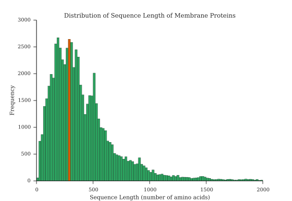
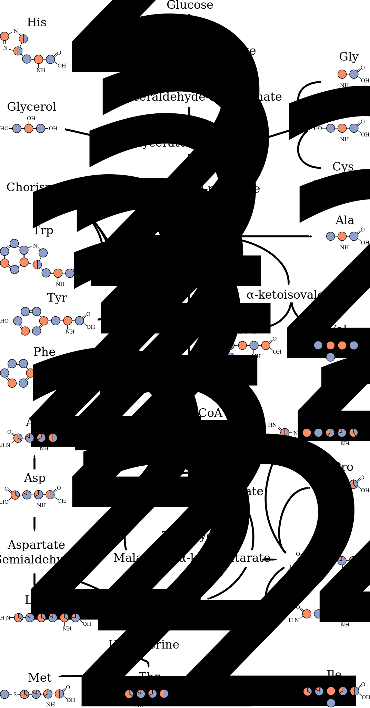
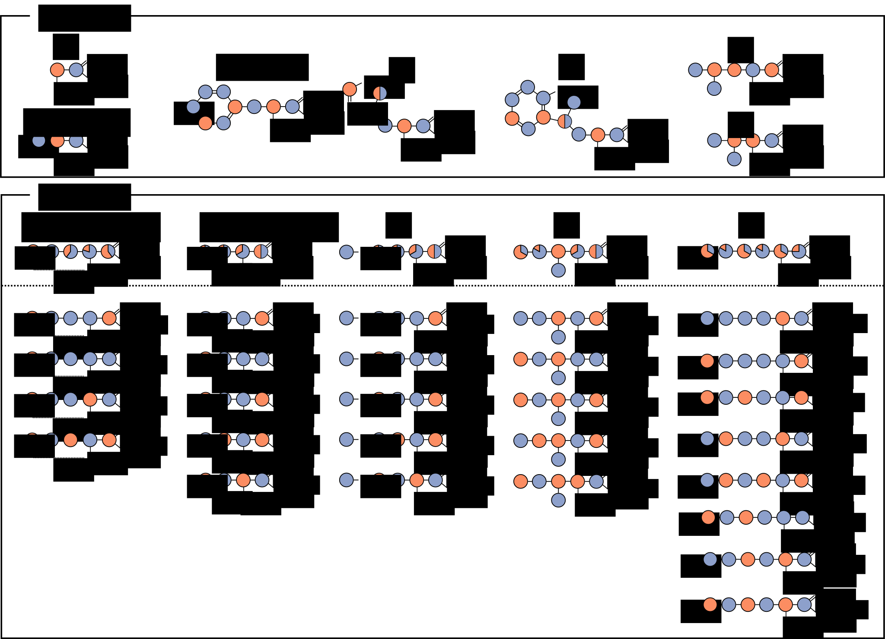
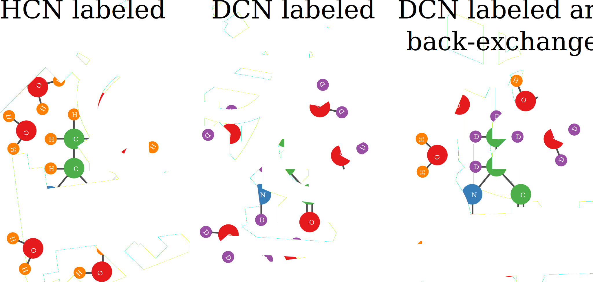
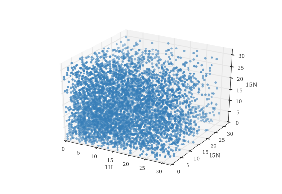

\part{Introduction}

Structural Biology
==================

This thesis is about 'assignment methods for large proteins in solid state nuclear magnetic resonance spectroscopy ...'. Before bombarding you with details I would like to give a short introduction into the context of this research.

Nuclear magnetic resonance, or NMR, spectroscopy is a very standard method for the analysis of chemical substances. The general idea behind the technique is, like in any other form of spectroscopy, to measure a difference in energy between different states. In the case of NMR spectroscopy the different states are generated by bringing the sample in a large magnetic field. All atomic nuclei have a quantum mechanical property called 'spin'. In a magnetic field the spin of some atomic nuclei, for example the nucleus of the normal hydrogen 1H isotope, will be either pointed along the magnetic field or against it. The energy of the spins that are aligned with the magnetic field is slightly lower than that of those that are pointed against it. This is the energy difference that is exploited by NMR spectroscopy and leads to a signal in a NMR spectrum. The energy difference is directly related to the strength of the magnetic field. However the magnetic field that is perceived by a given spin is not only only determined by the external field of the magnet. Also the direct chemical environment around the spin influences the local magnetic field. Therefor every nucleus in a molecule that has a slightly different chemical environment gives rise to a peak on a different position in the spectrum. By careful analysis of these spectra, often combined with mass spectrometry, it has been possible for decades to determine the composition and structure of small organic molecules.
The use of NMR spectrometry in structural biology, which this thesis is about, is a little bit different. We generally already know the chemical composition of the molecule of interest. In case of a protein we know its amino acid sequence. In case of RNA or DNA we know the nucleotide sequence. Of course we also know the chemical composition of the amino acids and nucleotides respectively. The only missing information is the shape it adopts in three dimensional space and how this shape changes over time. Structural biology is essentially about reverse-engineering on a bio-molecular level. The central dogma in the field is that the structures of bio-molecules such as DNA, RNA and proteins can tell something about their function and how they fulfill this function. Of course this is interesting from a purely scientific point of view. However, understanding the biological mechanisms that are connected to diseases can help developing therapies.

The energy difference used in NMR is only very small compared to the thermal energy at biologically relevant temperatures. Therefor NMR is an inherently insensitive method. A measurable signal can only be generated by the measuring millions of molecules at the same time. As will be explained later, in one way or another all difficulties with this method lead back to this fact.

In both liquid and solid samples, every molecule in the sample has a different spacial orientation in respect to direction of the static field of the magnet.
The first structure of a protein,... was solved in 19.. by x-ray crystallography.

and a citation. [@higman2009assigning]

> *This* is a quotation block: Lorem ipsum dolor sit amet, consectetur adipisicing elit, sed do eiusmod tempor incididunt ut labore et dolore magna aliqua. Ut enim ad minim veniam, quis nostrud exercitation ullamco laboris nisi ut aliquip ex ea commodo consequat. Duis aute irure dolor in reprehenderit in voluptate velit esse cillum dolore eu fugiat nulla pariatur. Excepteur sint occaecat cupidatat non proident, sunt in culpa qui officia deserunt mollit anim id est laborum.

![Percentage of subsequences that is only present in the sequence once. Purple, orange and green correspond to subsequences of length 1,2 and 3 respectively. This plot is made using 1000 membrane protein sequences from the uniProt database. Every point represents one protein. As expected, the amount of single amino acids that only appear in the sequence once very quickly drops of with increasing sequence length. At the other side, even for the largest proteins still more than half of all triplets (subsequences of length 3) is completely unique in the sequence. Of course, the fact that the subsequence is unique does not necessarily mean that the subsequence can be distinguished from all other subsequences based on the chemical shifts of these residues. That also heavily depends on how many 13C chemical shifts of the spin systems are known, which is directly dependent on the type of spectra recorded.  \label{unique_subsequences}](figures/amount_of_unique_subsequences.svg)

![All amino acid selective labeling schemes used for the sequential assignment of OmpG on the sequence. Highlighted rectangles indicate in which labeling schemes the residue is labeled. Colored (green, orange and purple) clusters of rectangles indicate that a sequential walk is possible without using the more congested spectra of non-residue specific labeling schemes. A sequential walk is possible when two sequential residues are co-labeled in at least one labeling scheme. Grey rectangles indicate that the residue is not co-labeled with any of its two neighboring residues. The average cluster length is 3.0 and on average a given residue is part of a cluster of length 5.5.  \label{labeling_schemes_on_ompg_sequence}](figures/labelling_schemes_on_ompg_sequence.png)

![Overlay of HN correlations in solid state NMR (red), and solution NMR (black). The solid state spectrum is recorded using the cross-polarization based pulse sequence as described ..... The solution spectrum is a modified copy of the second figure in the paper of Lukas K. Tamm and coworkers describing the solution structure of OmpG. [@liang2007structure] The solution spectrum was recorded using a TROSY-HSQC sequence. Besides the obvious difference in line-width between the two spectra, there are also peaks present in the solution spectrum that are absent in the solid state spectrum. These peaks correspond mostly to the flexible loops on the extra-cellular side of OmpG and some to the shorter turns on the intra-cellular side.](figures/HN_solid_solution.png)

![Pulse sequences and magnetization transfers in carbon detected experiments. A) Pulse sequence of 2D CC correlation using DARR. Phases are Φ0 = 0, Φ1 = 13, Φ2 = {0}*8 {2}*8, Φ3 = 1133, Φ4 = 1122 3300, Φaq = 2013 0231 0231 2013. B) Pulse sequence of NCACX and NCOCX. The sequences are identical. Only the specific CP condition is different between both experiments. Phases are Φ0 = 0, Φ1 = 1111  1111 3333 3333, Φ2 = {0}*16 {2}*16, Φ3 = 0202, Φ4 = 0022, Φ5 = 3333 1111, Φ6 = 1122, Φaq = 0231 2013 2013 0231 2013 0231 0231 2013. Both sequences are part of Trent Franks' pulse sequence repository at github.com/TrentFranks/ssNMR_pp_TopSpin2 as fmp.hCC_DARR and fmp.hNCC_DARR respectively. C) Magnetization transfers of 2D CC correlations. In spectra with a short mixing time (50 ms) only cross-peaks will arise that correlate two nuclei in the same residue. Using longer mixing times (200 ms)allows magnetization transfer to neighboring residues. If the mixing time is even increased (400 ms)long range correlations can be observed. D) Magnetization transfers demonstrating how a sequential walk can be performed using NCACX and NCOCX spectra.](figures/carbon_detected_pulse_sequences_and_magnetization_transfers.svg)

![Graphical User Interface of the CCPN Analysis plug-in that helps comparing spin systems to each other. In the tables at the top, the two spin systems that should be compared are selected. The tables at the bottom show the resonances unique to the first spin system, the resonances that are assigned to the same type of nuclei and the resonances unique to the second spin system. In this case a spin system created based on the proton detected data is compared to one that was created using carbon detected data.](figures/compare_spin_systems_gui.png)

