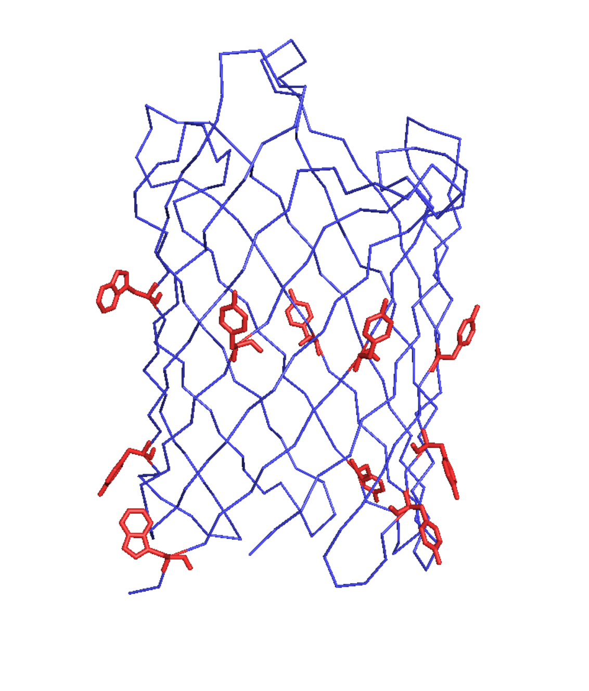
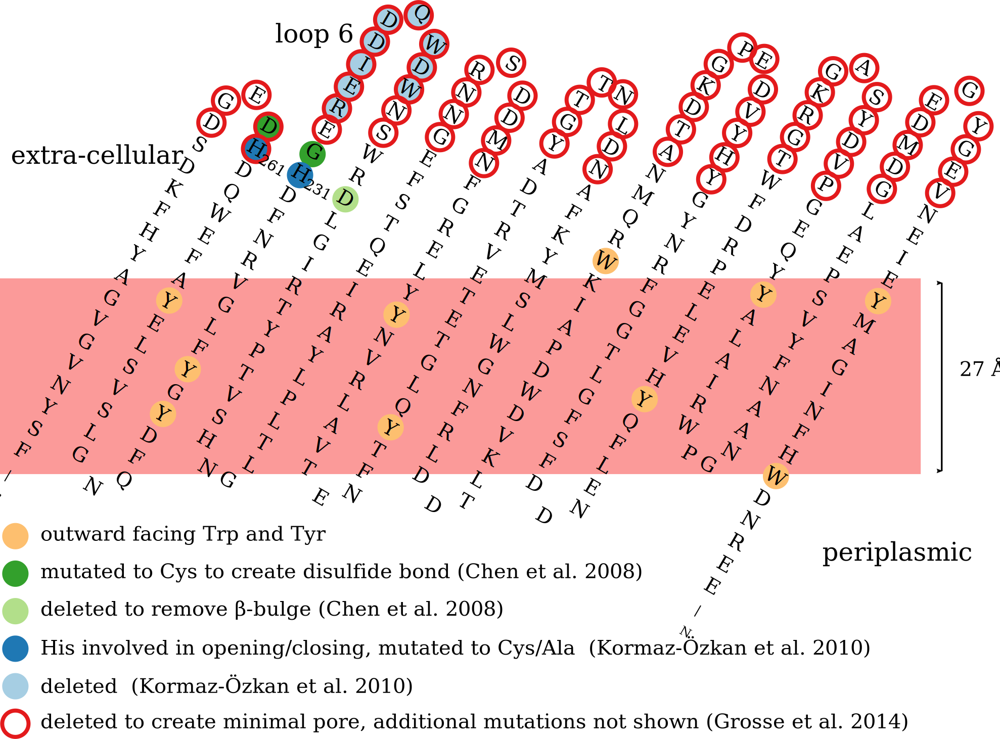

\mainmatter
\part{Introduction}
\fancyhead[RE]{CHAPTER \thechapter}

Structural Biology of Membrane Proteins
=======================================

This thesis revolves around the sequential assignment and structure determination of outer membrane protein G (OmpG) by solid-state NMR.

Structural biology is essentially about reverse-engineering on a bio-molecular level. The central dogma in the field is that the structures of bio-molecules such as DNA, RNA and proteins can tell something about their function and how they fulfill this function. Of course this is interesting from a purely scientific point of view. However, understanding the biological mechanisms that are connected to diseases can help developing therapies.

The first structure of a protein,... was solved in 19.. by x-ray crystallography.

## Biological Membranes

Some form of compartmentalization is essential for the existence of life. In a semi-closed off system energy and organic matter can reach sufficiently high concentrations to support the rise of complex structures. Therefor every origin of live theory in one way or another involves spatial compartments [@deamer_first_1997]. These original compartments are often believed to be of non-biological nature such as mineral surfaces [@cairns-smith_genetic_1982][@koonin_origin_2005]. At some point during the early evolution of life first biological cells were formed that possessed a lipid membrane so that live could break free from the pre-existing compartments. Whether this happened before or after the last universal common ancestor and what the composition of this membrane exactly was is under some debate [@jekely_did_2006][@mulkidjanian_coevolution_2009]. The fact is that all modern cells have membranes though.

Membranes form the barrier between the inside and the outside of cells. In eukaryotes membranes are also present within the cell dividing it in different compartments such as the nucleus, mitochondria, golgi apparatus and in the case of plants the chloroplasts. Membranes do not only function purely as separators but play an active role determining the cell's shape, locomotion, interaction with other organisms or neighboring cells and the extracellular matrix in the case of multicellular organisms. Proton gradients over the membranes of mitochondria and chloroplasts drive the synthesis of ATP and ion gradients over the membranes of our neurons allow them to fire.

The lipids in membranes are arranged to form a bilayer. The hydrophobic tails are pointing towards the center of the bilayer while the the hydrophilic head groups point towards the aqueous solution. Because of the various different roles lipid composition in biological membranes is very diverse and differs widely between organisms and cell types [@dowhan_molecular_1997].

In general the main lipid component of membranes are phospholipids. In addition eukaryotic membranes also contain sterols influenceing rigidity and permeability [@haines_sterols_2001]. Furthermore membranes of plant cells contain large amounts of glycolipids. Knowledge about the exact chemical composition of different lipids in cells is mostly obtained by a combination of mass spectroscopy and liquid chromatography and generated its own omics field logically called lipidonomics [@dennis_lipidomics_2009][@ivanova_lipidomics_2009]. In eukaryotes thousands of different lipids can be present based on the combination of different head groups and chain lengths [@sud_lmsd_2007][@vanmeer_membrane_2008]. An interesting divide in the type of phospholipids that make up the membrane is between bacteria and eukaryotes versus archaea [@kates_phytanyl_1977][@pereto_ancestral_2004]. The most important distinction here is that in archaea the opposite glycerol stereoisomer is used to synthesize the phospholipid backbone in comparison to the other two branches of life.

The combination of lipids does not only vary between different membranes but also between the two leaflets that compose the lipid bilayer. This is also the case in the outer membrane of E. coli. The outer leaflet is composed of lipopolysaccharides (LPS), and the inner leaflet of the more usual phospholipids of which the majority is phosphatidylethanolamine (PE) (75%), phosphatidylglycerol (PG) (20%) and cardiolipin [@nikaido_molecular_2003][@gidden_lipid_2009][@garrett_quantification_2012][@sohlenkamp_bacterial_2016].

Lipid biochemistry is a very complex subject since there is no simple basic paradigm like in the study of proteins and nucleic acids where there is a more or less direct transcription/translation between DNA sequences and RNA/proteins. The fact that there is such a large number of lipids and organisms spend expensive resources to maintain this variety this indicates its functional relevance. The mix of lipids making up the membrane directly influences properties such as its flexibility, curvature, permeability and interaction with membrane proteins [@kimura_roles_2016].

## Membrane Proteins

Besides lipids the membrane consists for a large part of membrane proteins. In mouse liver the fraction of protein by weight is about 45% and in E. coli this is 75% [@lehninger_lehninger_2008]. Some membrane proteins are mostly outside of membrane only being anchored to the membrane with a covalently bound lipid tag or hydrophobic α-helix. These proteins are known as peripheral or monotopic membrane proteins. Others span the entier bilayer and have parts of the proteins stick out on both sides of the membrane. These proteins are called integral membrane proteins. In turn there are two large classes of integral membrane proteins: proteins consistent of multiple membrane spanning α-helices and β-barrels. The reason that basically all integral membrane proteins have either one of these two topologies is that there is a higher energy penalty for unfulfilled hydrogen bonds within the protein since there are virtually no hydrogen bond partners present in the non-polar part of the membrane [@white_how_2001]. Therefor all CO and NH pairs in the protein backbone should hydrogen bond within the protein itself leaving only these two basic topologies. β-sheets naturally roll up into barrels otherwise non-hydrogen bonded residues would be present on both extremes of the sheet.

In most organisms 20-30% of genes code for membrane proteins [@krogh_predicting_2001]. Membrane proteins play a role in numerous important biological events. Receptors transmit information from the outside of the cell to the inside. Transporters enable the flux of molecules and ions. Membrane proteins catalyze reaction such as the before mentioned synthesis of ATP. Almost the entier photosynthesis machinery consists of membrane proteins. The flagellar motor that lets some bacteria swim is membrane embedded. Of course membrane proteins are also active in processes during which the shape of the membrane has to be transformed such as endocytosis and cell division. Furthermore over 60% of all approved drugs target a membrane protein [@overington_how_2006][@yildirim_drugtarget_2007].

For these reasons it is important to gather a detailed understanding of how these proteins work. However, the number of unique proteins in the database of membrane proteins of known 3D structure is at the moment (4.5.2016) 612 from which 22 are porins, like OmpG [@membrane-protein-db]. The reason for this underrepresentation is actually quite simple. The two major work horses for the structure elucidation at atomic length scales, x-ray crystallography and solution NMR spectroscopy, work very well with soluble protein but less so with large insoluble membrane proteins [@lacapere_determining_2007]. The most used technique to grow crystals for x-ray crystallography is the hanging drop method. This method relies on proteins being free in solution. To accomplish this for membrane proteins detergents have to be added. As the volume of the drop shrinks and the concentration of both protein and detergent rises often a phase separation takes place negatively influencing the formation of crystals [@lacapere_determining_2007]. An alternative method to produce crystals specifically designed for the crystallization of membrane proteins is to employ a lipid cubic phase which is a complex but ordered matrix of lipid bilayers [@landau_lipidic_1996][@caffrey_comprehensive_2015]. For solution NMR studies membrane proteins are often introduced in micelles or nanodisks [@sanders_reconstitution_1995][@gluck_integral_2009]. Although these crystallography and solution NMR techniques have enabled the structure determination of the majority of membrane proteins in the protein data band (PDB), see table {@tbl:pdb_count_table}, the growth in the number of deposited membrane protein structures still lags behind.

|                       | α-helical | β-barrel | monotopic |
|-----------------------|-----------|----------|-----------|
| total unique          | 463       | 133      | 46        |
| x-ray crystallography | 398       | 124      | 46        |
| electron microscopy   | 34        | 5        | 1         |
| solution NMR          | 55        | 16       | 1         |
| solid-state NMR       | 9         | 1        | -         |

Table: membrane proteins protein data bank (PDB) for four structure determination methods [@bernstein_protein_1977]. To prevent over-representation of the amount of protein entries for each method have been filtered for 95% sequence similarity. Note that the numbers of structures determined by individual methods does not add up to the total number of unique structures because the structure of several proteins has been determined by more than one method. Also the total number of structures is slightly higher than the number reported in the database of membrane proteins of known 3D structure.{#tbl:pdb_count_table}

Recently the development of direct electron detectors has allowed impressive progress in single molecule cryo-electron microscopy [@milazzo_initial_2011][@li_electron_2013][@li_influence_2013]. This method can be applied to membrane proteins [@zorzi_singleparticle_2015][@vinothkumar_membrane_2015]. It is very promising and will likely allow the structure determination of many membrane proteins in the future. However this technique also has limitations. Because the method is based on aligning thousands of individual noisy images the protein (complexes) under investigation should be relatively large. Also the images are taken of a flash frozen solution. This means that, like for solution NMR, membrane proteins have to be reconstituted in some vehicle that allows that. Several structures of membrane proteins reconstituted in liposomes have been published [@tilley_structural_2005][@wang_structure_2009]. Liposomes are small vesicles closed off by a lipid bilayer and therefor depending on the mixture of lipids they are composed of a reasonable approximation of a real biological bilayer. However, all high resolution structures have been determined using detergents such as DDM, amphipols and digitonin or in nanodisks. The review of Vinothkumar containts a good table listing the different detergents used in recent cryo-electron microscopy studies [@vinothkumar_membrane_2015].

## Protein-lipid interactions

In order for membrane proteins to be incorporated into the membrane the residues facing the lipids almost exclusively have hydrophobic side-chains [@white_membrane_1999]. A hydrofobic core of a membrane is roughly 30 Å thick meaning that there must be around 19 hydrophobic residues to span this distance with an α-helix. For a β-barrel only every second residue points into the lipid bilayer and the length of a stretch spanning the hydrophobic core depends on its shear number but is normally around 10 residues. Another common feature of membrane proteins is that at the interface between the hydrophobic core of the membrane and the head groups of the lipids often tyrosine and tryptophan residues are found [@yau_preference_1998][@killian_how_2000]. On the basis of these kind of features algorithms are written to predict from the primary sequence whether a protein is a membrane protein and what its topology is. Because of the larger amount of residues needed to span the membrane and the lack of an alternating pattern this is easier for α-helical membrane proteins than for β-barrels [@wimley_genomic_2002].

It has become clear though that the interaction between proteins and surrounding lipids is a lot more complex than just aspecific hydrophobic interactions between the membrane protein and membrane. If the size of the hydrophobic part of the protein is different than the length of the fatty acid chain there is a hydrophobic mismatch which might cause an incorrect geometry of the protein [@lee_how_2005]. Not only thickness plays a role. Because the relative width of the head groups and fatty acid tails varies between lipids some of them are cylindrical whether others are conical causing a specific pressure profile within the membrane [@zhou_influences_2013]. Indeed membrane proteins can be regulated by physical properties such as thickness and the intrinsic curvature of the membrane [@andersen_bilayer_2007]. The thickness of the membrane can even vary locally around the circumference of a protein [@ellena_membrane_2011]. Furthermore, in some very interesting examples detecting changes in the physical properties of the membrane is the sole purpose of a membrane protein as is the case for mechano sensing channels [@battle_lipidprotein_2015].

Besides from bulk mechanical properties induced by the lipids composition of the membrane specific lipids might be needed in close proximity to the protein. It might be useful to divide these protein-lipid interactions into three modes [@bechara_different_2015]. The first group consists of an annular shell of lipids that directly surrounds the membrane protein but are not tightly bound to the protein. A second class of lipids is bound more specifically to structural features of the protein. Lipids that act as a substrates of membrane proteins form the third group. The identity of the first group of lipids is the most problematic to retrieve since they are often removed by the use of harsh detergents in extraction protocols. However, by extracting membrane proteins from membranes in a more controlled manner the identity of these lipids can be analyzed by mass spectrometry to varies extends [@barrera_role_2013][@bechara_different_2015]. More information is available about the more tightly bound lipids in the last two groups. To obtain crystals for x-ray crystallograpy these specific lipids often have to be present. In a number of crystal structures these lipids could be observed tightly bound to the protein. Multiple reviews have been written summarizing all observed lipids in crystal structures [@lee_lipidprotein_2003][@palsdottir_lipids_2004][@hunte_specific_2005]. A recent review by Philip L. Yeagle lists more than a hundred crystal structures with bound lipids such as cholesterol, cardiolipin, phosphatidylethanolamine (PE) and phosphatidylglycerol (PG) [@yeagle_noncovalent_2014]. Many of these lipids were not specifically added during crystallization but were so tightly bound the the protein that they were not removed during the purification. There does not seem to be one general principle as to how these lipids interact with membrane proteins. In some structures binding is mediated by the head groups, in others by the tails or by both head group and tails. Also in many structures detergents are found most likely occupying a place of a removed lipid. Although some information became available in recent years our real understanding of protein-lipid interactions is still very limited.

## Outer membrane protein G

{#fig:membrane_protein_sequence_lenth_distribution}

Outer membrane protein G (OmpG) is a 34 kDa β-barrel protein found in the outer membrane of E. coli. Besides Gram-negative bacteria like E. coli also mitochondria and chloroplasts have outer membranes. The outer membranes of Gram-negative bacteria are exclusively populated by proteins with a β-barrel topology while in mitochondria and chloroplasts also some α-helical Omps are found [@wimley_versatile_2003]. In the case of Gram-negative bacteria outer membrane proteins are produced in the cytoplasm and moved into the periplasm were they are inserted into the outer membrane by the β-barrel assembly machinery (BAM) complex of which one of the proteins, BamA, itself contains a membrane embedded β-barrel subunit [@gu_structural_2016]. Outer membrane proteins perform a host of different functions that are needed on the interface between the inside and outside of the cell/organel [@fairman_structural_2011]. They can act as enzymes, transporters and receptors. Many are autotransporters that translocate one of their domains to the extracellular space often acting as adhesins helping with the invasion of other cells and therefor linked to infectious decease [@shahid_membraneprotein_2012]. OmpG belongs to a class of outer membrane proteins known as porins. These proteins act as pores allowing the passive but selective uptake and secretion of nutrients, ions and proteins. In general porins in Gram-negative bacteria have short turns on the periplasmic side and long loops on the extracellular side [@wimley_versatile_2003].

The main porins for the uptake of sugars in the outer membrane of Gram-negative bacteria are LamB and OmpF. When genes for LamB and OmpF were deleted and a selection procedure was carried out to generate phenotypes that were able to grow on a maltodextrin medium a number of different mutations were found. One of those mutations allowed the otherwise not expressed OmpG to come to expression [@misra_novel_1989]. Interestingly low levels of OmpG expression were found in Salmonella and Shigella bacteria [@fajardo_biochemistry_1998]. Further biochemical analysis showed that OmpG is able to import mono-, di- and trisacharides [@fajardo_biochemistry_1998]. Furthermore it was discovered that OmpG seems to only exist as a monomer, which is exceptional since most porins are trimers. No evidence of a oligomeric form could be found in native/denaturing PAGE analysis and cross-linking experiments [@fajardo_biochemistry_1998]. Further evidence from electrophysiology studies confirmed the monomeric nature of OmpG [@conlan_biochemical_2000]. The OmpG gene codes for 301 amino acids of which the first 20 are a signal sequence that gets cleaved off upon arrival in the periplasm [@fajardo_biochemistry_1998].

An cryo electron microsopy projection map at 6 Å confirmed the β-barrel structure of OmpG and its observed diameter of 2.5 nm agreed with earlier made predictions that OmpG is composed of 14 strands [@behlau_projection_2001][@conlan_biochemical_2000]. In 2006 and 2007 crystal structures and a solution NMR structures were published [@subbarao_crystal_2006][@yildiz_structure_2006][@liang_structure_2007]. The studies of Yildiz et al. hint at a pH-dependent opening and closing mechanism [@yildiz_structure_2006]. For these studies OmpG was crystallized at pH 7.5 and pH 5.6. The structure at pH 7.5 showed an open conformation while in the structure at pH 5.6 the longest extra-cellular loop (loop 6) was folded into the pore closing it off, see figure {@fig:ompg_crystal_and_solution_structures}. The crystal structure of Subbarao and van den Berg was crystallized at pH 5.5 and misses part of the residues in loop 6 (220-231) but seems to resemble the pH 7.5 stucture of Yildiz et al., which is surprising [@subbarao_crystal_2006]. The solution NMR studies were performed at pH 6.3 which is between the conditions of the structures of Yildiz et al. [@liang_structure_2007]. The entire loop 6 and parts of loop 7 could not be assigned. In general almost no long-range restraints could be found for most of the extra-cellular loops indicating motional inhomogeneity. Therefor the β-barrel in the solution NMR structure is a lot shorter on the extra-cellular side. This smaller β-sheet size fits the probable thickness of the outer membrane E. coli which is around 27 Å corresponding to around 10 residues to cross the membrane [@wimley_genomic_2002]. Also, the barrel in the crystal structures is extended very far beyond the ring of outward facing tryptophans and tyrosines that are likely indicating the membrane interface, see figure {@fig:trp_tyr_outward}. For the solution NMR structure the motion of the extra-cellular loops was confirmed by heteronuclear NOESY experiments [@liang_structure_2007].

{#fig:ompg_crystal_and_solution_structures}

{#fig:trp_tyr_outward}

Yildiz et al. proposed that the protonation state of two histines (231 and 261) determines whether the protein is in open or closed configuration, see figure {@fig:ompg_mutations}. At a lower pH the histidine side-chains get protonated which causes them to repel each other disrupting the hydrogen bond pattern and thereby allowing loop 6 to fold into the pore. Although this seems a simple and attractive explanation the exact mechanism for the pH-dependent opening and closing of OmpG remains unclear. Because OmpG is a monomer it is a good candidate to form the basis for a stochastic biosensor for the detection of analytes. The detection method of this type of biosensor relies on the binding of an analyte to cause a disruption in the ion flow when an electrical potential is applied between both sides of the membrane [@gu_stochastic_1999][@bayley_stochastic_2001]. Within this context the opening and closing mechanism of OmpG is of interest since it is necessary to remove all spontaneous opening and closing of the pore which manifests itself as noise. To reach this goal glycine 231 and aspartic acid 262, which directly neighbor the before mentioned histidines, were mutated to cysteines to form disulfide bond keeping strands 12 and 13 together. Also aspartic acid 215 was deleted to remove a beta bulge and thereby reinforcing the hydrogen bonding pattern. These residues are shown in dark and light green respectively in {@fig:ompg_mutations}. This combination of mutations removed 95% of the spontaneous gating [@chen_outer_2008].

Another study, partially by the same people that published the crystal structures in two states, performed by fourier transform infrared spectroscopy indicated that there is an increase in β-sheet rigidity and thermostability at higher pH [@korkmaz-ozkan_correlation_2010]. In this study also three different mutants were created. In two of the mutants the histidine pair was mutated to alanines or cysteines respectively. In the third mutant 9 residues in loop 6 were deleted (light blue in {@fig:ompg_mutations}). In the first two mutants no pH-dependent alteration of secondary structure content could be observed and always showed a similar profile as wild type OmpG at pH 7.5. The crystal structure of the alanine mutant at pH 6.5 resembling the wild type structure at pH 7.5. However, for the third mutant a slight pH-dependent change in secondary structure was observed. This combination of results showed that the protonation state of the histidine pair directly determines the opening and closing of the pore. However, in a follow up study by the same author this conclusion is softened somewhat pointing out that other factors such as state of the charged aspartic acid, glutamic acid and arginine residues in the lumen of the pore might play a role [@korkmaz_situ_2012]. This type of argument is further enforced by a study that tried to reduce the spontaneous gating of OmpG further than was done before [@grosse_structurebased_2014]. Now large parts of all extra-cellular loops were deleted to create a minimal pore, see figure. Even in the absence of the loops and one of the histidines of the pair pH-dependent gating was detected. Furthermore solution NMR ensembles obtained by attaching paramagnetic relaxation enhancers to the flexible loops indicated that not only loop 6 might be involved in the opening and closing mechanism but also the other loops [@zhuang_nmrbased_2013]. Therefor a combination of all these factors might govern the gating of OmpG.

{#fig:ompg_mutations}

### OmpG as a model for solid-state NMR method development

[@hiller_solidstate_2005]
[@hiller_2313clabeling_2008]
[@higman_assigning_2009]

## Solid-State NMR

Nuclear magnetic resonance, or NMR, spectroscopy is a very standard method for the analysis of chemical substances. The general idea behind the technique is, like in any other form of spectroscopy, to measure a difference in energy between different states. In the case of NMR spectroscopy the different states are generated by bringing the sample in a large magnetic field. All atomic nuclei have a quantum mechanical property called 'spin'. In a magnetic field the spin of some atomic nuclei, for example the nucleus of the normal hydrogen 1H isotope, will be either pointed along the magnetic field or against it. The energy of the spins that are aligned with the magnetic field is slightly lower than that of those that are pointed against it. This is the energy difference that is exploited by NMR spectroscopy and leads to a signal in a NMR spectrum. The energy difference is directly related to the strength of the magnetic field. However the magnetic field that is perceived by a given spin is not only only determined by the external field of the magnet. Also the direct chemical environment around the spin influences the local magnetic field. Therefor every nucleus in a molecule that has a slightly different chemical environment gives rise to a peak on a different position in the spectrum. By careful analysis of these spectra, often combined with mass spectrometry, it has been possible for decades to determine the composition and structure of small organic molecules.
The use of NMR spectrometry in structural biology, which this thesis is about, is a little bit different. We generally already know the chemical composition of the molecule of interest. In case of a protein we know its amino acid sequence. In case of RNA or DNA we know the nucleotide sequence. Of course we also know the chemical composition of the amino acids and nucleotides respectively. The only missing information is the shape it adopts in three dimensional space and how this shape changes over time.

The energy difference used in NMR is only very small compared to the thermal energy at biologically relevant temperatures. Therefor NMR is an inherently insensitive method. A measurable signal can only be generated by the measuring millions of molecules at the same time. As will be explained later, in one way or another all difficulties with this method lead back to this fact.

## Magic Angle Spinning

In both liquid and solid samples, every molecule in the sample has a different spacial orientation in respect to direction of the static field of the magnet.

## Cross-polarization

## Relaxation

## Sequential Assignment of solid state NMR spectra

In most NMR studies very little can be done before the chemical shifts of the nuclei that are interesting in the context of the biological question are known. Sometimes those are only a few. However if the goal is to calculate the structure and study the overall dynamics of the protein a fairly complete mapping between resonance frequencies and nuclei in the molecule has to be present. This mapping process is referred to as sequential assignment and often is the most time consuming part of a NMR study. The general idea behind sequential assignment methodologies is always the same: the graph that arises from a set of correlation spectra is mapped on the molecular topology. In most (but not all) methodologies to find this mapping, the process is divided into two steps. In the first step parts of the total signal pattern are identified that correspond to individual residues. In a second step connectivities are found between these signal patterns and a larger signal pattern that belongs to a set of sequentially connected residues is created. Because the nuclei in different amino acids give rise to a different combination of chemical shifts, the sets of signals can be classified down to a few or sometimes even one type of amino acid. When this is done, the larger pattern can be mapped to a subsequence in the protein that matches these possible residue type assignments.

From now on I will call the collection of resonance frequencies that belong to one residue a spin system. The term **spin system** is often used in NMR in a somewhat less confined sense, meaning a set of resonances that are in some way influenced by one another. However, since this thesis will deal with sequential assignment for a large extent, it is good to have quick way to describe this object. Also the CCPNMR Analysis software, that is used to analyze NMR spectra, uses the term as I just defined it.

In order to get a unique match between the potential residue types of a sequential stretch of spin systems and a subsequence in the protein, the stretches should in general be long enough. I.e. the longer a connected stretch is, the higher the chance there is only one possible location along the protein sequence were this stretch fits. Of course it highly depends on the length of the protein sequence how long it takes before this is the case. In figure {@fig:amount_of_unique_subsequences} the fraction of unique subsequences of lenght 1, 2 and 3 are plotted vs. the lenght of the protein. As can be seen, even for very large proteins, connected stretches of 3 spin systems can in theory be uniquely matched to a subsequence of the protein in the majority of cases. This is of course under the assumption that each spin system can be uniquely typed to one amino acid type, which is not the case in practice since some amino acids give rise to very similar signal sets. Therefor in practice often somewhat longer stretches need to be generated before a unique match to a subsequence in the protein can be found.

![Percentage of subsequences that is only present in the sequence once. Purple, orange and green correspond to subsequences of length 1,2 and 3 respectively. This plot is made using 1000 membrane protein sequences from the uniProt database. Every point represents one protein. As expected, the amount of single amino acids that only appear in the sequence once very quickly drops off with increasing sequence length. At the other side, even for the largest proteins still more than half of all triplets (subsequences of length 3) is completely unique in the sequence. Of course, the fact that the subsequence is unique does not necessarily mean that the subsequence can be distinguished from all other subsequences based on the chemical shifts of these residues. That also heavily depends on how many ^13^C chemical shifts of the spin systems are known, which is directly dependent on the type of spectra recorded.](figures/amount_of_unique_subsequences.svg){#fig:amount_of_unique_subsequences}

For the assignment of larger proteins both steps in the assignment process become more diffeicult. The real bottleneck in here is chemical shift degeneracy. The larger the amount of NMR active nuclei in a protein, the smaller the average spacing between the resonance frequences will be. This causes two problems that are very closely related, but should be considered both distinctly:

1. Spectral crowding, the overlap of signals in spectra.
2. Degeneracy of assignment of peaks.

The first problem is very simple, spectra get very hard to interpret if signals are piled on top of each other. The second problem maybe needs a little more explanation. In order to connect spin systems to form a sequential stretch, cross peaks between them in correlation spectra are needed. However, if a crosspeak can be explained by multiple different resonance frequencies from multiple spin systems on each dimension, it gets a lot harder to build these stretches. It is not so much that this type of peak is necessarily really overlapping with another peak, it is the apparent overlap of peaks.

Of course in the end both these problems barrel down to linewidth. If linewidths were infinitely narrow, none of these problems would exist. There would be no signal overlap and every cross-peak could be explained by the correlation of spins of exactly the same number as its dimensions. If this were the case, there would be a very clear one to one mapping between the signal set and the molecular topology.

To combat the problem of spectral crowding and assignment ambiguity of crosspeaks, in general three approaches can be taken:

1. Reduce the amount of signals in the signal set by isotopically labelling only a subset of the nuclei in the protein.
2. Spread the signal set over more dimensions.
3. Decrease linewidths.

Over the last few years, solid state NMR has made an enormous amount of progress and also the methods we used in this project changed during this process. The NMR methods used have a large influences on the way sequential assignments are made. A first chapter will explain the efforts we did to assign OmpG using ^13^C-detected NMR, because that is how this was generally done at the time this project started off. Afterwards the progress that was made in this project using ^1^H-detected experiments will be shown. Although it might seem that the use of the latter method is more important, the results from the ^13^C-detected experiments are not just included for chronological completeness. As will be clear, a lot of information obtained from the ^13^C-detected spectra is still very valuable and there is until now not a method in ^1^H-detected solid state NMR that can fully obtain all information provided by the ^13^C-detected experiments. Spectra from both methods have been used in conjunction and in a complementary fashion. Therefor in a third chapter the combination of both types of spectra will be discussed.

## Recent Progress

