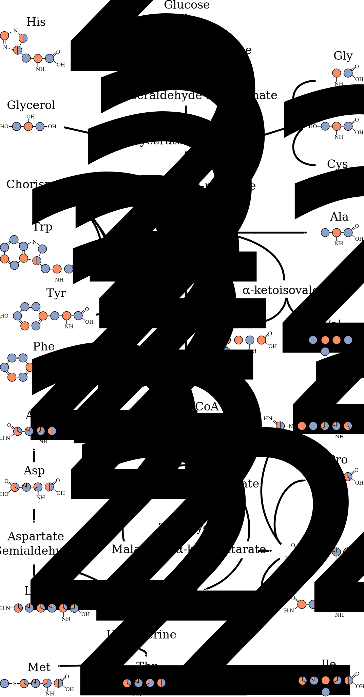

Assignment Using ^13^C-detected Spectra
=======================================

## Introduction

### Types of Experiments

As explained in the introduction, the assignment process is generally split up into two steps. The first step consists of grouping resonance positions belonging to individual residues into spin systems. In ^13^C-detected solid state NMR this generally done using 2D ^13^C-^13^C and NCACX spectra with a short DARR mixing time of about 20 to 50 ms. In these type of spectra only intra-residual cross-peaks are expected. The second step, in which these spin systems are connected sequentially, can be done using NCOCX spectra that connect the ^15^N resonance of one residue to the ^13^C resonances in the N-terminal neighboring residue. In addition, 2D ^13^C-^13^C correlation spectra with a longer DARR mixing time of around 150 to 200 ms are used in this step since they contain a lot of short range sequential cross peaks. In figure {@fig:carbon_detected_pulse_sequences_and_magnetization_transfers} the pulse sequences and the corresponding magnetization transfer pathways for the 2D ^13^C-^13^C DARR and NCACX and NCOCX experiments are shown.

![Pulse sequences and magnetization transfers in carbon detected experiments. A) Pulse sequence of 2D CC correlation using DARR. Phases are Φ0 = 0, Φ1 = 13, Φ2 = {0}*8 {2}*8, Φ3 = 1133, Φ4 = 1122 3300, Φaq = 2013 0231 0231 2013. B) Pulse sequence of NCACX and NCOCX. The sequences are identical. Only the specific CP condition is different between both experiments. Phases are Φ0 = 0, Φ1 = 1111  1111 3333 3333, Φ2 = {0}*16 {2}*16, Φ3 = 0202, Φ4 = 0022, Φ5 = 3333 1111, Φ6 = 1122, Φaq = 0231 2013 2013 0231 2013 0231 0231 2013. Both sequences are part of Trent Franks' pulse sequence repository at github.com/TrentFranks/ssNMR_pp_TopSpin2 as fmp.hCC_DARR and fmp.hNCC_DARR respectively. C) Magnetization transfers of 2D CC correlations. In spectra with a short mixing time (50 ms) only cross-peaks will arise that correlate two nuclei in the same residue. Using longer mixing times (200 ms)allows magnetization transfer to neighboring residues. If the mixing time is even increased (400 ms)long range correlations can be observed. D) Magnetization transfers demonstrating how a sequential walk can be performed using NCACX and NCOCX spectra.](figures/carbon_detected_pulse_sequences_and_magnetization_transfers.svg){#fig:carbon_detected_pulse_sequences_and_magnetization_transfers}

The 13^C^-^13^C and through backbone ^15^N-resolved spectra are always used in combination since they both have their positive sites. A nice feature of the through-backbone experiments is that there is a sense of directionality. If two spin-systems are connected in these type of spectra one always knows which one is the first in the sequence, making mapping to a subsequence in the protein easier. Whereas in a purely through-space 2D ^13^C-^13^C experiments is not directional. At the other side, in 2D ^13^C-^13^C correlations very specific cross peaks between the less degenerate side chain resonances can be found. These types of cross-peaks are not present in the NCACX and NCOCX spectra because one of the ^13^C-dimensions encodes either the Cα or the CO.

When performing a backbone walk using NCACX and NCOCX spectra, the ^15^N chemical shift is used as a pivot and therefor the usefulness of these spectra is highly dependent on the ^15^N chemical shift dispersion. Since the ^15^N T2 relaxation times are very short for the OmpG samples this dispersion is not very large. Additionally, the short T2 times also influence the efficiency of the ^15^N-^13^C cross-polarization step and therefor the signal to noise in these experiments is in general a lot lower than in the simpler ^13^C-^13^C experiments. There are other ^13^C-detected experiments possible that complement the NCACX and NCOCX, such as CANCO, CANcoCA and CANCOCX, that prevent the ^15^N chemical shift from being the sole pivot [@franks_fourdimensional_2007][@schuetz_protocols_2010][@sperling_assignment_2010][@shi_bshcp_2014]. However these experiments incorporate yet an additional ^13^C-^15N^ transfer step which, making them only applicable to highly ordered samples. These experiments have only been successfully acquired on small or micro-crystalline proteins and OmpG is neither small nor micro-crystalline.

### Isotope Labeling Schemes
Both 2- and 3-dimensional ^13^C-detected spectra of uniformly ^13^C-^15^N labeled OmpG are very crowded, and therefore very hard to assign, see figure {@fig:uniform_cc_25ms}. Before I joined the project different paths were explored to simplify the spectra to find starting points for the assignment. There are two main possibilities to do this. The first is to use spectroscopic techniques that reduce the amount of cross peaks in the spectra by specifically selecting resonances based on there spectroscopic or chemical properties. For instance, a path explored in the early stages of the project was to use spectral editing to specifically select methyl resonances [@jehle_spectral_2006]. The second route that was explored was to reduce the amount of peaks in the spectra by producing a set of selectively labeled samples [@hiller_2313clabeling_2008][@higman_assigning_2009]. The labeled samples that were produced can basically be divided into three groups:

1. Amino acid type specific samples: only a subset of the amino acids are ^15^N, ^13^C labeled.
2. Uniform 1,3- or 2-glycerol labeled samples: all residues are labeled with the patterns produced by feeding bacteria with glycerol as the sole carbon source labeled either on the 1st and 3rd position or just on the 2nd position.
3. Amino acid type specific 1,3- or 2-glycerol labeled samples: only a subset of the amino acids is labeled with the 1,3 or 2-glycerol labeling pattern.

{#fig:uniform_cc_25ms}

#### Forward labeled schemes

To produce the first group of labeling schemes forward labeling is used. This is conceptually the most straight-forward method and just means that a set of labeled amino acids is added to an otherwise unlabeled feedstock. The combinations of amino acids that can be labeled together is restricted by the amino acid metabolism. Since it is not possible to suppress the metabolic routes to and from a amino acid completely. This effect is minimized by choosing a set of amino acids that are either related in the metabolism, form an endpoint in the metabolism (like tyrosine or lysine), or of which the production/use is easily suppressed.

The forward labeling schemes have advantages and disadvantages. The big advantage of the forward labeled samples is that the amino acids that are labeled are uniformly labeled. As a consequence, spectra of these samples contain the full intra-residual peak pattern, which is extremely useful for grouping resonances into spin systems. This is a lot harder in the spectra of glycerol based labeled samples. This is especially true for the amino acids in group I in figure {@fig:glycerol_labeling}. In this group there is only one isotopomer in the 1,3-glycerol sample and one isotopomer in 2-glycerol sample that are completely complementary. Hence, for any given residue two distinct peak patterns arise, but the information that these two patterns belong to one and the same residue is absent. Therefore, in the case of large proteins, it is necessary to have specifically samples that are uniformly ^13^C/^15^N-labeled within these residues with as little as possible overlap of the intra-residual peaks of different amino acids. As will be discussed in [chapter 4](#connecting-assignments-in-13c--and-1h-detected-spectra), these spectra are really helpful when connecting data from ^1^H- and ^13^C-detected spectra as there is for most amino acids at least one spectrum where the Cα-Cβ crosspeaks are clearly separated.

#### 1,3- and 2-glycerol labeling

These two labeling schemes are produced by using glycerol that is either labeled on the extreme two carbons (1,3) or the middle carbon (2) as the sole carbon source during protein expression [@lemaster_dynamical_1996][@hong_determination_1999]. The labeling patterns produced in this fashion are shown in figure {@fig:glycerol_labeling}. This labeling scheme has been succesfully used in the assignment and structure calculation of SH3 and αB-crystallin [@castellani_structure_2002][@jehle_solidstate_2010]. Examples of how to use these labeling patterns to assign large proteins and specifically OmpG have been illustrated in the publication by Higman et al. in 2009 [@higman_assigning_2009].

Apart from decreasing the amount of signals in the spectra, these labeling schemes also produce narrower linewidths because most directly bound carbon nuclei are not labeled in the same isotopomer. This reduces the ^13^C-^13^C homonuclear dipolar coupling, which in turn causes lines to be narrower. Additionally, a lot more long-range cross-peaks and cross-peaks between two sequential residues are visible in these spectra, which is really important for assignments. For the same reason, these type of spectra are really useful for generating distance restraints used in structure calculations.

As indicated before, the downside of these samples is that they are not well suited to generate spin systems, because a lot of the intra-residual peaks are missing. At the other side, many inter-residual cross-peaks that would otherwise be overlapped by intra-residual peaks are now resolved.

Another disadvantage is that they are not as practical in 3 dimensional NCACX and NCOCX spectra. To make a sequential walk, it is really useful when the CO peak is present in the strip from the NCACX, so that that the connecting strip in the NCOCX (at the ^15^N chemical shift of the following residue) can be easily found. In exactly the same way, when walking 'backwards' it is really useful when the NCOCX strip contains the Cα peak so the connecting NCACX strip can be found. Since directly bound carbons are almost never simultaneously labeled in these samples, these peaks are hardly ever present. Therefor spectra of samples that are uniformly labeled on the residue level are always necessary in conjunction to spectra of glycerol labeled samples.

{#fig:glycerol_labeling}

{#fig:glycerol_metabolism}

#### Amino acid specific 1,3- or 2-glycerol labeling

The third group of labeled samples is produced using reverse labeling. In this case *E. coli* is grown on an isotopically labeled feedstock, here 1,3- or 2-glycerol, and all amino acids that should not be labeled are added in unlabeled form to suppress their metabolism. This technique was pioneered by Hong and Jakes and one of the labeling schemes used here, 2-SHLYGWAVF, is basically identical to the labeling scheme introduced by them as TEASE (**te**n **a**mino acid **s**elective and **e**xtensive labeling), where the tenth amino acid is cysteine, which is not present in OmpG [@hong_selective_1999]. Using this strategy, two sets of amino acids were produced. The first set of amino acids, SHLYGWAFV, consists out of the amino acids produced in the glycolysis and the pentose phosphate pathway, see figure {@fig:glycerol_metabolism}. The other set of amino acids, TEMPQANDSG corresponds to the amino acids produced in the citric acid cycle (minus lysine, isoleucine and arginine) plus alanine, glycine and serine.
For each of the two sets amino acids, SHLYGWAFV and TEMPQANDSG, two samples were produced using the 1,3- and 2-glycerol labeling strategy, leading to a total of four labeled samples: 2-SHLYGWAFV, 1,3-SHLYGWAFV. 2-TEMPQANDSG and 1,3-TEMPQANDSG.

#### Combinations of residues in residue specific labeling schemes

As can be seen in {@fig:glycerol_metabolism}, the combinations of amino acids that can be labeled in a labeling scheme are confined by the bacterial metabolism. For the freedom that is left, a concession has to be made between two major conflicting interests. At the one hand the crowding in the resulting spectra should be reduced as much as possible. On the other hand, as many as possible neighboring residues should be co-labeled in at least one of the labeling schemes. For example, alanine is co-labeled with every other amino acid, except for Lysine, in at least one of the labeling schemes (figure {@fig:labelling_venn}). That means that there will almost always be one or more spectra were the cross peaks between a sequential stretch involving an alanine can be observed, thereby enabling the assignment of this stretch. At the other hand, proline and tyrosine (as an example) are not co-labeled in any of the residue specific labeling schemes, so whenever there is a proline-tyrosine pair in the sequence, the more crowded non-residue specific labeled spectra have to be used to find the cross peaks connecting them.

As discussed in the previous chapter, it is preferable to be able to connect at least three spin systems to unambiguously assign them to a subsequence in the protein. By having a set of labeling schemes with a certain overlap, it is possible to jump between spectra to find the sequential cross peaks to produce such longer stretches of connected spin systems. In figure {@fig:labeling_schemes_on_ompg_sequence}, such stretches are hight-lighted on the OmpG sequence. Whenever the color changes there is a 'dead end', where no residue specific labeling scheme connects two neighboring residues. On average, a given residue in the sequence is part of a stretch of 5.5 residues, which allows an unambiguous assignment in many cases.

![Venn-diagram illustrating the overlap between the different labeling schemes that were produced of OmpG. Every amino acid present in the OmpG sequence is at least labeled in one labeling scheme. Many of the residue types are present in multiple labeling schemes. This feature is important because the combination of labeling schemes then can be used to connect longer stretches in the protein sequence. Labeling schemes listed on the left where produced by forward labeling. Labeling schemes on the right where produced by reverse labeling.](figures/labelling_venn.png){#fig:labelling_venn}

![All amino acid selective labeling schemes used for the sequential assignment of OmpG on the sequence. Highlighted rectangles indicate in which labeling schemes the residue is labeled. Colored (green, orange and purple) clusters of rectangles indicate that a sequential walk is possible without using the more crowded spectra of non-residue specific labeling schemes. A sequential walk is possible when two sequential residues are co-labeled in at least one labeling scheme. Grey rectangles indicate that the residue is not co-labeled with any of its two neighboring residues. The average cluster length is 3.0 and on average a given residue is part of a cluster of length 5.5.](figures/labelling_schemes_on_ompg_sequence.png){#fig:labeling_schemes_on_ompg_sequence}

## Materials and Methods

### Materials

Isotopically labeled amino acids or labeled glucose, glycerol and labeled NH~4~Cl were purchased from SIGMA-ALDRICH and Cambridge Isotopes Laboratories Inc., respectively. Dodecyl-β-D-maltoside was purchased from Glycon and E.coli total lipid extract from Avanti Polar lipids.

### Protein expression and purification

#### Forward labeling strategy

Cell mass is predominately grown on 4 litres of unlabeled rich medium allowing rapid growth to high cell densities. Upon reaching optical cell-densities of ~0.5-0.7 (measured at 600 nm), cells were pelleted by centrifugation. The cells were then washed and pelleted using a 1 x M9 salt solution to exclude all nitrogen and carbon sources. The cell pellet was re-suspended in 1 litre isotopically labelled M9 minimal medium containing 100mg of labeled and unlabelled amino acids, 2 g of unlabeled glucose and 0.5 g of ^15^N-NH~4~Cl. After one hour of incubation, protein expression was induced by the addition of isopropylthio-β-D-galactoside (1 mM IPTG). Cells were harvested after 3 hours by centrifugation.

#### Reverse labeling strategy

The expression protocol is nearly the same as described above with the following exception: after washing and pelleting the cell pellet was re-suspended in 1 litre isotopically labeled M9 minimal medium containing 50 mg of ^15^N-labelled amino acids, 2 g of 1.3- or 2-^13^C labeled glycerol and 0.5 g of ^15^N-NH~4~Cl.Protein purification, refolding and 2D crystallization were carried out as described previously [@hiller_solidstate_2005].

### NMR experiments

2D ^13^C-^13^C DARR spectra were recorded on a Bruker narrow-bore 900 MHz spectrometer equipped with a 3.2 mm triple-resonance probe (Bruker, Karlsruhe, Germany). The MAS-frequency was set to 13 kHz and the sample temperature was set to 280 K. The typical π/2-pulses were 3-3.5 μs for ^1^H and 5 μs for ^13^C. ^1^H/^13^C cross-polarization (CP) contact time was 1.5 ms, with a constant radio-frequency (r.f.) field of 58.5 kHz on proton and with a carbon lock-field ramped linearly around the Hartmann-Hahn matching n=1 (50% ramp, optimized experimentally). SPINAL64 decoupling with a power level of 90kHz were used during indirect and direct chemical shift evolutions. DARR mixing with a duration of 20 ms, 200 ms and 400 ms were used for the forward labeled OmpG-samples. 50 ms, 200 ms and 400 ms were used for reverse-labelled OmpG-samples. The carrier frequency was placed at 100 ppm. The time domain data matrix of each experiment was 512 (t1) × 2048 (t2) points, with t1 and t2 increments of 10 μs and 16 μs, respectively. 96 or 160 scans per point were recorded with a recycle delay of 3 sec with a total acquisition time of ~ 42 or 68 hours, respectively. Data were processed with shifted Sinebell (t1) and Lorentzian-to-Gaussian (t2) apodization functions and zero filled to 4096 (t1) × 8192 (t2) points using Topspin version 2.1 (Bruker, Karlsruhe, Germany). The carbon chemical shifts were indirectly referenced to 2,2-dimethyl-2-silapentane-5-sulfonic acid (DSS) through the ^13^C adamantane downfield peak resonating at 40.48 ppm.

3D NCACX and NCOCX spectra were recorded on a Bruker 400 MHz wide bore spectrometer (Bruker, Karlsruhe, Germany). The MAS-frequency was set to 8 kHz and the sample temperature was set to 280 K. Typical π/2-pulses were 3-3.5 μs for ^1^H, 5 μs for ^13^C and 7 µs ^15^N. ^1^H/^15^N cross-polarization (CP) contact time was 1.5 ms, with a constant rf-field of 55 kHz on proton and with a nitrogen lock-field ramped linearly around the Hartmann-Hahn matching n=1 (70% ramp, optimized experimentally). The ^15^N carrier frequency was set to 120 ppm. Following the evolution of nitrogen, adiabatic CP was employed to selectively transfer magnetization from 15N to Cα or CO. For NCA-type experiments the 13C carrier-frequency was placed at 55ppm. The rf-field strengths N-Cα transfer were optimized around 3/2 ω~R~  (for Cα) and 5/2 ω~R~ (for nitrogen). For NCO-type experiments the ^13^C carrier-frequency was placed at 170 ppm. The rf-field strengths during the N-CO transfer were optimized around 7/2 ω~R~ (for CO) and 5/2 ω~R~ (for nitrogen). In both cases the N-C CP- contact time was optimized between 3 and 5 ms. For ^13^C-^13^C mixing DARR irradiation was used with a duration of 20, 50, 100, 200 and 400 ms, depending on the labeling scheme (literature). During all evolution periods, proton decoupling was applied, using SPINAL64 (90 kHz) (Reference). The 3D data sets were recorded using evolution times of 6.8 and 6.4 ms in t1 and t2, respectively. Each FID was averaged from 96 scans yielding a total measurement time of ~4 ½ days per spectrum.

## Results and Discussion

### Forward labeled schemes

Most of the forward labeled samples were already made by Matthias Hiller before I joined the project. The GAF~2,3~Y~2,3~SHVL and GENDQPASR samples were produced by Gregorio Guiseppe de Palma while I was already involved in this project. Additionally, an initial assignment was already made based on these spectra in combination with spectra of the uniform 2- and 1,3-glycerol labeled samples [@higman_assigning_2009]. They are quickly reviewed in this chapter, because they form the basis for further assignments made in this work. All names of labeling schemes reflect the amino acids that added labeled to the feedstock. Between brackets are amino acids that were unintentionally labeled due to metabolic scrambling. All these samples contain labeled glycine and alanine. Furthermore, labeled serine is present in all samples, including GAF~2,3~Y~2,3~(S) and RIGA(S) for which serine was not added labeled to the feedstock. Because serine is metabolically closely related to glycine, it was labeled as well in these samples. Alanine and serine Cα-Cβ peaks are well resolved in uniformly labeled OmpG and therefor as well in residue selective labeled samples.

#### GAF~2,3~Y~2,3~(S)
In this labeling scheme the phenylalanine and tyrosine where ^13^C-labeled only on the Cα and Cβ nuclei. This was done because their fast relaxing aromatic rings can act as a magnetization sink. And indeed the phenylalanine and tyrosine Cα-Cβ peaks are higher in intensity than in spectra of uniformly labeled samples and a lot better defined. This labeling strategy has been described in Hiller et al. 2008 [@hiller_2313clabeling_2008].

#### GAVLS(W~1,2,3~)
Complete cross peak patterns for the targeted amino acids are present.
Also Cα-Cβ peaks of tryptophan are visible along with correlations to the carbonyl region. However, no signals were present in the aromatic region. The labeling of tryptophan C', Cα and Cβ and the backbone nitrogen atom arise from the last step of the tryptophan synthesis in which serine is used to build this part of the molecule. This actually turned out to be beneficial since the tryptophan Cα-Cβ peaks are seperated from the rest of the intra-residual peaks, while these peaks are not present in any of the other residue specific labeling schemes. The leucine Cα-Cβ peaks are well resolved, while they would overlap in a uniformly labeled sample with the Cα-Cβ peaks of aspartic acid and asparagine and partially with those of tyrosine and phenylalanine. The leucine Cα-Cγ peaks are freed from partial overlap with intra-residual peaks from glutamine/glutamic acid and lysine. The Valine Cα-Cγ1/Cγ2 resonances are not overlapped any longer by those of threonine Cα-Cγ. Also the Cα-Cβ peaks of valine are singled out in these spectra but this is a feature that is also present in the 2-glycerol labeled samples.

#### RIGA(S)
Complete cross-peak patterns can be observed for all labeled amino acids, although the isoleucine peaks are slightly lower in signal to noise then for instance the alanines. This might be due to an insufficient amount of labeled isoleucine to suppress the metabolism from threonine. In a uniformly labeled sample of OmpG isoleucine Cα-Cβ peaks are almost completely covered by the Cα-Cβ peaks from phenylalanine and tyrosine. Almost the complete intra-residual peak pattern of arginine would be covered up by intra-residual peaks from glutamine, glutamic acid, lysine and methionine, which is not the case in the RIGA(S) sample.

#### GANDSH(LV)
Complete cross-peak patterns for all labeled amino acids can be observed. However, the asparagine and aspartic acid peaks are very low in intensity. Additionally, the full intra-residual peak patterns of leucine and valine are present, although they are very low in intensity. The histidine cross-peaks are well resolved. The amount of useful inter-residual peaks in the GANDSH spectra with longer mixing times was lower than expected.

####GENDQPASR
To suppress isotope scrambling/dilution of Asn, Asp, Gln and Glu, the protocol of Tong et al. was followed [@tong_simple_2008]. In this case the M9 medium was supplemented with inhibitors against the aspartate transaminase, aspartate ammonium lyase, ß-alanine-pyruvate-transaminase, glutamine synthase and with an excess of unlabelled amino acids. The ^13^C-^13^C DARR spectrum of this sample shows the complete side chain signal pattern of all the amino acids that intended to be labeled. No additional isotope scrambling was found.

#### GAF~2,3~Y~2,3~SHVL(W~1,2,3~)
This labeling scheme is basically a combination of the GAF~2,3~Y~2,3~(S) and GAVLS schemes with the addition of histidine. All intra-residual peaks of the amino acids that were intended to be labeled are present. Additionally, small Trp Cα-Cβ peaks were observed as were in the GAVLS sample. The remarkable feature of this labeling scheme is that because the aromatic rings of phenylalanine, tyrosine and tryptophan are not labeled, the only signals in the aromatic region of the spectra are from histidines.

### Residue selective 1,3- and 2-glycerol labeling schemes

#### 2-TEMPQANDSG
The most remarkable feature of this labeling scheme is that in the region between 42 and 49 ppm there are basically no other chemical shifts than the glycine Cα shifts. Only the Cβ shifts of aspartic acid and asparagine are still present in this region, which are only labeled in one third of the isotopomers and therefore give rise to less intense cross-peaks. Therefore, all large cross peaks in this region correlate glycine with one of the other labeled residues, see figure {@fig:2TEMPQANDSG_assigned}. This is a great feature since in general glycine is the most frequently occurring amino acid in membrane integrated β-barrels (27 glycines in OmpG) and the third most frequently occurring amino acid in membrane spanning α-helices [@ulmschneider_amino_2001]. Knowledge of which spin systems potentially neighbor a glycine facilitates assignment. In comparison, in the spectra of the uniform 2-glycerol sample this chemical shift region is overlapped by the shift of the leucine Cβ's and partially by the lysine Cε and arginine Cδ shifts.

Because there are only four clusters of intra-residual peaks in this spectrum belonging to proline Cα-Cδ, proline Cβ-Cδ, methionine Cα-Cγ and Threonine Cα-Cγ2, a lot of space is left for inter-residual cross peaks. Furthermore, because many Cα resonances are removed compared to the uniformly 2-glycerol labeled sample, the Cα-Cα region of the spectrum is less crowded and easier to interpret.

{#fig:2TEMPQANDSG_assigned}

#### 1,3-TEMPQANDSG

Like the 2-TEMPQANDSG labeling scheme, 1,3-TEMPQANDSG does not reduce the crowding of intra-residual peaks much in comparison to its uniformly glycerol labeled counterpart. However, the inter-residual peaks are a lot easier to interpret because of the reduced chemical shift degeneracy in the spectrum. For instance, in the spectra of both the uniformly 1,3-glycerol and the 1,3-TEMPQANDSG sample, the methyl region around 20 ppm shows a lot of well dispersed cross-peaks. However, in the spectrum of the 1,3-TEMPQANDSG sample, the amount of possible resonances that could be correlated by these peaks is reduced. The same is true for the inter-residual cross-peaks on the serine and threonine Cβ frequencies. Also here the cross-peaks are well dispersed in spectra of both the uniformly 1,3-glycerol and 1,3-TEMPQANDSG sample. The assignment of the first dimension of these cross peaks (corresponding to serine or threonine) would be quite clear in both spectra. However, the number of assignment options for the second dimension is greatly reduced in spectra of the 1,3-TEMPQANDSG sample. In table {@tbl:removed_shifts_13TEMPQANDSG} the spectral region up to 80 ppm is divided in 4 major regions and for each region the resonances of the amino acids that are removed and left over are indicated.

| region               | removed                                   | left                                                      |
|----------------------|-------------------------------------------|-----------------------------------------------------------|
| +/- 20 ppm           | LeuCδ, ValCγ, IleCγ/Cδ                    | AlaCβ, ThrCγ2, MetCε                                      |
| 25 - 35 ppm          | LysCβ/Cγ, ArgCβ/Cγ, TrpCβ, IleCγ1, HisCβ  | ProCβ/Cγ, MetCβ/Cγ, GluCβ/Cγ, GlnCβ/Cγ                    |
| 35 - 45 ppm          | PheCβ, TyrCβ, LysCε                       | AsnCβ, AspCβ                                              |
| 50 - 80 ppm          | LysCα, LeuCα, IleCα, ArgCα                | ThrCα/Cβ, MetCα, GluCα, GlnCα, AspCα, AsnCα, ProCα, SerCβ |

Table: Shifts being removed in the 1,3-TEMPQANDSG labeling scheme compared to a uniformly 1,3-glycerol labeled sample for different regions of the spectrum.{#tbl:removed_shifts_13TEMPQANDSG}

#### 2-SHLYGWAFV(QENDT)
In theory the only intra-residual peaks in this labeling scheme are those of leucine (Cβ-Cγ, C-Cβ and C-Cγ) and valine (Cα-Cβ). Additionally, clear threonine (Cα-Cγ), glutamine/glutamic acid (Cα-Cδ, Cβ-Cδ) and possibly asparagine/aspartic acid (Cα-Cγ) peaks are present in this spectrum. This indicates that the metabolism of amino acids produced in the citric acid cycle (TCA cycle) were insufficiently suppressed. However, we did not observe intra-residual peaks of amino acids like proline, methionine, isoleucine, lysine and arginine. This might be explained by the relative frequencies of the amino acids in the OmpG sequence. The amino acids for which peaks are present are those that present in larger numbers in the OmpG sequence: proline (8), methionine (6), isoleucine (7), lysine (6) and arginine (16) versus threonine (15), glutamic acid (23), glutamine (8), asparagine (21) and apartic acid (27). Therefore, to fully suppress the metabolism towards the amino acids produced in the TCA cycle, higher amounts of unlabeled amino acids may be needed for those residue types that are more frequent in the protein sequence. This idea is further supported by comparing the differences in peak volume of the glutamic acid and threonine peaks in the 2-SHLYGWAFV spectra to those in the 2-TEMPQANDSG spectra. In the 2-SHLYGWAFV sample, the glutamic acid peak volumes are relatively higher than those of threonine, indicating that the unlabeled glutamic acid (23 amino acids in the sequence) was exhausted quicker than the unlabeled threonine (15 amino acids in the sequence).

Even though this scrambling was present, these spectra were very useful. Many inter-residual peaks are present in the Cα-Cα region of the spectra, which were helpful for the sequential assignment and to generate distance restraints for the structure calculation. Also the inter-residual cross-peaks in the aromatic region of the 2-SHLYGWAFV spectra with longer mixing times were very valuable since their ambiguity for assignment is greatly reduced in comparison to those in the same region of the uniform 2-glycerol spectra.

#### 1,3-SHLYGWAFV
The spectra of this sample look like spectra of a partially unfolded protein (data not shown). Something might have gone wrong during the preparation of this sample. Therefore, this spectrum was not analyzed further.

#### 1,3-MKINDT

## Conclusion

TODO: too negative
A starting assignment could be made using these labeling schemes. However, it proved very hard to assign a large enough part of the residues only using ^13^C-detected spectra. to be able to do a structure calculation. One of the main problems was the poor quality of ^15^N resolved spectra due to the fast T2 relaxation at moderate spinning rates (~13kHz). Therefor the relative importance of the ^13^C-^13^C correlation spectra was relatively high. The labeling schemes with a small amount of residues labeled could be used to assign stretches of residues corresponding to these schemes. These stretches mostly contained glycine, alanine, valine, proline, threonine, leucine, tyrosine and phenylalanine corresponding roughly to the residue types in the middle of the venn diagram in figure [labelling_venn] and residues that have less degenerate resonances. However, whenever stretches with more asparagine, aspartic acid, glutamine and glutamic acid were encountered it was very hard to connect more than two spin systems with certainty. A stretch of two residues hardly ever has a unique match to a subsequence of the protein of the length of OmpG, especially not when it is not known in which order the residues map to the sequence, which is the case in a purely through-space experiment.  To extend the assignment, ^1^H-detected spectra were crucial. The usage of ^1^H-detected spectra will be the topic of the next chapter.

## A CCPNMR Analysis plug-in for the visualization of cross peak patterns

When using a lot of labeling schemes it can be very useful to visualize the cross-peak patterns that are expected, especially for the case of the glycerol based labeling schemes. Although it is not impossible to infer these patterns directly from the diagrams of the isotopomer schemes it is easier to directly look at the expected peak patterns as this directly combines the co-labeling of nuclei with their expected chemical shifts. The supporting material of the paper of Higman et al. 2009 contains such figures for the 1,3- and 2-glycerol labeling schemes [@higman_assigning_2009]. Inspired on these type of diagrams I wrote a plug-in for CCPNMR Analysis to automatically generate the expected cross-peak pattern in 2D ^13^C-^13^C correlations for any labeling scheme, see figure {@fig:labeling_patterns_plugin}. Integrating these kind of diagrams within the Analysis software has some advantages:

1. Not only intra-residual, but also expected inter-residual crosspeak patterns can be shown for any combination of two residues. This would be hard on paper since it would involve a lot of figures.
2. The location of expected peaks can be based on assigned chemical shifts, if present. If not present average values from the refDB, which is a carefully re-referenced subset of the bmrb are used [@zhang_refdb_2003].Hovering the mouse over the diagram will make the cross-hairs move in the spectra, so the actual peaks can be found. It will also show which peak dimensions are based on assigned chemical shifts and which are based on average shifts.
3. The assignment status of peaks in a spectrum is indicated by dark/light coloring.

{#fig:labeling_patterns_plugin}

Especially the last feature is really helpful as it gives a quick overview of which peaks in a pattern are assigned and which are not. It is hard to get this type of overview just by looking at the spectra or in peak tables. The two selected residues do not have to be sequential and therefor this plug-in can in principle also be used to visualize and find long-range cross-peaks between any two residues.
Also the expected peaks for the whole spectrum can be shown at once, which can be handy when considering which labeled samples to produce in the future.

CCPNMR Analysis has very good support for configuring custom labeling schemes [@stevens_software_2011]. For each amino acid a set of isotopomers can be configured. Also a labeled sample can be created based on these labeling schemes. This labeled sample can in turn be connected to an experiment. All necessary information about the labeling schemes is directly taken from the project and therefor basically any scheme can be visualized using this plug-in. All other information, like residue sequences and assigned chemical shifts are also pulled directly from the project.

The plug-in can be downloaded from <https://github.com/jorenretel/ccpnmr-cc-patterns> and is easy to install.

