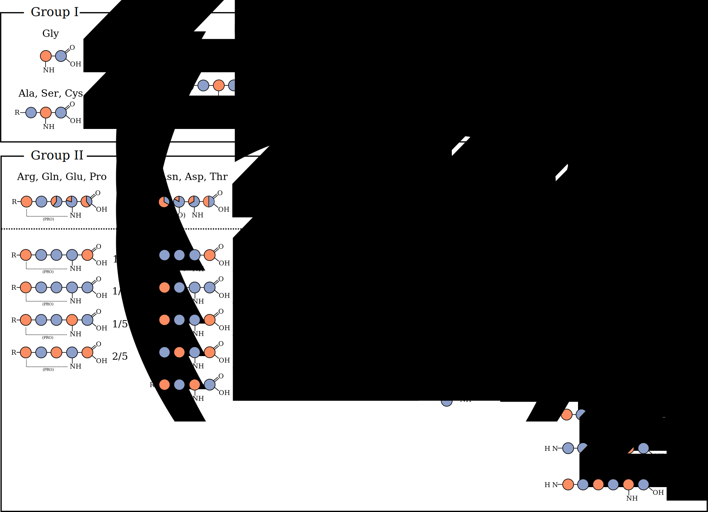

Assignment Using ^13^C-detected Spectra
=======================================

At moderate spinning rates and fully protonated samples it is not possible to detect protons in a useful manner in the solid state since the linewidths are very large due to the strong dipolar coupling network between protons. Therefor until very recently assignments where done almost exclusively using ^15^N and ^13^C chemical shifts. This was the method used when I joined the project.

## Types of Experiments

The three main types of spectra recorded were 2D trough-space ^13^C-^13^C and 2 and 3 dimensional NCACX and NCOCX spectra using the pulse sequence shown in figure {@fig:carbon_detected_pulse_sequences_and_magnetization_transfers}. Depending on the mixing time correlations between nuclei at different distances can be observed. To create spin-systems, mostly 2D ^13^C-^13^C and NCACX spectra with a short DARR mixing time of about 20 to 50 ms were used. When a longer mixing time is used, around 150 to 200 ms short range crosspeaks can be observed that help connecting spin systems sequentially. Also NCOCX spectra are used for this since they directly correlate a spin system i with its sequential i-1 neighbor through the backbone. The 13^C^-^13^C and through backbone ^15^N-resolved spectra are always used in combination since they both have their positive sites. The nice feature of the though-backbone experiments is that there is a sense of directionality. If two spin-systems are connected in these type of spectra one always knows which one is the first in the sequence, making mapping to a subsequence easier. Whereas when a connection between two spin systems is established in the purely through-space 2D ^13^C-^13^C experiments, it is not clear purely from the spectrum in what order they appear in the sequence. Of course even whether they are truly sequential should always be doubted. At the other side, in 2D ^13^C-^13^C corelations very specific crosspeaks between the less degenerate side chain resonances can be found. These type of cross-peaks are not present in the NCACX and NCOCX spectra because one of the ^13^C-dimensions encodes either the CA or the CO.

When performing a backbone walk using NCACX and NCOCX spectra, the ^15^N chemical shift is used as a pivot and therefor the usefulness of these spectra is highly dependent on the ^15^N chemical shift dispersion, which is not very large in general. There are other ^13^C-detected experiments possible that complement the NCACX and NCOCX, such as CANCO and CANcoCA, that prevent the ^15^N chemical shift from being the sole pivot [@schuetz_protocols_2010]. However these experiments are lower in signal to noise, because of a added NC cross polarization step. Because of this, we were never able to obtain satisfying spectra using these type of experiments.

![Pulse sequences and magnetization transfers in carbon detected experiments. A) Pulse sequence of 2D CC correlation using DARR. Phases are Φ0 = 0, Φ1 = 13, Φ2 = {0}*8 {2}*8, Φ3 = 1133, Φ4 = 1122 3300, Φaq = 2013 0231 0231 2013. B) Pulse sequence of NCACX and NCOCX. The sequences are identical. Only the specific CP condition is different between both experiments. Phases are Φ0 = 0, Φ1 = 1111  1111 3333 3333, Φ2 = {0}*16 {2}*16, Φ3 = 0202, Φ4 = 0022, Φ5 = 3333 1111, Φ6 = 1122, Φaq = 0231 2013 2013 0231 2013 0231 0231 2013. Both sequences are part of Trent Franks' pulse sequence repository at github.com/TrentFranks/ssNMR_pp_TopSpin2 as fmp.hCC_DARR and fmp.hNCC_DARR respectively. C) Magnetization transfers of 2D CC correlations. In spectra with a short mixing time (50 ms) only cross-peaks will arise that correlate two nuclei in the same residue. Using longer mixing times (200 ms)allows magnetization transfer to neighboring residues. If the mixing time is even increased (400 ms)long range correlations can be observed. D) Magnetization transfers demonstrating how a sequential walk can be performed using NCACX and NCOCX spectra.](figures/carbon_detected_pulse_sequences_and_magnetization_transfers.svg){#fig:carbon_detected_pulse_sequences_and_magnetization_transfers}

## Isotope Labeling Schemes
Both 2- and 3-dimensional ^13^C-detected spectra of uniformly ^13^C-^15^N labeled OmpG are very crowded, and therefor very hard to assign. See figure {@fig:uniform_cc_25ms}. Therefor a set of sparsely labeled samples was produced. The labeling schemes used for the ^13^-C detected experiments can basically be divided in three groups:

{#fig:uniform_cc_25ms}

1. Residue-specific: only a subset of the residues are ^15^N, ^13^C labeled but for these amino acids all carbon nuclei are labeled.
2. Uniform 1,3- or 2-glycerol: all residues are labeled with the patterns produced by feeding bacteria with glycerol labeled either on the 1st and 3rd position or just on the 2nd position [@lemaster_dynamical_1996] [@hong_determination_1999] [@castellani_structure_2002] [@higman_assigning_2009]. The labeling patterns produced in this fashion are shown in figure {@fig:glycerol_labeling}.
3. Residue-specific 1,3- or 2-glycerol: only a subset of the residues is labeled with the 1,3 or 2-glycerol labeling pattern.

To produce the first group of labeling schemes forward labeling is used. This conceptually the most straight-forward method and just means that a set of labeled amino acids is added to a otherwise unlabeled feedstock.

The third group of labeled samples is produced using reverse labeling. In this case E. Coli is grown on an isotopically labeled feedstock, here 1,3- or 2-glycerol, and all amino acids that should not be labeled are added in unlabeled to suppress the metabolism producing these amino acids from the feedstock. This technique was pioneered by Hong and Jakes and one of the labeling schemes used here, 2-SHLYGWAVF, is basically the same as the labeling scheme introduced by them [@hong_selective_1999].

The combinations of amino acids that can be labeled together is restricted by the amino acid metabolism. Since it is not possible to suppress the metabolic routes to and from a amino acid completely just by feeding them to the organism, some isotope leakage will always appear both in forward and reverse labeling. This effect is minimized by choosing sets of amino acids that are relatively closely related in the metabolism or were the production/use of this amino acid is easily suppressed.

To choose a set of amino acid selective labeling schemes a concession has to be made between two major conflicting interests. At the one hand the crowding in the resulting spectra should be reduced as much as possible. But at the other hand, as many as possible neighboring residues should be co-labeled in at least one of the labeling schemes. For example, as can be seen in figure {@fig:labelling_venn} alanine is co-labeled with every other amino acid (except for Lysine) in at least one of the labeling schemes. That means that there will almost always be one or more spectra were the cross peaks between a sequential stretch involving an alanine can be observed, thereby enabling the assignment of this stretch. At the other hand, for instance proline and tyrosine are not co-labeled in any of the residue specific labeling schemes, so therefor whenever there is a proline-tyrosine pair in the sequence, the more crowded non-residue specific labeled spectra have to be used to find the crosspeaks connecting them. As discussed earlier, it is preferable to be able to connect at least three spin systems to unambiguously assign them to a subsequence in the protein. By having a set of labeling schemes with a certain overlap as is indicated in the venn diagram of figure {@fig:labelling_venn} it is possible to jump between spectra to find the connectivities to produce such longer stretches of connected spin systems. In figure {@fig:labeling_schemes_on_ompg_sequence} the OmpG sequence were such stretches are hight-lighted. Whenever the color changes there is a 'dead end', where there is no residue specific labeling scheme to connect two neighboring residues. Taking all labeling schemes together, on average a given residue in the sequence is part of a sequential stretch of 5.5 residues connected though the schemes, which allows an unambiguous assignment in many cases.

{#fig:labelling_venn}

![All amino acid selective labeling schemes used for the sequential assignment of OmpG on the sequence. Highlighted rectangles indicate in which labeling schemes the residue is labeled. Colored (green, orange and purple) clusters of rectangles indicate that a sequential walk is possible without using the more crowded spectra of non-residue specific labeling schemes. A sequential walk is possible when two sequential residues are co-labeled in at least one labeling scheme. Grey rectangles indicate that the residue is not co-labeled with any of its two neighboring residues. The average cluster length is 3.0 and on average a given residue is part of a cluster of length 5.5.](figures/labelling_schemes_on_ompg_sequence.png){#fig:labeling_schemes_on_ompg_sequence}

### Forward labeled schemes

Both the forward labeling schemes, where mostly only a few amino acids are labeled and the 1,3- and 2-glycerol labeling schemes have pro's and cons. The big pro of the forward labeled samples is that the amino acids that are labeled are uniformly labeled. Or in the case of GAF~2,3~Y~2,3~(S) at least the nuclei giving rise to peaks in the aliphatic part of the spectra are. This is extremely useful for grouping resonances into spinsystems. This is especially true for the amino acids in group I in figure {@fig:glycerol_labeling}. Because there is only one isotopomer for both the samples based on 1,3- and 2-glycerol, the nuclei from both these worlds never 'meet' and is would not be possible to connect them into one spin system representing one residue in the sequence. Therefor it is necessary, in the case of large proteins, to have these residue specific but uniformly ^13^C labeled samples with as little as possible overlap of the intra-residual peaks of different amino acids. As will be discussed later, these spectra are really helpful when connecting data from ^1^H- and ^13^C-detected spectra as there is for most amino acids at least one spectrum where the Cα-Cβ crosspeaks are clearly separated.

#### RIGA(S)
This labeling scheme gave some very beautiful spectra which are really useful. In a uniformly labeled sample the isoleucine Cα-Cβ peaks are covered by phenylalanine and tyrosine and the arginine peaks would be covered by glutamine and glutamic acid.

#### GAF~2,3~Y~2,3~(S)
In this labeling scheme the phenylalanine and tyrosine where ^13^C-labeled only on the Cα and Cβ nuclei. This was done because their fast relaxing aromatic rings can act as a magnetization sink. And indeed the phenylalanine and tyrosine Cα-Cβ peaks are higher in intensity than in spectra of uniformly labeled samples and a lot better defined. Serine was not added labeled to the feedstock, but as it is metabolically closely related to glycine, it was labeled as well. This labeling strategy has been described in Hiller et al. 2008 [@hiller_2313clabeling_2008].

#### GAVLS(W)
The Cα, Cβ and CO of tryptophan are labeled as well because this part of the molecule is produced from serine. This actually turned out beneficial since the tryptophan Cα-Cβ peaks are seperated from the rest of the intra-residual peaks and in none of the other labeling schemes has tryptophan labeled in this way. The Leucine Cα-Cβ peaks are nicely resolved aswell, while they would overlap in a uniformly labeled sample with aspartic acid and asparagine peaks. Also the Cα-Cβ peaks of Valine are singled out in these spectra but this is a feature that is also present in the 2-glycerol labeled samples.

#### GANDSH
This labeling scheme the intra-residual peaks of asparagine and aspartic acid are well seperated from the other residues. In a uniform labeling scheme the Cα-Cβ peaks from these residues are partially overlapped with leucine, phenylalanine and tyrosine peaks. Also here the histidine cross-peaks are well resolved.

#### GAF~2,3~Y~2,3~SHVL
The nice feature of this labeling scheme is that because the aromatic rings of phenylalanine and tyrosine are not labeled, the only signals in the aromatic region of the spectrum are from histidines.

#### GENDQPASR

### 1,3- and 2-Glycerol Labeling

Apart from decreasing the amount of signals in the spectra, these labeling schemes also produce narrower linewidths because the in most cases directly bound carbon nuclei are not both labeled in the same isotopomer. This reduces the ^13^C-^13^C homonuclear dipolar coupling, which in turn causes lines to be narrower. In these spectra, a lot more long-range cross-peaks are observed and in general a larger amount of the expected cross-peaks between two sequential residues are visible, which is of course really important for assignments. Also they provide a lot of cross-peaks used later on to generate distance restraints. As indicated before, the downside of these samples is that they are not very good to generate spin systems because a lot of the intra-residual peaks are missing. But of course every disadvantage has its advantage. Because those peaks are not present, inter-residual cross-peaks that would otherwise be overlapped by them now become are resolved and can be used for sequential assignments. Another disadvantage is that they are not as practical in 3 dimensional NCACX and NCOCX spectra. To make a sequential walk it is really useful when the CO peak is present in the strip from the NCACX so that that the connecting strip in the NCOCX (at the ^15^N chemical shift of the following residue) can be easily found. In exactly the same way, when walking 'backwards' it is really useful when the NCOCX strip containts the Cα peak so the connecting NCACX strip can be found. However, these peaks are hardly ever present in the spectra of 1,3- and 2-glycerol labeled samples.

#### Uniform 1,3-glycerol labeling

#### Uniform 2-glycerol labeling

#### 2-TEMPQANDSG
The most remarkable feature of this labeling scheme in comparison to the uniform 2-glycerol labeling scheme is that in the region between 42 and 49 ppm there are basically no other chemical shifts than the glycine Cα shifts, see figure {@fig:2TEMPQANDSG_assigned}. In the uniform 2-glycerol labeled spectra this shift is overlapped by the shift of the leucine Cβ's and partially by the lysine Cε and arginine Cδ. Only the Cβ shifts of aspartic acid and asparagine is present in this region, which are only labeled in one third of the isotopomers. Therefor at least all large cross peaks in this region correlate glycine with one of the other labeled residues. This is a great feature since there are 27 glycines in OmpG. Knowing which spin systems potentially neighbor a glycine is very useful information. In general glycine is the most frequently occurring amino acid in membrane integrated β-barrels and the third most frequently occurring amino acid in membrane spanning α-helices [@ulmschneider_amino_2001]. This could make this labeling scheme very appropriate for the assignment of other large membrane proteins.

There are only four clusters of intra-residual peaks in this spectrum belonging to proline Cα-Cδ, proline Cβ-Cδ, methionine Cα-Cγ and Threonine Cα-Cγ2, leaving a lot of space for inter-residual cross peaks. Removing a lot of the Cα resonances compared to the uniformly 2-glycerol labeled sample renders the Cα-Cα region of the spectrum a lot less crowded and easier to interpret.

{#fig:2TEMPQANDSG_assigned}

#### 1,3-TEMPQANDSG

Like the 2-TEMPQANDSG labeling scheme, 1,3-TEMPQANDSG does not reduce the crowding of intra-residual peaks much in comparison to the uniformly 1,3-glycerol labeled sample. However, the inter-residual peaks are a lot easier to interpret because of the reduced chemical shift degeneracy in the spectrum. For instance in the methyl region around 20 ppm a lot of well dispersed cross peaks are present.  {@tbl:removed_shifts_13TEMPQANDSG}

| region               | removed                                   | left                                                      |
|----------------------|-------------------------------------------|-----------------------------------------------------------|
| +/- 20 ppm           | LeuCδ, ValCγ, IleCγ/Cδ                    | AlaCβ, ThrCγ2, MetCε                                      |
| 25 - 35 ppm          | LysCβ/Cγ, ArgCβ/Cγ, TrpCβ, IleCγ1, HisCβ  | ProCβ/Cγ, MetCβ/Cγ, GluCβ/Cγ, GlnCβ/Cγ                    |
| 35 - 45 ppm          | PheCβ, TyrCβ, LysCε                       | AsnCβ, AspCβ                                              |
| > 50 ppm             | LysCα, LeuCα, IleCα, ArgCα                | ThrCα/Cβ, MetCα, GluCα, GlnCα, AspCα, AsnCα, ProCα, SerCβ |

Table: Shifts being removed in the 1,3-TEMPQANDSG labeling scheme compared to a uniformly 1,3-glycerol labeled sample for different regions of the spectrum.{#tbl:removed_shifts_13TEMPQANDSG}

#### 2-SHLYGWAFV
As said before this labeling pattern is similar to the pattern described by Hong and Jakes as TEASE (**te**n **a**mino acid **s**elective and **e**xtensive labeling), where the tenth amino acid is cyteine, which is not present in OmpG. The labeled amino acids are those that are not produced in the citric acid cycle, see figure {@fig:glycerol_metabolism}. All the amino acids in this labeling scheme belong to group I in figure {@fig:glycerol_labeling} for which there is only one isotopomer per residue. In theory the only intra-residual peaks are the leucine Cβ-Cγ and valine Cα-Cβ cross-peaks. It is however clear that there is labeled threonine, glutamine and glutamic acid present in this sample as well.

#### 1,3-SHLYGWAFV
This sample did not turn out very well and therefor no good judgment can be made about its added value.

#### 1,3-MKINDT

{#fig:glycerol_metabolism}

{#fig:glycerol_labeling}

## A CCPNMR Plug-in for the visualization of crosspeak patterns

When using a lot of labeling schemes it can be very useful to visualize the cross-peak patterns that are expected, especially for the case of the glycerol based labeling schemes. Although it is not impossible to infer these patterns directly from the diagrams of the isotopomer schemes it is easier to directly look at the expected peak patterns as this directly combines the co-labeling of nuclei with their expected chemical shifts. The supporting material of the paper of Higman et al. 2009 contains such figures for the 1,3- and 2-glycerol labeling schemes [@higman_assigning_2009]. Inspired on these type of diagrams I wrote a plug-in for CCPNMR Analysis to automatically generate the expected cross-peak pattern in 2D ^13^C-^13^C correlations for any labeling scheme, see figure {@fig:labeling_patterns_plugin}. Integrating these kind of diagrams within the Analysis software has some advantages:

1. Not only intra-residual, but also expected inter-residual crosspeak patterns can be shown for any combination of two residues. This would be hard on paper since it would involve a lot of figures.
2. The location of expected peaks can be based on assigned chemical shifts, if present. If not present average values from the refDB, which is a carefully re-referenced subset of the bmrb are used [@zhang_refdb_2003].Hovering the mouse over the diagram will make the cross-hairs move in the spectra, so the actual peaks can be found. It will also show which peak dimensions are based on assigned chemical shifts and which are based on average shifts.
3. The assignment status of peaks in a spectrum is indicated by dark/light coloring.

Especially the last feature is really helpful as it gives a quick overview of which peaks in a pattern are assigned and which are not. It is hard to get this type of overview just by looking at the spectra or in peak tables. The two selected residues do not have to be sequential and therefor this plug-in can in principle also be used to visualize and find long-range cross-peaks between any two residues.
Also the expected peaks for the whole spectrum can be shown at once, which can be handy when considering which labeled samples to produce in the future.

CCPNMR Analysis has great support for configuring custom labeling schemes. For each amino acid a set of isotopomers can be configured. Also a labeled sample can be created based on these labeling schemes. This labeled sample can in turn be connected to an experiment. All necessary information about the labeling schemes is directly taken from the project and therefor basically any scheme can be visualized using this plug-in. All other information, like residue sequences and assigned chemical shifts are also pulled directly from the project.

The plug-in can be downloaded from <https://github.com/jorenretel/ccpnmr-cc-patterns> and is easy to install.

{#fig:labeling_patterns_plugin}

