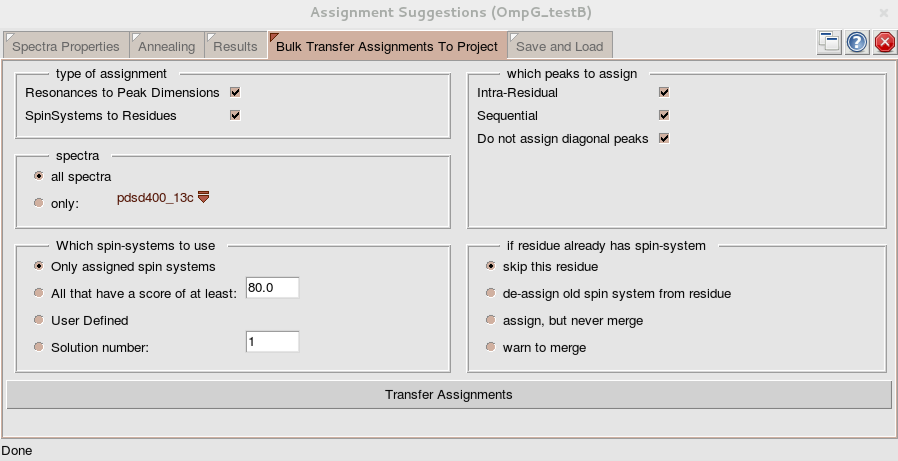

Chapter 2
=======

some markdown here.

another figure:

and another citation.

Some tabe with chemical shifts:

| NUM | RES | H      | N        | C        | CA      | CB      |
|-----|-----|--------|----------|----------|---------|---------|
| 11  | I   | ?      | ?        |          | 59.5714 | 43.3235 |
| 12  | G   | 7.8237 | 110.2885 | 170.4074 | 47.019  | -       |
| 13  | A   | 8.5316 | 116.5981 | 176.0558 | 51.0275 | 24.0505 |
| 36  | Y   | ?      | ?        |          | 56.9905 | 42.2332 |
| 37  | F   | 9.1957 | 118.7215 | 174.4956 | 56.4493 | 45.1258 |
| 38  | N   | 9.3731 | 122.0408 | 172.093  | 53.062  | 42.7003 |
| 39  | A   | 9.1099 | 120.3996 | 175.358  | 51.0839 | 25.0486 |
| 40  | A   | 9.0187 | 123.5415 | 175.9691 | 51.1878 | 23.8952 |
| 41  | N   | 8.1035 | 118.3551 |          | 53.1362 | 38.9827 |
| 42  | G   | 8.895  | 116.8016 | 174.1619 | 45.3641 | -       |
| 43  | P   | -      | -        | 176.4319 | 63.6556 | 32.3854 |
| 44  | W   | 8.0269 | 122.5419 | 177.6204 | 57.6832 | 33.3977 |
| 45  | R   | 9.2478 | 121.7002 | 174.9783 | 56.5096 | 34.692  |
| 46  | I   | 9.7707 | 127.0504 | 173.6002 | 60.9113 | 42.1424 |
| 47  | A   | 9.5816 | 128.8814 | 175.4979 | 51.6386 | 23.9558 |
| 48  | L   | 9.5963 | 122.7545 | 176.5513 | 54.3227 | 46.9105 |
| 49  | A   | 9.2088 | 122.6752 | 175.4522 | 52.2887 | 24.4044 |
| 50  | Y   | 9.0742 | 118.342  | 172.0701 | 60.0655 | 42.1528 |
| 51  | Y   | 6.126  | 128.1575 |          | 55.4226 | 43.3702 |
| 73  | E   | 9.6753 | 121.9648 |          | 55.363  | 34.731  |

