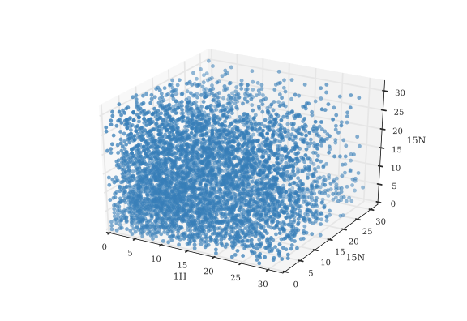

Assignment Using ^1^H-detected Spectra
======================================

Recently the use of higher MAS rates of around 60 kHz, and even higher have become technically achievable. In combination with samples that are expressed in fully deuterated medium and where the exchangeable sides are subsequently back-exchanged with a chosen percentage of protons, this allows protons to be detected. This opens up the possibility to do NMR experiments that are conceptually very comparable to solution NMR experiments.

![Overlay of HN correlations in solid state NMR (red), and solution NMR (black). The solid state spectrum is recorded using the cross-polarization based pulse sequence as described ..... The solution spectrum is a modified copy of the second figure in the paper of Lukas K. Tamm and coworkers describing the solution structure of OmpG. [@liang_structure_2007] The solution spectrum was recorded using a TROSY-HSQC sequence. Besides the obvious difference in line-width between the two spectra, there are also peaks present in the solution spectrum that are absent in the solid state spectrum. These peaks correspond mostly to the flexible loops on the extra-cellular side of OmpG and some to the shorter turns on the intra-cellular side.](figures/HN_solid_solution.png)

![Proton detected pulse sequences for assignment. Phase cycle: (a and d) ph0 = 0, φ1 = 0 2, φ2 = 1, φ5 = 0, φ6 = 0 0 2 2, φ7 = 1, φ11 = 1 1 1 1 3 3 3 3, φ10 = 0, φ15 = 0, φ17 = 0, φ19 = 0, φ20 = 1, φrec = 1 3 3 1 3 1 1 3; (b and e) φ0 = 0, φ1 = 1 3, φ2 = 1 1 3 3, φ3 = 0, φ4 = 1, φ5 = 1, φ6 = 0, φ7 = {1}*4 {3}*4, φ8 = {0}*8 {2}*8, φ9 = 3, φ10= 1, φ11= 0, φ12= 0, φ20= 0, φrec= 0 2 2 0 2 0 0 2 2 0 0 2 0 2 2 0; (c) φ0 = 0, φ1  = 0 2, φ20 = 1, φ15 = 0, φ10 = 0, φ2 =  1, φ5 =  0, φ6 =  0 0 2 2, φ14 = {0}*4 {1}*4, φ16 = 0, φ17 = {0}*8 {1}*8, φ19 = 0, φ7 = 1, φ11 = 1 1 1 1, φ31 =  3 1 1 3 1 3 3 1 1 3 3 1 3 1 1 3; (f) φ0 = 0, φ1 = 1 3, φ2 = 1 1 3 3, φ3 = 0, φ4 = 1, φ5 = 1, φ6 = 0, φ8 = {0}*16 {2}*16, φ9 = 3, φ10= 1, φ11= 0, φ12= 0, φ20= 0, φ16 = 3, φ18=0, φ17= {0}*4 {1}*4, φ19 = 0, φ14= {0}*8 {1}*8, φ27 = 0, φrec= 0 2 2 0 2 0 0 2 2 0 0 2 0 2 2 0 2 0 0 2 0 2 2 0 0 2 2 0 2 0 0 2.](figures/assignment_experiments_proton_detected.svg)

