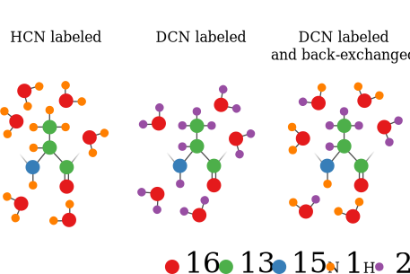
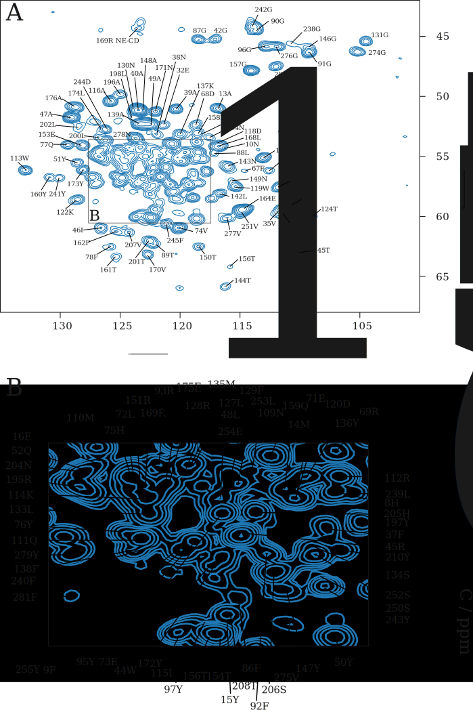

Assignment Using ^1^H-detected Spectra
======================================

## Introduction

Recently the use of higher MAS rates of around 60 kHz, and even higher have become technically achievable. In combination with samples that are expressed in fully deuterated medium and where the exchangeable sides are subsequently back-exchanged with a chosen percentage of protons (see figure {@fig:deuteration}), this allows protons to be detected. This opens up the possibility to do NMR experiments that are conceptually very comparable to solution NMR experiments. [@barbet-massin_outandback_2013] [@barbet-massin_rapid_2014]

{#fig:deuteration}

## Sequential assignment of OmpG using ^1^H detected spectra

In comparison to ^13^C-detected experiments the signal set can be spread over a third independent dimension which increases the resolution in the spectra drastically. Also the general approach towards assignment is simplified. As discussed before, in the 3 dimensional ^13^C detected experiments NCACX and NCOCX, the pivot along which a strip representing one spin system is connected to its sequential neighbor is the backbone ^15^N chemical shift. In the set of ^1^H-detected experiments used for assignment, this pivot is dispersed by the chemical shift of its directly bound proton. There is still a lot of overlap in the ^1^H-^15^N correlation compared to a similar spectrum in solution NMR (see figure {@fig:HN_solid_solution}). However, in the 3 dimensional spectra it is easier to distinguish individual ^1^H-^15^N pairs, simply because the peaks mostly do not overlap in the ^13^C dimension, thereby making it possible to see the exact peak maxima.

Two sets of three experiments were recorded illustrated in figure {@fig:assignment_experiments_proton_detected}. The first set, consisting of the hCANH, hCOcaNH and hcaCBcaNH, correlates each ^1^H-^15^N pair respectively to the Cα, CO and Cβ frequencies within the same residue. The second set correlates the ^1^H-^15^N pairs to the Cα, CO and Cβ frequencies of the preceeding residue. By subsequently matching strips at ^1^H-^15^N positions were the ^13^C chemical shifts from the first set match the second set a sequential walk can be generated and matched to a part of the sequence, see figure {#fig:strip_plots_37_52_B}.

This set of spectra is conceptually similar to the basic set of spectra used for the assignement of solution NMR data although there are a few differences. Because in solution NMR the ^15^N-^13^C transfer is achieved by INEPT instead of cross-polarization and the N-Cα~i~ and N-Cα~i-1~ scalar coupling are similar in size, the HNCA experiment in solution NMR normally includes both the Cα~i~ and Cα~i-1~ peak. In the solid-state version of the experiment the hCANH only includes the Cα~i~ peak, which is advantaguous since this reduces signal overlap. Also in solution NMR the Cα-Cβ scalar transfer is generally evolved only half-way to create an HNCA/CB experiment were the Cβ peaks are negative. This is also possible in solid-state and this experiment was actually performed on OmpG. However, the Cβ peaks were higher in signal to noise when the Cα-Cβ transfer was evolved fully.

![Overlay of HN correlations in solid state NMR (red), and solution NMR (black). The solid state spectrum is recorded using the cross-polarization based pulse sequence as described ..... The solution spectrum is a modified copy of the second figure in the paper of Lukas K. Tamm and coworkers describing the solution structure of OmpG. [@liang_structure_2007] The solution spectrum was recorded using a TROSY-HSQC sequence. Besides the obvious difference in line-width between the two spectra, there are also peaks present in the solution spectrum that are absent in the solid state spectrum. These peaks correspond mostly to the flexible loops on the extra-cellular side of OmpG and some to the shorter turns on the intra-cellular side.](figures/HN_solid_solution.png){#fig:HN_solid_solution}

![Proton detected pulse sequences for assignment. Phase cycle: (a and d) ph0 = 0, φ1 = 0 2, φ2 = 1, φ5 = 0, φ6 = 0 0 2 2, φ7 = 1, φ11 = 1 1 1 1 3 3 3 3, φ10 = 0, φ15 = 0, φ17 = 0, φ19 = 0, φ20 = 1, φrec = 1 3 3 1 3 1 1 3; (b and e) φ0 = 0, φ1 = 1 3, φ2 = 1 1 3 3, φ3 = 0, φ4 = 1, φ5 = 1, φ6 = 0, φ7 = {1}*4 {3}*4, φ8 = {0}*8 {2}*8, φ9 = 3, φ10= 1, φ11= 0, φ12= 0, φ20= 0, φrec= 0 2 2 0 2 0 0 2 2 0 0 2 0 2 2 0; (c) φ0 = 0, φ1  = 0 2, φ20 = 1, φ15 = 0, φ10 = 0, φ2 =  1, φ5 =  0, φ6 =  0 0 2 2, φ14 = {0}*4 {1}*4, φ16 = 0, φ17 = {0}*8 {1}*8, φ19 = 0, φ7 = 1, φ11 = 1 1 1 1, φ31 =  3 1 1 3 1 3 3 1 1 3 3 1 3 1 1 3; (f) φ0 = 0, φ1 = 1 3, φ2 = 1 1 3 3, φ3 = 0, φ4 = 1, φ5 = 1, φ6 = 0, φ8 = {0}*16 {2}*16, φ9 = 3, φ10= 1, φ11= 0, φ12= 0, φ20= 0, φ16 = 3, φ18=0, φ17= {0}*4 {1}*4, φ19 = 0, φ14= {0}*8 {1}*8, φ27 = 0, φrec= 0 2 2 0 2 0 0 2 2 0 0 2 0 2 2 0 2 0 0 2 0 2 2 0 0 2 2 0 2 0 0 2.](figures/assignment_experiments_proton_detected.svg){#fig:assignment_experiments_proton_detected}

![Strip plots showing the backbone walk from phenyl-alanine 37 to Glutamine 52. Residue 42 is a proline, and therefor this strip is not present. The correlations to the carbon nuclei can be observed in the strip of tryptophan 44. Notice how the signal intensities, especially of the peaks in the longer experiments like the hcaCBcacoNH drop of towards the end of this sequential stretch and eventually even completely disappear in the strip of Glutamic acid 52, which is the last assigned residue on this strand of the β-sheet.](figures/strip_plots_37_52_B.svg){#fig:strip_plots_37_52_B}

Almost all observed strips present in the spectra were sequentially assigned. This is shown by the relatively complete assignment of the peaks in ^13^C-^15^N projection of the hCANH spectrum shown in {@fig:CAN_projection}. There is slightly more dispersion in this projection than in the ^1^H⁻^15^N correlation spectrum and therefor it is easier to use this projection as a reference for orientation and to track the status of the sequential assignment.

{#fig:CAN_projection}

TODO: table with T2 times
TODO: figure of signal intensities over sequence.
