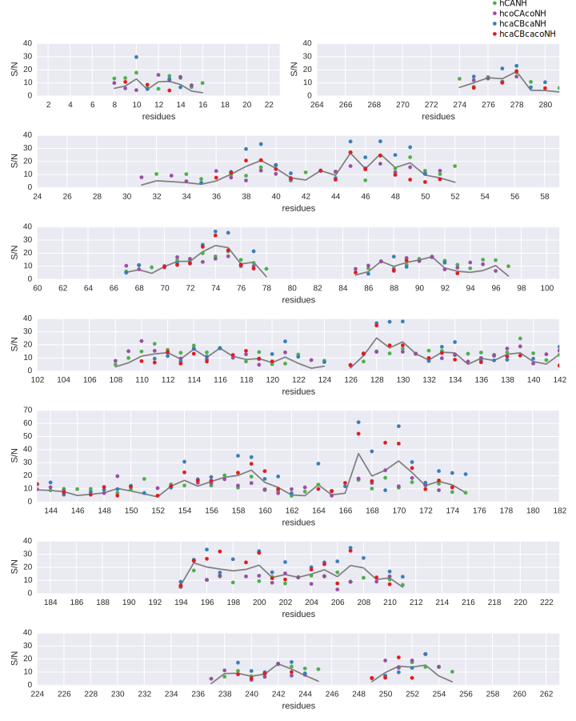

Assignment Using ^1^H-detected Spectra
======================================

## Introduction

There are good reasons to detect proton. Since the gyromagnetic ratio of protons is 8 and 31 times higher as those of ^13^C and ^15^N respectively, the signal to noise in proton detection is higher. Also adding an observable nucleus adds dispersion in multi-dimensional spectra. That proton detection was badly needed was clear since applications of solid state on biological samples became into reach. There are two main strategies that can be employed to reduce the ^1^H linewidths:

1. Reduce the amount of ^1^H in the sample by perdeuterating the sample and subsequently reintroduce protons at the exchangeable sites, see figure {@fig:deuteration}.
2. Spin small diameter rotors (<2 mm) at higher MAS frequencies (>40 kHz).

Early proton-detected experiments were performed on dipeptides and small model proteins using the first method [@reif_1h1h_2001][@reif_1h_2003][@chevelkov_1h_2003][@paulson_sensitive_2003]. It was shown that by drastically reducing the amount of back-exchanged protons from 100% to 10% ^15^N-^1^H correlation spectra of the model protein SH3 could be acquired with ultra-high resolution [@chevelkov_ultrahigh_2006]. Also proton detect experiments that allowed the assignment and, in combination with protonated methyls, the structure calculation of SH3 could be performed under these low back-exchange levels (10 and 25% respectively) and moderate MAS rates [@linser_protondetected_2008][@linser_structure_2011]. The optimal amount of reprotonation at 24kHz MAS was found to be around 30% [@akbey_optimum_2009]. A first ^15^N-^1^H correlation of OmpG was measured at this back-exchange level [@linser_protondetected_2011].

Recently probes spinning small diameter rotors at ultra-fast MAS rates (40-60kHz) have become available. At these high spinning rates high resolution spectra can be recorded with full reprotonation of the exchangeable sites [@zhou_protondetected_2007][@lewandowski_enhanced_2011]. Although the sample volume in these rotors is smaller, loss of signal to noise is balanced by a few factors. First of all, the higher proton content of course increases the signal to noise. Second the improved filling factor of the coils for smaller rotors plays a role. Furthermore, at ultra-fast spinning conditions spectroscopic techniques have been developed that can not be employed at lower MAS frequencies. Low power hetero-nuclear decoupling can be used, which reduces sample heating [@ernst_lowpower_2001][@kotecha_efficient_2007][@laage_fast_2009]. Also ^1^H-^13^C cross-polarization conditions become available that selectively transfer magnetization to either the carbonyl or aliphatic carbons at these spinning rates [@laage_bandselective_2008].

{#fig:deuteration}

Various groups have introduced proton detected experiments for sequential assignments at ultra-fast MAS and have successfully applied them to a number of different systems: micro-crystalline (SH3, GB1, Human Superoxide Dismutase, DsbA and β2m), α-synuclein fibrils, sedimented viral capsids, a secretion needle from salmonella and membrane proteins (the conductance domain from influenza A M2, and DsbB) [@zhou_solidstate_2007][@knight_fast_2011][@barbet-massin_rapid_2014][@zhou_solidstate_2012][@chevelkov_protondetected_2014]. Also structures have been calculated using ^1^H-^1^H distances acquired at fast MAS, among which GB1 and Human Superoxide Dismutase  [@zhou_solidstate_2007][@knight_fast_2011][@knight_structure_2012].
TODO: it does not seem like there is many more. DsbA restraints were in zhou 2012 paper, but no real structure yet.

For the assignment of OmpG two sets of three experiments were recorded illustrated in figure {@fig:assignment_experiments_proton_detected} at 60 kHz MAS. These are the pulse sequences presented in the papers of Barbet-Massin et al. in 2013 and 2014 [@barbet-massin_outandback_2013][@barbet-massin_rapid_2014]. The first set, consisting of the hCANH, hCOcaNH and hcaCBcaNH, correlates each ^1^H-^15^N pair in the backbone to respectively the Cα, CO and Cβ frequencies within the same residue. The second set correlates the ^1^H-^15^N pairs to the Cα, CO and Cβ frequencies of the preceding residue. By subsequently matching strips at ^1^H-^15^N positions were the ^13^C chemical shifts from the first set match the second set a sequential walk can be generated and matched to a part of the sequence.

The hcoCAcoNH, hCOcaNH, hcaCBcaNH and hcaCBcacoNH pulse sequences make use of scalar-coupling based transfer steps to transfer magnetization between the carbons. These transfer blocks are basically equivalent to INEPT except that the magnetization is transferred between two nuclei of the same type. To evolve the scalar coupling relatively long delays τ  of 1/(4J~CC~) are needed. This equals 4.5 ms for a Cα-CO and 7.1 ms for a Cβ-Cα transfer (with J~CαCO~=55Hz and J~CαCβ~=35Hz). For the transfer of magnetization between the CO and Cα in the hcoCAcoNH and the Cα and Cβ in the hcaCBcaNH and hcaCBcacoNH experiments out-and-back schemes are used [@barbet-massin_outandback_2013]. This means that instead of using a CP transfer directly from proton to the carbon measured in one of the indirect dimensions (which would be the case in hCAcoNH, hCBcaNH and hCBcacoNH experiments), the magnetization is transfered first to the neighboring carbon on the magnetization transfer pathway. Both in the out-and-back and 'normal' variant of the experiment contain 4 delays τ. The advantage of the out and back scheme is that the transverse magnetization during these delays is on the slower relaxing nucleus (Cα in case of a Cα-Cβ transfer and CO in case of a Cα-CO transfer) instead of on each nucleus for 2 out of 4 delays. Because of the inhomogeneous nature of the sample ^13^C T2 times are very short in OmpG. The bulk T2 time for Cα was measured to be around 8 ms. The CO T2 was not measured but is likely to be a factor of 3-4 larger. Therefor this experimental scheme helped making these experiments sensitive enough.

![Proton detected pulse sequences for assignment. Phase cycle: (a and d) ph0 = 0, φ1 = 0 2, φ2 = 1, φ5 = 0, φ6 = 0 0 2 2, φ7 = 1, φ11 = 1 1 1 1 3 3 3 3, φ10 = 0, φ15 = 0, φ17 = 0, φ19 = 0, φ20 = 1, φrec = 1 3 3 1 3 1 1 3; (b and e) φ0 = 0, φ1 = 1 3, φ2 = 1 1 3 3, φ3 = 0, φ4 = 1, φ5 = 1, φ6 = 0, φ7 = {1}*4 {3}*4, φ8 = {0}*8 {2}*8, φ9 = 3, φ10= 1, φ11= 0, φ12= 0, φ20= 0, φrec= 0 2 2 0 2 0 0 2 2 0 0 2 0 2 2 0; (c) φ0 = 0, φ1  = 0 2, φ20 = 1, φ15 = 0, φ10 = 0, φ2 =  1, φ5 =  0, φ6 =  0 0 2 2, φ14 = {0}*4 {1}*4, φ16 = 0, φ17 = {0}*8 {1}*8, φ19 = 0, φ7 = 1, φ11 = 1 1 1 1, φ31 =  3 1 1 3 1 3 3 1 1 3 3 1 3 1 1 3; (f) φ0 = 0, φ1 = 1 3, φ2 = 1 1 3 3, φ3 = 0, φ4 = 1, φ5 = 1, φ6 = 0, φ8 = {0}*16 {2}*16, φ9 = 3, φ10= 1, φ11= 0, φ12= 0, φ20= 0, φ16 = 3, φ18=0, φ17= {0}*4 {1}*4, φ19 = 0, φ14= {0}*8 {1}*8, φ27 = 0, φrec= 0 2 2 0 2 0 0 2 2 0 0 2 0 2 2 0 2 0 0 2 0 2 2 0 0 2 2 0 2 0 0 2.](figures/assignment_experiments_proton_detected.svg){#fig:assignment_experiments_proton_detected}

This set of spectra is conceptually very similar to the basic set of spectra used for the assignment of solution NMR data although there are a few differences. Because in solution NMR the ^15^N-^13^C transfer is achieved by INEPT instead of CP and the N-Cα~i~ and N-Cα~i-1~ scalar couplings are similar in size, the HNCA experiment in solution NMR normally includes both the Cα~i~ and Cα~i-1~ peak. In the solid-state version of the experiment the hCANH only includes the Cα~i~ peak, which is advantageous since this reduces signal overlap. Also in solution NMR the Cα-Cβ scalar transfer is generally evolved only half-way to create an HNCA/CB experiment were the Cβ peaks are negative.

In comparison to ^13^C-detected experiments, the assignment strategy is enormously simplified. As discussed before, in the 3-dimensional ^13^C detected experiments NCACX and NCOCX, the pivot along which a strip representing one spin system is connected to its sequential neighbor is the backbone ^15^N chemical shift. In the set of ^1^H-detected experiments, this pivot is dispersed by the chemical shift of its directly bound proton. Therefor it is in most cases clear which 6 peaks belong to one ^1^H-^15^N combination. At this point, already before any strips have been matched, the possible amino acid types of two correlated residues can be deduced. In the ^13^C-detected experiments it would take the matching of 3 consecutive strips to do the same. When walking 'forward' starting at a strip in the NCACX, a strip from the NCOCX with matching peaks has to be found based on the CO chemical shift that is known from the NCACX strip. Now the newly determined ^15^N chemical shift has to be used to find a second NCACX strip. When just looking at the ^15^N dimension in the ^1^H-^15^N correlation, figure {@fig:HN_solid_solution}, one can see how hard that is.

## Materials and methods

### Sample preparation

Samples were prepared in the same way as described before with a few exceptions [@hiller_solidstate_2005]. The M9 minimal medium was perdeuterated. For the samples used to record the hCANH and hcoCAcoNH shown here the refolding buffer contained a mixture of 70:30 H~2~O:D~2~O. Reconstitution in lipid bilayers of this last sample was performed in buffer containing H~2~O. After reconstitution the samples were pelleted and incubated in a MES buffer with pH 6.3. In the case of the hCANH and hcoCAcoNH samples this buffer contained a mixture of 70:30 H~2~O:D~2~O.

### NMR experiments

| experiment  | ^13^C aq (ms) | ^15^N aq (ms) | scans | duration |
|-------------|---------------|---------------|-------|----------|
| hCANH       | 8.6           | 14.4          | 12    | 1d15h    |
| hcoCAcoNH   | 6.6           | 14.4          | 36    | 3d18h    |
| hcaCBcaNH   | 3.0           | 5.4           | 64    | 2d20h    |
| hcaCBcacoNH | 3.0           | 5.4           | 128   | 5d23h    |
| hCONH       | 10.0          | 14.0          | 8     | 16h      |
| hCOcaNH     | 10.0          | 9.8           | 64    | 3d15h    |

Table: Aquisition parameters for the six ^1^H-detected experiments used for the assignment of OmpG.{#tbl:proton_detected_aquisition_times}

## Results and discussion

There is still a lot of overlap in the ^1^H-^15^N correlation compared to a similar spectrum in solution NMR (see figure {@fig:HN_solid_solution}). However, in the 3 dimensional spectra it is easier to distinguish individual ^1^H-^15^N pairs, simply because the peaks mostly do not overlap in the ^13^C dimension, thereby making it possible to see the exact peak maxima.

, see figure {@fig:strip_plots_37_52_B}.

![Overlay of HN correlations in solid state NMR (red), and solution NMR (black). The solid state spectrum is recorded using the cross-polarization based pulse sequence as described ..... The solution spectrum is a modified copy of the second figure in the paper of Lukas K. Tamm and coworkers describing the solution structure of OmpG. [@liang_structure_2007] The solution spectrum was recorded using a TROSY-HSQC sequence. Besides the obvious difference in line-width between the two spectra, there are also peaks present in the solution spectrum that are absent in the solid state spectrum. These peaks correspond mostly to the flexible loops on the extra-cellular side of OmpG and some to the shorter turns on the intra-cellular side.](figures/HN_solid_solution.png){#fig:HN_solid_solution}

![Strip plots showing the backbone walk from phenyl-alanine 37 to Glutamine 52. Residue 42 is a proline, and therefor this strip is not present. The correlations to the carbon nuclei can be observed in the strip of tryptophan 44. Notice how the signal intensities, especially of the peaks in the longer experiments like the hcaCBcacoNH drop of towards the end of this sequential stretch and eventually even completely disappear in the strip of Glutamic acid 52, which is the last assigned residue on this strand of the β-sheet.](figures/strip_plots_37_52_B.svg){#fig:strip_plots_37_52_B}

Almost all observed strips present in the spectra were sequentially assigned. This is shown by the relatively complete assignment of the peaks in ^13^C-^15^N projection of the hCANH spectrum shown in {@fig:CAN_projection}. There is slightly more dispersion in this projection than in the ^1^H⁻^15^N correlation spectrum and therefor it is easier to use this projection as a reference for orientation and to track the status of the sequential assignment.

{#fig:CAN_projection}

{#fig:peak_intensities_on_sequence.svg}

