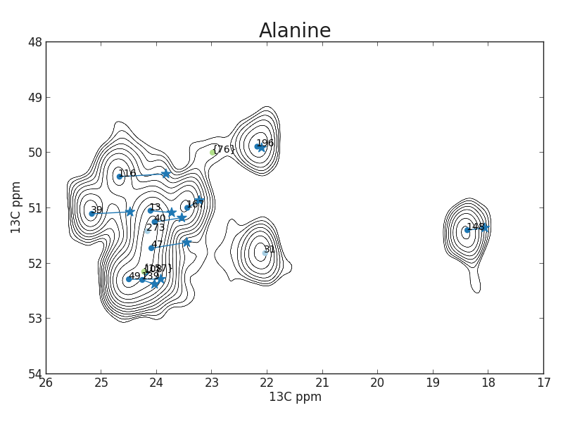
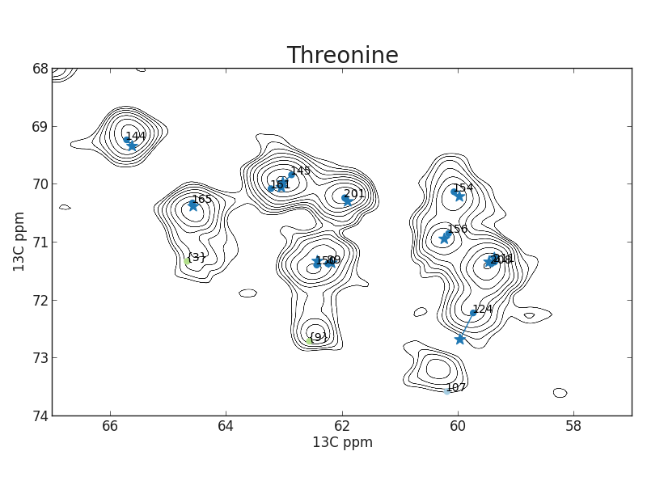
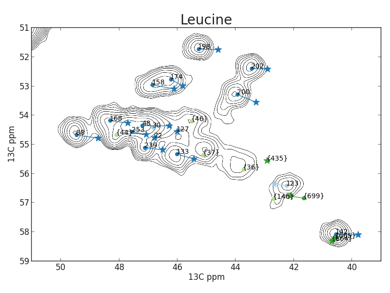

Connecting Carbon and Proton Detected Assignments
=================================================

The most straight-forward approach to sequential assignment would be to first finish the backbone and Cβ chemical shift assignment using the ^1^H detected strip matching approach described earlier, and afterwards find the ^13^C side-chain chemical shifts using ^13^C-detected spectra. However, it is very handy to already connect spin systems that are made in the proton and carbon detected data during the sequential assignment process, if possible. The ^13^C chemical shifts found in the ^1^H detected spectra can easily be used to find the Cα-Cβ cross peak 2D ^13^C-^13^C correlation spectra. If there is enough dispersion in the ^13^C-^13^C spectrum the peak can be easily found and from there the rest of the ^13^C chemical shifts of the side-chain. Having found side chain chemical shifts makes residue typing a lot more exclusive. Thereby mapping a series of otherwise ambiguous strips to a stretch in the sequence becomes possible. Also, sequential cross peaks in the ^13^C-^13^C correlation can reinforce the certainty that two strips really fit together sequentially.

A very similar approach is taken in solution NMR when TOCSY spectra are used to find the side-chain ^1^H chemical shifts. Often this happens after the entire back-bone has already been assigned, it can however also aid the assignment process itself by facilitating residue typing.

## Isotope Shift

Because ^13^C detected and ^1^H detected spectra are typically recorded using different samples (fully protonated and deuterated/back-exchanged respectively) the ^13^C chemical shifts can be shifted by up to a full ppm. Therefor a correction for this deuterium isotope shift has to be performed. This deuterium shift has been described before and quantified by solution NMR spectroscopists [@hansen_isotope_1988][@venters_characterizing_1996][@maltsev_deuterium_2012]. The magnitude of the shift can be approximated by the following equation:

$$\Delta C(D) =  ^{1}\Delta C(D)d _{1} + ^{2}\Delta C(D)d _{2} + ^{3}\Delta C(D)d _{3}$$ {#eq:isotope_shift}

Here *d~1~*, *d~2~* and *d~3~* are the amount of deuterons one, two and three bonds away from the carbon nucleus of interest. For all amino acid types, except Glycine, more deuterons are surrounding the Cβ than the Cα and therefor the Cβ shifts are more affected. Both *Venters et al.* and *Maltsev et al* determined the factors ^i^ΔC(D) experimentally, but got different values [@venters_characterizing_1996][@maltsev_deuterium_2012]. As argued by *Maltsev et al.* this is just a estimate, as the real values also heavily depend on the local structure. Indeed the study of *Maltsev et al.* used α-synuclein, which is an intrinsically disordered protein where *Venters et al.* used human carbonic anhydrase I, which is mostly β-sheet with some small α-helices.

Anyway, the values found by these studies can be used to be in the right ball park and will in most cases be good enough to connect the resonances in proton and carbon detected spectra. A more exact calculation of the isotope shift does not seem possible for now and if possible in the future it will most probably involve at least secondary structure information like φ and χ angles, which are most likely not known at the stage of sequential assignment.

## Strategy for combining spin systems

Having residue specifically labeled samples will ease this process of matching Cα and Cβ chemical shifts in protonated and deuterated samples enormously since there is a lot less overlap of in the Cα-Cβ regions of these spectra. Because of the many labeling schemes that were produced, there is for nearly every residue type a spectrum in which the Cα-Cβ is well resolved, see {@tbl:preferred_samples}. Whether it is easier to first sequentially assign a strip in the ^1^H detected data to a residue and then find its ^13^C detected counterpart or the other way around completely depends on the situation. If the Cα-Cβ combination is very unique, i.e. corresponding to an uncrowded part of the uniformly labeled 2D ^13^C-^13^C correlation, it is of course easier to find the corresponding spin system in the ^13^C-detected data first since the improved residue typing decreases the amount of options for the sequential assignment.

However, if the Cα-Cβ combination corresponds to a very crowded area of the 2D ^13^C-^13^C correlation, it can sometimes be easier to first do the sequential assignment of the spin system purely based on matching strips in the ^1^H-detected spectra and looking at the remaining possibilities. Of course finding the i+1 strip is also harder for very degenerate Cα-Cβ combinations, but at least the peak positions in the ^13^C dimensions of the matching strips should fit a lot better because of the lack of isotope shift between different spectra recorded using the same sample. 
Also, if the N-H combination of the strip is not degenerate, the possible residue types of the preceding spin system can already be narrowed down just by looking at the CAcoNH and CBcacoNH peaks, even before any strips are matched.

After the sequential assignment of a particular spin system is done, it is a lot easier to find the corresponding ^13^C-detected spin system since now the residue type is known, which limits the choice between possible spin systems and it is clear now which of the residue specific labeled ^13^C-^13^C correlation to use to find the matching Cα-Cβ peak. If it is still not clear which Cα-Cβ peak should be chosen, the exact resonance frequencies in the protonated samples can be found by looking at sequential cross-peaks instead of just at the intra-residual peaks. When the sequential assignment has been made already, this becomes a lot more trivial since often the correct ^13^C chemical shifts in the protonated sample of the neighboring spin system and therefor the expected peak positions are already known. 

In practice, there is no sharp distinction between the two strategies, since they can basically be used at the same time.

| amino acid                 | sample         | comment            |
|----------------------------|----------------|--------------------|
| alanine                    | RIGA(S)        |                    |
| asparagine / aspartic acid | GANDSH         |                    |
| glutamine /glutamic acid   | 1,3-TEMPQANDSG |                    |
| phenylalanine / tyrosine   | GAFY           |                    |
| glycine                    | RIGA(S)        | Cα-CO peak is used |
| histidine                  | GANDSH         |                    |
| isoleucine                 | RIGA(S)        |                    |
| lysine                     | MKINDT         |                    |
| leucine                    | GAVLS(W)       |                    |
| methionine                 | 2-TEMPQANDSG   | Cα-Cγ peak is used |
| proline                    | 1,3-TEMPQANDSG |                    |
| arginine                   | RIGA(S)        |                    |
| serine                     | RIGA(S)        |                    |
| threonine                  | 1,3-TEMPQANDSG |                    |
| valine                     | GAVLS(W)       |                    |
| tryptophan                 | GAVLS(W)       |                    |

Table: For every amino acid there is a labeled sample where the intra-residual peaks are best resolved. For some residue types, multiple spectra could be used as a reference spectrum in which case the one specifically used in this study is listed. For methionine there is no labeling scheme in which the Cα-Cβ is separated wel from other peaks. Therefor the Cα-Cγ peak is used. The Cγ chemical shift can not be observed in ^1^H-detected spectra. Therefor only the Cα shift can be used directly, further support for the assignment is given by sequential cross peaks.{#tbl:preferred_samples}

## A CCPNMR Analysis plug-in for comparing spin systems

During the assignment process you will very likely end up with two sets of spin systems, one from the ^1^H detected data and one from the ^13^C detected data. Also, in CCPN Analysis ^1^H- and ^13^C-detected spectra should be connected to separate shift lists to prevent internally averaging the two shifts into one main shift. This would be very unhandy for all parts of the program that rely on shift matching in some way. To make the process of matching up and merging the two sets of spin systems I wrote a simple CCPN analysis plug-in, see figure {@fig:compare_spin_systems_gui}. Any two spin systems can be compared to one another. As a measure of how comparable the two spin systems are, the euclidean distance between the corresponding shifts is calculated. If the shifts from protonated and deuterated samples are indeed divided into two different shift lists, a correction based on the values reported by *Maltsev et al.* can be performed. This tool could also be useful in other scenarios where spin systems have to be compared. It can be downloaded at <https://github.com/jorenretel/compare_spinsystems>.

![Graphical User Interface of the CCPN Analysis plug-in that helps comparing spin systems to each other. In the tables at the top, the two spin systems that should be compared are selected. The three tables at the bottom show the resonances unique to the first spin system, the resonances that are assigned to the same type of nuclei and the resonances unique to the second spin system respectively. In this case a spin system created based on the proton detected data (left side) is compared to one that was created using carbon detected data (right side).](figures/compare_spin_systems_gui.png){#fig:compare_spin_systems_gui}

## Final extend of the assignment

Finally, by combining data from the ^1^H- and ^13^C-detected spectra, a coherent assignment could be found for a bit less than 60% of the residues, see table {@tbl:extend_of_assignment_table}. As can be seen in this table, there are some assigned residues for which the ^1^H and ^15^N is not known. Often these residues are the first residue in an assigned stretch of strips and therefor the ^13^C chemical shifts are known from the hcaCBcacoNH and hcoCAcoNH in the first strip. Also there are a few residues that only have assignments in the ^1^H-detected data, in this case it was very hard to determine exactly where the correspoding shifts in the ^13^C-detected data were. This was the case for a few glutamic acid and glutamine residues and residues where only the Cα-peak was found in the ^1^H detected data and not the Cβ-peak, which makes it harder finding the correspoding spin system in the ^13^C-detected data. In Appendix A the full chemical shift is printed, where the Cα and Cβ shifts given for both the protonated and deuterated samples.

|                   | of assigned residues  | of all residues   |
|-----------------  |---------------------: |----------------:  |
| Carbon Detected   |                       |                   |
| Residues          |        165/170 (97%)  |   165/281 (59%)   |
| N backbone        |        124/170 (73%)  |   124/281 (44%)   |
| C aliphatic       |        443/485 (91%)  |   443/781 (57%)   |
| C aromatic        |         58/227 (26%)  |    58/341 (17%)   |
| CA                |        163/170 (96%)  |   163/281 (58%)   |
| CB                |        145/156 (93%)  |   145/254 (57%)   |
| CO                |        127/204 (62%)  |   127/360 (35%)   |
| Proton Detected   |                       |                   |
| Residues          |        167/170 (98%)  |   167/281 (59%)   |
| H backbone        |        151/164 (92%)  |   151/272 (56%)   |
| N backbone        |        151/170 (89%)  |   151/281 (54%)   |
| CA                |        167/170 (98%)  |   167/281 (59%)   |
| CB                |        131/156 (84%)  |   131/254 (52%)   |
| CO                |        133/204 (65%)  |   133/360 (37%)   |

Table: Extend of the assignment in the shift lists based on the carbon and proton detected spectra.{#tbl:extend_of_assignment_table}

{#fig:assignment_on_topology.svg}

