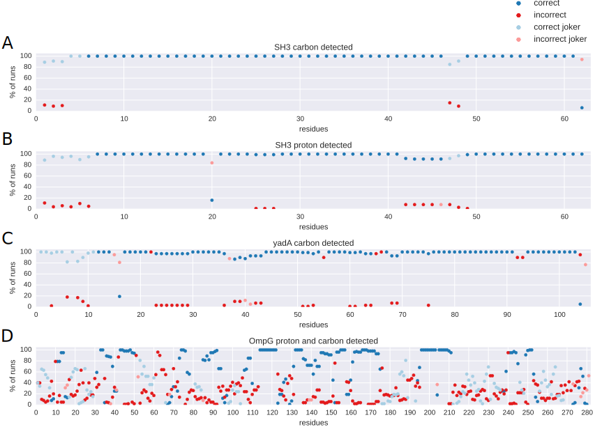

(Semi-) Automatic Assignment of Solid-State NMR spectra
=======================================================

## Introduction

Over the years a lot of different sequential assignment algorithms have been written. This is completely understandable since this is a completely deterministic problem, the kind computers are actually very good at solving. However, a lot of these scripts suffer from limitations that made them unsuitable to use in my project. None of the methods was able to correctly deal with 2- and 1,3-glycerol labeled samples, for instance. A more general problem is that most algorithms are implemented as stand-alone applications. This often invokes a complicated work-flow in which one has to export several peak and resonance lists from the program that is used to do the analysis of the NMR spectra and convert them to the format expected by the routine. Afterwards the results should be imported back into the analysis program so the result can be analyzed. This is not necessarily bad if it has to be done only be done once. However, for complex assignment projects, with a work-flow in which new data and assignments are added incrementally, this becomes cumbersome. Ironically, often these programs do not get used either for the less complicated assignment tasks since the expected payoff is lower for the user when the assignment can also be done by hand in a reasonable amount of time. Installing the program, converting a hand full of text files and having to check the results afterwards in a not so straight-forward way might be enough to scare off users that would potentially have gotten perfect results using an automatic assignment algorithm.

Also the type of data these stand-alone applications output is somewhat problematic. Often this is one possible sequential assignment that is the true one according to the program. In other words, there is little space for human interference. It would be great however to be able to compare the alternative assignments that the algorithm had to consider and cherry-pick the results for those assignments that are believed to be correct. Many of these problems can be easily overcome when the (semi-) automatic assignment algorithm is integrated within the analysis program. CCPN Analysis databases a lot of information that is relevant to an automatic assignment routine, that would often be lost in a export-import routine. The program has a great Application Programming Interface (API) that gives access to all information stored in the project by the user.

It was not the initial goal to write an assignment algorithm, but to create a tool that would help compare alternative assignment possibilities in a fast way. Because of the extensive use of different labeling schemes used in the assignment of OmpG the peaks that sequentially connect spin systems are often spread over a large amount of spectra. Therefor a tool was needed that would show which peaks are expected in all differently labeled experiments for two sequential residues A and B. Furthermore the tool should then use the resonance information from all combinations of spin systems A' and B' with a residue type assignment that matches the types of residues A and B to cross check whether there are indeed peaks in the peak lists at the expected positions. The general idea is that the more sequential peaks present and the better these peaks fit the expected positions, the higher the likelihood that these two spin systems are indeed sequentially connected. The only method available before, was to plot rulers on the spectra at the resonance frequencies of the nuclei within a pair of spin systems A' and B'. Then the intersections of those rulers could be used to check whether there were the expected crosspeaks in different spectra. Of course this was too slow to systematically try out all combinations of spin systems over the whole sequence. Also, when this does not immediately result in a sequential assignment it is hard to remember or write down which combinations of spin systems fit together sequentially and to which extend. Therefor information can easily be lost and work has to be redone.

Of course, an application that compares different assignment possibilities for two sequential residues can easily be abstracted to the whole sequence. And this is what was done. A optimization procedure can be used to find out the optimal mapping between spin systems and residues. In figure {@fig:malandro_flow_diagram} an overview is given of the different steps in the algorithm, which are discussed in more detail in the following paragraphs.

## Description of the algorithm

#### 1 Input of data

 In the first step the input to the algorithm is gathered. In principle most information can be automatically loaded from the CCPN project:

* molecular topology
* labeling schemes
* experiment types describing the magnetization transfer pathway
* picked peaks
* spin systems
* shift lists
* assignment tolerances
* previously made sequential, tentative, and non-sequential amino acid type assignments

Not all information that is databased in the project has to be used necessarily. The user can choose which information is used and which is not. Excluding certain information can be practical when one wants to check a ready made assignment for instance. Spin systems in CCPN Analysis can basically have one of to following five levels of assignment: 1) The most definite form of assignment is of course when a spin system is sequentially assigned to a specific residue in the sequence. 2) One level of assignment lower, a spin system can be assigned 'tentatively' to multiple residues but it is not known which of those residues is the correct one. 3) Then there are spin systems that are residue typed, but no information about sequential assignment is present. 4) Also multiple residue types can be set for a residue. This option is not standardly accessible in the GUI of CCPN Analysis, but is present in the API and called ResidueTypeProbs. This feature is useful because often a residue type can be narrowed down to two very closely related residue types like asparagine and aspartic acid. 5) The spin systems with the lowest level of assignment are those that for which not any form of sequential assignment nor residue type information is available.

In the part of the GUI shown in figure {@fig:malandro_gui}B it can be configured which of these different levels of assignment are used. If residue type information is not available or not used, the residue typing algorithm already included in CCPN will be used to classify the spin systems to residue types. Because in most cases the classification is not definite, the user can set a threshold score above which residue types will considered a possibility.

There is one more type of assignments that can either be used or not by the algorithm, namely the assignment of peak dimensions to specific nuclei (resonances in CCPN). If this information is used, the only possible assignment of a peak dimension that is considered is the present assignment.

Furthermore the molecular chain to be used (the molecule) has to be selected. Optionally, parts of the chain that should not be considered for assignment can be entered. This last option can be used if it is clear that parts of the molecule can not be seen because of dynamics or for instance incomplete back-exchange of protons.

#### 2 Evaluate possible mapping between spin systems and residues

On the basis of the different levels of assignment describe above and which of that information should be used, for each spin system a set of possible residue assignments is created. Based on these sets, it can already be determined for each spin system with which other spin systems it could ever exchange sequential assignments in the Monte Carlo procedure later on. This information is used during the Monte Carlo procedure to pick which two spin systems to exchange. Also, at this stage 'joker' spin systems are introduced to make sure that always a spin system can be assigned to every residue. This is important since the Monte Carlo procedure was designed to select two spin systems and exchanging their residue assignments rather than the other way around. For this reason all residues should at any stage of the optimization procedure have a spin system assigned to them, because once that would not be case no spin system will ever be assigned to it.

#### 3 Predict peak pattern

The intra-residual and sequential peak patterns are predicted based on the molecular topology, the experiment graph and the isotope labeling scheme. Each spectrum in a CCPN project is connected to an experiment type. Normally, the user is prompted to set the experiment type for each new spectrum that is loaded into the CCPN project. When this was not done, it can be set afterwards and is essential for this algorithm to work. In the CCPN data model each experiment type is connected to an experiment graph. This graph describes which magnetization transfers happen during the experiment and how parts of the experiment map to dimensions in the spectrum. For each magnetization transfer information is present about which types of nuclei take part, whether the transfer is through-space or through-bond and whether a transfer from a nucleus to itself can happen. The specified atom types are not restricted to just isotopes but can be more specific, only aromatic carbons for instance. Together with the molecular topology, the graph can be walked recursively to generate a list of expected peaks for virtually any correlation experiment. This list is then filtered by the labeling scheme. For each peak the colabeling fraction over all nuclei on the magnetization transfer pathway is calculated. Only if the colabeling fraction exceeds a user defined variable the peak is retained. By default this minimal colabeling fraction is 0.1.

#### 4 Match predicted and real peaks

Now that a peak pattern is predicted for each spectrum, this can be matched with the peaks in the peak lists corrsponding to those spectra. The positions of the expected peaks can be determined using the chemical shifts assigned to resonances in the spin systems. Of course we don't know yet at this moment which spin systems is in which position on the sequence as that is the purpose of this algorithm. Therefor the possible mapping between residues and spin systems determined in step 2 is used. For every two sequentially neighboring residues A and B, all combinations of spin systems A' and B' are used to search the peak lists, see figure {@fig:malandro_peak_matching} A. The position of the expected sequential peaks will be different for each combination of A' and B'. To find out which peaks in the peaklists match to the expected pattern a chemical shift tolerance is used in each dimension of the spectrum. For each dimension of each spectrum a assignment tolerance can be set in CCPN Analysis, and those tolerances are used here as well.

The more of the expected sequential cross peaks are present in the peak lists, the likelier it is that a specific combination A'-B' is indeed a sequential pair. It is also important how well the actual peak positions fit the expected positions. To do this, for each matched peak a simple function is used that assigns an energy between 0 and -1 depending on the difference between cross-peak position and expected peak position. That value is then multiplied with the square of the number of resonances involved with the expected peak to acknowledge that peaks in higher dimensional spectra carry more weight. This number is mostly equal to the number of dimensions, except for partially diagonal peaks. For instance the N~resonances~ for a diagonal peak in a NCOCX spectrum would be 2 instead of 3, which it should be since it contributes less prove for a sequential connection between two spin systems than an off-diagonal peak. Furthermore the energy is normalized by the symmetry of the spectrum the peak is in. A 2D ^13^C-^13^C correlation for instance has two sets of crosspeaks on each side of the diagonal, making the symmetry 2. All together the energy contribution of one peak can then be expressed as:

$$ E_{peak} = max(-1, \sum_{n=1}^{N_{d}} (\frac{\Delta\delta _{n}}{t_{n}}^2 - 1) \frac{1}{N_{d}(1-k^2)}) \frac{N_{resonances} ^2}{symmetry} $$

Where N~d~ is the number of dimensions, ∆δ~n~ is the difference between the shift of the peak and the shift from the shiftlist in the n-th dimension, t~n~ is the tolerance in the n-th dimension and k is the fraction of the tolerance window that has a flat bottom. This last value is set by default on 0.4.
The flat bottom was introduced to prevent over-interpreting small differences between the peak and the expected position. The energy then goes up gradually and becomes 0 for peaks that are all the way in the corner of the tolerance window, see figure {@fig:malandro_peak_matching} B.

As discussed before chemical shifts can differ between spectra depending on the sample and experimental conditions such as temperature and isotope shifts. If these kind of differences are present it is important that spectra are connected to different shift lists. The correct shift list is then used by this algorithm to perform this matching step.

Besides from sequential cross-peaks, also intra-residual cross-peaks are matched. They do not play a role during the optimization of the sequential assignment as they carry no sequential information. However, it is useful to collect these peaks as well, since they can be used for a quick assignment of peaks in new spectra to already known spin systems.

{#fig:malandro_peak_matching}

#### 5 Temporarily remove a fraction of the cross peaks

The optimization procedure that follows can be repeated multiple times to create an ensemble of possible sequential assignment, that can be later on compared to one another. If the assignment of a spin system to a residue in the sequence stays the same with different subsets of the peaks used, this might be a good indication that this assignment is correct. In each run a new randomly selected part of the data will be removed before the optimization starts. This is optional as the fraction can be set to 0. Also without removing cross-peaks the result of the optimization will likely be a little different every time depending on how well defined the energy minimum is.

#### 6 Generate a random starting assignment

A random assignment is generated that is consistent with the possible mapping between spin systems and residues determined in step 2. Every residue is assigned to one spin system. This can be an actual spin system or a joker. Not every spin system has to be assigned to a residue though, as there might be a surplus of spin systems.

#### 7 Optimization of the sequential assignment using a simulated annealing / Monte Carlo procedure

For each step in the Monte Carlo procedure two spin systems are selected to exchange residue assignments. In practice this is done by first randomly choosing one spin system, independent on whether it is assigned to a residue or not. Then from the more selective list of spin systems this spin system could ever exchange with, as determined in step 2, randomly one other spin system is chosen. Before the change is attempted, a check is performed to assure that the change would not produce an assignment that is inconsistent with the possible mapping between spin systems and residues. Now the change in energy can be calculated corresponding to the attempt. Therefor the energy of the individual links between the two spin systems and the current neighboring spin systems in the sequence has to be calculated. If both spin systems were assigned to residues this would be 4 links both in the old and the new situation. The energy of one link can be defined as:

$$ E_{link} = \sum_{n=1}^{N_{p}} \frac{E_{peak,n}}{degeneracy_{n}} N_{resonances, total}  $$

where N~p~ is the number of peaks. E~peak, n~ is the peak score of the n-th peak determined in step 4. The degeneracy is the amount of different assignments the peak has at the current point of the minimization. The peak energies are normalized by this value, because if a peak already has a lot of assignments it is not very relevant in proving this link between two spin systems is correct. N~resonances total~ is the total amount of unique resonances playing a role in the assignments of all peaks. The difference in energy is now simply:

$$  \Delta E = E_{links, new} - E_{links, old}  $$

The change will be accepted when the Monte Carlo criterium is fulfilled:

$$  e^\frac{-\Delta E}{kT} \geq random(0 \rightarrow 1)   $$

During the procedure the temperature is lowered in steps, making it harder for assignment changes that increase the energy to be accepted.

{#fig:malandro_flow_diagram}

#### The graphical user interface

A relatively simple GUI was created to choose the data to be used, configure the algorithm and display the results. In the first tab, see figure {@fig:malandro_gui} A, spectra and corresponding peak lists and whether to use the connected labeling scheme are selected. In the second tab, the parameters discussed in step 1 can be set. Also the residue range can be set here, as it can be useful to exclude parts of the sequence from the optimization if it is known that these parts do not give rise to peaks in the spectra. Furthermore the cooling regime and the amount of steps per temperature point can be configured as well as the total amount of runs. When the algorithm is started, the energies after each temperature step is shown in a plot for all annealing runs.

After all annealing runs are completed the results will be shown, see {@fig:malandro_gui} B. The user can walk through the sequence and see a subsequence of five residues at a time. For each residue the spin system selected in a given run is shown. The five tables below summarize the overall outcome of all runs. For each residue all spin systems are shown that could be assigned to this residue consistent with the mapping performed in step 2. For each spin system the percentage of runs is shown in which it was selected as the assignment to the residue. When clicking on one of the 'links' buttons in between the buttons representing the residues, all peaks will be shown that were found to connect the two selected spin systems. These are the found peaks on which the algorithm based its decisions. When clicking on the residue button itself all found intra-residual peaks will be shown for the selected spin system.
Another row of residue buttons can be used to configure a self defined assignment, independent of the annealing procedure, and check the information supporting that assignment.
The advantage of having the assignment procedure integrated within CCPN Analysis is that it is possible to automatically navigate to a selected peak in the table. This makes checking by eye whether the peak pattern is indeed good prove for the assignment suggested by the algorithm easy and fast. It is also possible to automatically navigate to the expected peak positions of peaks that were not found. This is very important to form an opinion about the correctness of the assignment. In this way it is possible to check whether the peak is really absent, or it was just not picked.
If the user agrees with certain assignments, they can be transferred to the CCPN Analysis project. There are basically two types of assignment to be considered here. Assignment of spin systems to residues and assignment of resonances to peak dimensions. Both can be done independently. None of the suggested assignment are transferred to the project just by running the algorithm as this will change the CCPN Analysis project in an unwanted way. In this way assignments the user agrees on can be cherry-picked and transferred to the project individually. If the user wants to transfer the assignments to the project in bulk anyway, this is possible in the last tab, see figure {@fig:malandro_gui} D. Because every run of the annealing generates a different possible sequential assignment, the user has to choose one. It is also possible to only transfer assignment for those spin systems that were selected in a certain threshold percentage of all runs. This threshold has to be set higher than 50% as it is otherwise unclear which spin system to choose if there could be two spin systems exceeding the threshold otherwise.

![Graphical User Interface of the (semi-)automatic assignment algorithm. A: a subset of spectra can be selected to be used by the routine. B: a number of settings can be configured controlling which information in the CCPN project is used by the algorithm. Also parameters controlling the annealing process are set here. The graph at the bottom shows the progress of the annealing procedure. C: The results are shown in 5 tables, representing 5 consecutive residues in the sequence. In each table all spin systems that can be assigned to that particular residue are listed. When selecting two spin systems for two sequential residues, all peaks that connect these spin systems are listed in the table at the bottom. Assignments can be inspected here and individually transferred to the project. D: Assignments can also be transferred in bulk to the project. In order to do so, the user should indicate which assignments exactly as multiple annealing runs were performed. One of the possibilities is to only assign those spin systems that are assigned in a threshold fraction of all annealing runs.](figures/malandro_gui.png){#fig:malandro_gui}

## Implementation details

The plug-in for analysis was written in python, making extensive use of the Python API of CCPN analysis [@vranken_ccpn_2005]. Parts of the code that needed to be executed faster to make a lot of Monte Carlo attempts in a reasonable amount of time was written in Cython. Cython is used to generate Python extensions that are compiled to C, which in turn is compiled to byte code, making the execution a lot faster. [@behnel_cython_2011] The pseudo random number generator used is a Mersenne twister [@matsumoto_mersenne_1998]. At first the linear congruential generator from the c standard library was used. But this showed, as widely known, not to give random enough numbers and thereby skewed the results. The python mersenne twister was re-implemented in Cython by Josh Ayers [@_joshayers].

## Performance of the algorithm

To evaluate the algorithm, assignments made by Malandro where compared with the manual assignments that
were previously made for the α-Spectrin SH3 Domain and the Yersinia enterocolitica adhesin A (YadA) and OmpG. It was tested how well the algorithm was able to put existing spin systems in the right order on the sequence.
For SH3, two different tests were ran. First, with a sub-set of carbon detected spectra used for the
original assignment and structure determination [@pauli_backbone_2001] [@castellani_structure_2002]. And second, with a set of proton-detected spectra including the hCONH and hcoCAcoNH experiments, recorded more recently [@nieuwkoop_sensitivity_2015]. For YadA a set of ^13^C-detected spectra of a uniformly labeled sample was avaible [@shahid_assignment_2012] [@shahid_membraneprotein_2012]. The original assignments where used to generate spin systems as this step is not part of the algorithm. Also intra-residual peaks were assigned. For OmpG, both ^1^H- and ^13^C-detected spectra were used in conjuction.

### SH3 ^13^C-detected spectra

To test the performance of the algorithm on spectra of specifically labelled samples, 5 spectra were of
SH3 were used: 2D ^13^C-^13^C DARR spectra with a mixing time of 300 ms and NCOCX spectra with a mixing time of 50 ms of both 2- and 1,3-glycerol labelled samples and a NCACX with a mxing time of 200 ms of the 2-glycerol
labelled sample. Spectra were peak picked automatically just above the noise, where the diagonal was excluded. In the 1,3 glycerol 2D ^13^C-^13^C correlation spectrum 168 out of 512 peaks were assigned as intra-residual. In the 2-glycerol 2D ^13^C-^13^C correlation spectrum these were 91 out of 449 peaks and in the NCACX 53 out of 271 peaks. In the two NCOCX spectra, there are no purely intra-residual peaks since the backbone nitrogen of residue i is correlated to the carbonyl of residue i-1. The tolerances of all 13C dimensions was set to 0.3 and 0.4 for all 15N dimensions. All spin-systems were typed automatically as part of the procedure, were the minimal type score was set to 1%. The system converged in 22 temperature steps with 100,000 Monte Carlo attempts per temperature point. For all but the first 5 residues, residues 47, 48 and 62 a unique spin system was assigned, see figure {@fig:malandro_statistics}A. All unassigned residues were also unassigned in the original assignment except for residue 62, of which only the backbone nitrogen was defined in the original assignment.

{#fig:malandro_statistics}

### SH3 ^1^H-detected spectra

Recently new proton detected spectra have been recorded of SH3 at 40 kHz magic angle spinning. Of these spectra, a HNCO and a HNcoCA were used as input to the algorithm, since these spectra contain sequential cross peaks. Spin systems were generated containing HN, N, CO, CA and CB resonances, by evaluating HNCA, HNcaCB and HNCO spectra.
Automated peak picking yielded 52 peaks in the HNCO and 118 peaks in the HNcoCA. The higher than expected amount of peaks in the HNcoCA can be explained by the presence of the CA~i~ peak in a lot of strips where only a CA~i-1~ peak is expected. No repicking was performed to change this situation. Possible amino acid types were determined during the procedure as mentioned before, with a minimal type score of 1%. The algorithm already gives good results with 22 temperature steps and 100,000 attempts per step. However, when the amount of steps was increased to 1000,000 a bigger amount of the runs found the same final energy. This can partially be explained by the fact that the search-space is bigger due to less exclusive residue typing than is possible with ^13^C-detected data. Now spin systems only contain CA and CB carbon resonances that are relevant for residue typing, in contrast to the more fully configured spin-systems containing more side-chain carbon resonances in the previous example. For all residues the most frequent chosen assignment was the one that agrees with previously made manual assignments, except for proline 20, see figure {@fig:malandro_statistics}B. On this residue a joker spin system was placed in more than 90% of the runs, meaning that the algorithm could not assign it. No connecting peaks could be found to Arginine 21.

### YadA ^13^C-detected spectra

To test whether the algorithm was still of use for more challenging systems, YadA was used. Only two
spectra were used for this optimization: a 2D ^13^C-^13^C correlation spectrum, and a NCOCX, both
with a DARR mixing period of 200 ms and with uniform ^13^C, ^15^N labelling. As with
SH3, spin-systems were created using the published chemical shifts and the intra-residual peaks in the
2D carbon-carbon correlation were assigned to spin-systems by doing a short run of the algorithm. Two
alanine spin-systems (corresponding to residues 82 and 88) scored very low (less than 0.2%) for alanines in the residue-typing procedure as their Cβ shifts were slightly more downfield than expected. This was a clear case where human intervention was needed and these two spin systems were typed by hand. This directly
reveals one of the weakest spots in the procedure. If the correct residue-type is not in the set of
possibilities, a correct assignment of the spin system is not possible, which possibly leads to more
errors. For the rest of the spin systems, a set of possible residue-types was determined automatically
with a cut-off at 1% as described before. Tolerances were set to 0.3 and 0.4 for carbon and nitrogen
respectively. 100 independent runs with 22 temperature points and 1000,000 attempts per temperature point
were performed.
As can be observed in {@fig:malandro_statistics}C there are several differences between the manual assignment and the
assignment of the algorithm. There are basically 3 differences. In all cases the spin system corresponding to Asparagine 55 in the original assignment is assigned to Aspartic acid 22 and in most cases also visa
versa. Assigning these residues manually was also very difficult. A collection of other sequential peaks
from other connections are misinterpreted by the algorithm to be the connection between 21 and 55.
Furthermore a large part of the signal set connecting Asn 55 to its neighbors is missing because the
residue is located in a loop between the beta-sheet and alpha-helix where a lot of line-broadening is
observed.
The second difference is that alanine 37 is assigned to glutamic acid 104 in almost all cases, leaving Ala 37 with a joker.This happens because not a lot of connections are found that support the original hypothesis. This is
solved when making the tolerances larger or when the spin system is hand-typed to Alanine. A third difference is that two out of the three Serine-Serine pairs (residues 65-66 and 92-93 respectively) are assigned differently. Some less severe issues includes placing jokers on 15 and 16, which basically indicates that the right solution could not be found, but also no erroneous solution is proposed.

### OmpG ^1^H- and ^13^C-detected spectra

### Effect of missing peaks on the accuracy of proposed assignments

To simulate the effect of incomplete data, an increasing number of randomly selected peaks were
excluded from the carbon detected dataset of SH3. This dataset was chosen for this purpose because it
contains a lot of redundant information. The algorithm was tested on this reduced dataset and the
amount of correctly and incorrectly assigned spin-systems were determined. Because the quality of the
results is influenced by the subset of peaks that happens to be excluded, this procedure was repeated 10
times for each datapoint. The averages and standard deviations are shown in figure 5. Each execution
of the algorithm consisted of 100 annealing runs in the same fashion as described before (22
temperature steps of 100.000 Monte Carlo attempts).

{#fig:malandro_deleting_peaks}

