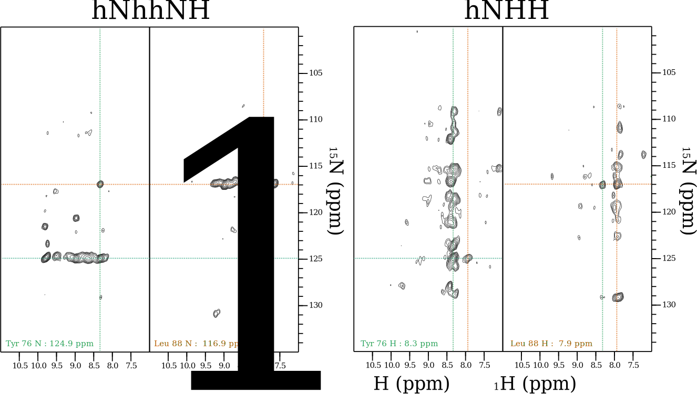

Structure Calculation
=====================

The restraints used in the structure calculation of OmpG can exist of two types: torsion angle restraints that are based on chemical shifts of the residues and distances restraints based on crosspeaks in through-space correlation spectra. This second group of restraints can in turn be subdivided into a group of distance restraints obtained from ^1^H-detected experiments and another group that is based on ^13^-detected experiments.

## Torsion Angle Restraints

Torsion angles where predicted using the program TALOS+ [@shen_talos_2009][@cornilescu_protein_1999].

