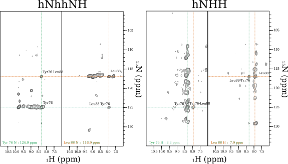
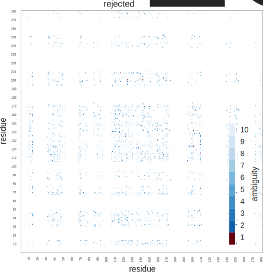

Structure Calculation
=====================

The experimental restraints used for the structure calculation of OmpG exist of two types: torsion angle restraints that are predicted based on chemical shifts and distances restraints based on cross-peaks in through-space correlation spectra. This second group of restraints can in turn be subdivided into a group of distance restraints obtained from ^1^H-detected experiments and another group that is based on ^13^C-detected experiments. To automatically produce lists of distance restraints, peak positions are matched with chemical shifts. As described earlier, all ^1^H-detected experiments were performed on perdeuterated and back-exchanged samples, whereas all ^13^C-detected experiments were performed on fully protonated samples. Because of the large isotope shift between these two different samples, two different shift lists were used to produce the distance restraints. Also spectra of poor quality that were present in the CCPNMR Analysis project were excluded from shift averaging before starting the shift matching procedure. Because of chemical shifts overlap this peak matching procedure does not produce unambiguous restraints between two nuclei in the protein for most peaks. Therefor sets of ambiguous distance restraints (ADRs) are generated. Each ADR basically consists of a list of possible assignments of a cross-peak in the spectrum. These assignment options are referred to as restraint items. The ADRs were disambiguated using ARIA (Ambiguous Restraints for Iterative Assignment) [@linge_aria_2003][@rieping_aria2_2007]. This program calculates the structure in a number of iterations. In each iteration an ensemble of structures is calculated based on the ADRs. After each iteration the restraint items that are unlikely to be correct based on the average distances in the highest energy structures of this temporary ensemble are removed. As ADRs become less ambiguous the calculated structures converge and vice versa.
After a first structure was calculated using the ARIA protocol hydrogen bond restraints could be added between residues that were clearly facing each other in the β-sheet.

## Torsion Angle Restraints

128 φ/ψ torsion angles (256 in total) where predicted using the program TALOS+ [@cornilescu_protein_1999][@shen_talos_2009]. In figure {@fig:secondary_structure_and_topology_prediction} the secondary structure that corresponds to these torsion angles is shown along the OmpG sequence. As expected the largest part of the assigned residues are predicted to be in a β-sheet conformation. These results can be compared to a prediction of the topology done purely on the basis of the amino acid sequence by a program called PRED-TMBB [@bagos_predtmbb_2004]. This tool is specifically designed for β-barrels and predicts which part of the molecule is part of the transmembrane β-sheet, intra-cellular turn and extra-cellular loop. Because the algorithm is based on machine learning, we send the author of the program an email to verify that previously calculated OmpG structures were not part of the training data, which was not the case. It can be observed that the two predictions align fairly well. Where PRED-TMBB predicts a turn, the chemical shifts are more coil-like. In these turns also a lower RCI-S2 value can be observed, indicating a less ordered part of the molecule. As discussed before the missing assignments cluster largely in the extra-cellular loops.

![Prediction of the secondary structure of OmpG by TALOS+ and PRED-TMBB. TALOS+ uses the secondary chemical shifts of assigned residues to search a database for triplets in the sequence of high resolution structures with similar secondary chemical shifts to predict φ/ψ torsion angles. PRED-TMBB is an algorithm that solely relies on the sequence and predicts which parts of the sequence are intra-cellular, extra-cellular and transmembrane given the molecule is a transmembrane β-barrel. Grey blocks in TALOS+ plots correspond to areas predicted as transmembrane by PRED-TMBB.](figures/secondary_structure_and_topology_prediction.svg){#fig:secondary_structure_and_topology_prediction}

## Restraints based on ^1^H-detected through-space correlation experiments

To obtain a set of distance restraints using ^1^H-detection, through-space experiments were recorded on the perdeuterated samples where the exchangeable sites were 100% back-exchanged for protons. Two spectra where recorded for this purpose: an hNHH and an hNhhNH, both using cross-polarization for transfers between proton and nitrogen and a 2 ms rfdr (radio frequency driven recoupling) mixing step to transfer magnetization between the protons. Also an extra hCANH was recorded in the same measurement block exclusively to obtain a chemical shift list that corresponds well to the through-space spectra.

{#fig:pulse_sequences_hNHH_hNhhNH}

Since most of the proton sites in the molecule are deuterated, most peaks present in these spectra are peaks correlating one amide group to another. In both spectra strips can be drawn at the ^15^N and ^1^H chemical shifts of one amide group. In general such strips contain, besides a diagonal peak, one big and often one or two smaller cross-peaks. Since the correlation pathway of the hNhhNH experiment guarantees that both interacting protons are part of an NH-group this spectrum seems a bit cleaner. If both spectra are considered together there are four peaks indicating the proximity of two NH groups. An example of such a set of four peaks correlating two amide groups is shown in figure {@fig:through_space_proton_detected_strips_Tyr76_Leu88}. In the case of an anti-parallel β-sheet, the biggest off-diagonal peak is almost always correlating two amide groups facing each other from neighboring strands in the sheet. These two residues are involved in two hydrogen bonds between one another's carbonyl-oxygens and amide protons. On average the two amide protons are only 3.1 Å separated from one another, see figure {@fig:distances_in_antiparallel_betasheet}B. The smaller peaks are often correlations to the amide groups of the neighboring residues in the same strand or to the amide group of the residue following the directly hydrogen bonded residue. As can be seen in figure {@fig:distances_in_antiparallel_betasheet}B, a very specific alternating pattern of cross-peaks is expected connecting two strands in the β-sheet, skipping residues in between which in turn are pointing towards the neighboring strand on the other side. The mixing time of 2 ms is relatively short, so that it was possible to distinguish between the short over-the-strand correlations and the correlations between more distant protons. The optimal mixing time was determined by recording several 2D hNhH spectra with different mixing times. Some peaks that are well separated in the NH correlation, like the 113 tryptophan and 155 glutamic acid peaks, could be used to monitor the relative sizes of the main cross-peak and the additional smaller peaks. At longer mixing times the smaller cross-peaks would increase in size, while the main cross-peak would become smaller. Since the smaller cross-peaks are often sequential, and therefor of little structural value, we chose to run the 3D experiments with a mixing time that gave maximum intensity for the main cross-peaks.

{#fig:through_space_proton_detected_strips_Tyr76_Leu88}

### Matching peak dimensions to chemical shifts

To generate ADRs based on peak positions a set of chemical shift tolerances has to be defined. These tolerances were set to 0.4 ppm for the ^15^N dimensions, 0.1 ppm for the indirectly detected ^1^H dimensions and 0.07 ppm for the directly detected ^1^H dimensions. The slightly smaller tolerance on the directly directed acquired dimension is possible because this dimension is better digitized. When using these tolerances directly, the window around the actual peak position in which assignments are accepted is square or cubical depending on the dimensionality. When considering the chemical shifts for each dimension together, in the corners of this square a combination of chemical shift that is still accepted as a possible assignment is further away from the actual peak position as a combination that is closer to one of the mid-lines of the square. In other words, when using tolerances like this on a multidimensional spectrum, some restraint items are created where all chemical shifts are really far away from the actual peak position. When assigning a peak by hand these kind of combinations would probably be discarded as they are less likely to be correct than a combination where only one of the dimensions is close to the edge of the tolerance. To reduce the number of unlikely assignment options, an extra rule was applied. In both the hNHH and the hNhhNH, 2 out of 3 dimensions directly correspond to one bonded ^15^N-^1^H pair, i.e. one peak in the ^15^N-^1^H correlation. Therefor these 2 chemical shifts can be considered together when mapping chemical shifts to peak positions. In practice the euclidean distance between the peak position and the combination of the ^15^N and ^1^H chemical shifts normalized by the shift tolerances is calculated. All assignment options that are closer than half of the distance between the center and the corner of the normalized tolerance square (i.e. $\sqrt{2}/2$) are accepted indiscriminately. All assignment options that are outside of this circle are only accepted when there is not an assignment option that is twice closer to the actual peak position, see figure {@fig:round_tolerance}. On the dimension of the through space correlated nucleus this rule was not applied. A similar technique is used by the CANDID routine in CYANA, where the likelihood of a peak assignment is made dependent on the closeness in chemical shift match [@herrmann_protein_2002]. In the case of CYANA this happens before every iteration of the structure determination/cross-peak assignment protocol. Here it is only done once before the ambiguous distance restraints enter the ARIA protocol.

![For the directly bonded ^1^H and ^15^N dimensions of the hNHH and hNhhNH spectra, the distance between the actual peak position (orange circle) and the combinations of ^15^N-^1^H chemical shifts of one amide group is calculated. These distances are normalized by the shift tolerances. Within the turquoise circle, corresponding to half of the distance between the peak position and the corners of the square, all possible assignments (A and B) are accepted. Outside of this circle assignment possibilities are only accepted in the absence of an assignment possibility twice closer to the peak position. For instance option C would only be accepted if A would not be present.](figures/round_tolerance.svg){#fig:round_tolerance}

### Using redundancy to disambiguate restraints

As detailed before there are in principle four cross-peaks that correlate the same two amide groups. This redundancy can easily be used to decrease the ambiguity of automatically generated ADRs further, already before the structure calculation. A CCPNMR macro script was used to determine for which items of each ADR all 4 peaks were present (giving rise to three other ADRs that also have the correlation between these amide hydrogens as one of their items). For restraints that had one or more of such items, all other items that had a 'symmetry' of 2 or less (instead of 4) were removed. In these cases all restraint items with a symmetry of 3 were preserved as to not remove a possibly correct item just because one peak is missing. In figure {@fig:ambiguity_histograms_h_restraints} it can be seen that after applying this operation the amount of restraints that become unambiguous or only have two items left is drastically increased while the amount of restraint with ten or more items decreases. When plotting the resulting restraints on a residue interaction matrix the pattern expected for β-sheets, lines of interactions perpendicular to the diagonal, can already be seen. Based on this pattern an assignment of the crosspeaks could in principle have been made by hand, we decided however to give the ARIA the task of further disambiguating these ambiguous restraints. Also this procedure is similar to a feature present in the CANDID routine, although again, it is applied before every iteration of structure calculation in the protocol [@herrmann_protein_2002]. Here it let ARIA find the correct global fold already in the first iteration of the protocol, which helps to disambiguate the more ambiguous restraints in the next iterations.

![Ambiguity of restraints based on the hNhhNH and hNHH spectra. Blue bars correspond to restraints that are automatically created by matching chemical shifts to peak dimensions. Red bars represent the same restraint set, but after applying a filter that selects restraints items for which all four expected peaks are present in the two spectra. This operation effectively decreases the amount of restraints with very high ambiguity and in both spectra about a third of the restraints becomes unambiguous (1 item per restraint). Light and dark color represent the hNhhNH and hNhhNH spectra respectively.](figures/ambiguity_histograms_h_restraints.svg){#fig:ambiguity_histograms_h_restraints}

### Distance classes

In the dipolar based transfer experiments used in solid-state NMR distances can not be extracted from peak volumes with the same amount of precision as in solution NMR [TODO:cite who?]. Therefor distance restraints based on these cross-peaks were divided in two upper bound distance classes. To do this a very simple rule was applied. Peaks were sorted from high  to low intensity. Peaks were classified to correspond to short distance (3.5 Å) until the first cross-peak is encountered that was not the largest in its strip. All peaks with a intensity equal or lower to this peak are given a more generous upper bound of 5.5 Å. Lower bounds were set to 1.0 Å in both cases.

![Orientation of two strands in an anti-parallel β-sheet (A). Residues i and j interact with two hydrogen bonds. Average distances between C', Cα and Cβ nuclei (B), and between the amide protons in the backbone (C) between residues on positions -2 to 2 in the sequence relative to residues i and j. The first column of B and C represent distances within the same strand, all other distances are between the two strands in the sheet. The shortest ^13^C-^13^C distance is between Cα~i-1~-Cα~j+1~ or Cα~j-1~-Cα~i+1~ which is 4.1 Å on average. The ^1^H-^1^H distances show a distinct pattern where smallest distance is between the amide protons of residue i and j (3.1 Å). The connection between residues i and to both j+1 and j+2 is a lot shorter than between i and j-1.](figures/distances_in_antiparallel_betasheet.svg){#fig:distances_in_antiparallel_betasheet}

## Restraints based on ^13^C-detected through-space correlation experiments

Another set of distance restraints was based on a set of 5 ^13^C-detected experiments that were also used during the assignment phase of the project. All spectra were 2D 13^C^-^13^C correlations with 400 ms DARR mixing. Several spectra with good dispersion and signal to noise where selected to create distance restraints. Peaks were picked in the aliphatic region. The reason for this is that the chemical shift assignment for this region is relatively high in comparison to other regions of the spectra at least for the resonances within assigned residues (91%), see table {@tbl:extend_of_assignment_table}. This is important since the biggest bottle-neck in structure calculation is incomplete resonance assignment. It has been shown in solution NMR studies that the resonance assignment should be at least 90% complete to produce reliable structures using automated NOE assignment [@jee_influence_2003]. The completeness of assignment over the whole sequence is far below that (57%) but, as argued before, inter-residual cross-peaks are expected to be absent for the unassigned parts of the sequence. Intra-residual peaks were avoided in the peak picking. This was done by overlaying the spectra with spectra that were recorded using a shorter mixing time complemented by knowlegde of which regions in the spectra simply can not contain intra-residual cross-peaks, see figures {@fig:picked_peaks_13glycerol} and {@fig:picked_peaks_2glycerol}. As discussed weak intra-residual signals are present in the ^13^C-^13^C correlations corresponding to unassigned spin systems. By not picking the intra-residual signal set it is avoided that incorrect ADRs are generated based on these peaks.

ARIA can use either lists of ADRs as input or peak lists accompanied by a chemical shift list. In the last case ARIA performs the shift-matching itself. Here lists of ADRs were produced using CCPNMR Analysis because of the build-in support for labeling schemes. Restraints were produced by shift-matching with a tolerance of 0.4 ppm in both dimensions and only assignment possibilities were generating for which the co-labeling fraction of the two correlated carbons exceeded 0.1. All ADRs based on the ^13^C-detected spectra were put in a single distance class with a lower bound of 1.5 Å and an upper bound of 8.0 Å.

{#fig:picked_peaks_13glycerol}

{#fig:picked_peaks_2glycerol}

## Structure calculation protocol

For the structure calculation and disambiguation of the ADRs the standard ARIA protocol was used with a few alterations. 192 structures were calculated in each iteration and the 15 lowest energy subset of those structures was used to disambiguate the assignment of the ADRs for the next iteration.

The most challenging part of this structure calculation was to reduce the effect of ADRs where a correct item is not present. These type of restraints can be generated if noise or artifacts are present in the peak lists the ADRs are based on. In the case of this structure calculation, the most likely source of these restraints is the incompleteness of the resonance assignment. For instance, when a cross-peak is present to a nucleus that is not assigned but at that same frequency there are one or more other, incorrect, assignment possibilities, an ADR will be generated with several items except for the correct one. One such a distance restraint can cause the calculation to converge to a completely wrong structure. This was not a large problem in the ^1^H detected spectra, since the not a lot of unassigned ^15^N-^1^H combinations were left unassigned. Because the amount of peaks in the proton detected spectra is a lot smaller and there is a basic mapping of one strip per residue it is more straight-forward to estimate the extend of the assignment. There are some unassigned side-chain protons left at exchangeable sides. However, their chemical shifts are often distinct and not overlapped by other chemical shifts. Therefor cross-peaks to these nuclei could be easily recognized and removed from the peak list, or in some cases the resonance could be assigned.

In the ^13^C-detected spectra however, this problem is more severe. First of all, the amount of peaks in these spectra is larger. And second, there are missing ^13^C assignments even in the parts of the protein that are structured. In these cases the lack of assignment is not caused by missing signals but by the ambiguity in the spectra. The unassigned shifts do not differ in any way from the assigned ones, making it hard to remove the peaks giving rise to incorrect ADRs before the structure calculation.

Two distinct approaches can be taken to calculate this structure. One is to first calculate the structure based solely on the ^1^H-detected restraints and perform a second calculation starting from the previously calculated ensemble but adding the carbon restraints. In the case of a beta-barrel structure like OmpG this is actually possible since most of the structure is defined by the backbone. In the second structure calculation the violation tolerance and the partial assignment p should already be set to a small value in the first iteration so that all erroneous ADRs get rejected immediately and do not take part in the structure calculation. Another approach is to apply restraint combination to the ^13^C-detected restraints.

Both restraint combination and network anchoring were first introduced in CYANA [@herrmann_protein_2002] and are implemented in ARIA as well. The basic idea behind restraint combination is to combine the restraint items of the two ADRs stemming from two unrelated peaks into one new ADR. As the amount of erroneous ADRs is small compared to the amount of correct ADRs the chance that the newly generated ADR still does not contain at least one correct item is decreased. Two strategies for the combination of restraints are implemented in both CYANA and ARIA: combining two ADRs to create one new ADR, or combining four ADRs to create four new combined ADRs. The last option was chosen because it keeps the amount of restraints the same and it is the most widely used strategy of the two. Restraint combination on the ^13^C-detected restraints was performed on the restraints based on the ^13^C detected spectra from iteration 0 to 6.

Network anchoring is an algorithm that aims to disambiguate ADRs and keep erroneous ADRs out of the structure calculation. The idea behind the algorithm is that the correct assignment of a crosspeak should be confirmed by a network of other assignments. For each restraint item connecting two nuclei α and β, lists of other nuclei γ are created that are close to either α or β based on the covalent connectivity. In ARIA these list where generated on forehand by extensively sampling possible conformations TODO:find out where I read this. These nuclei are located either in the same residues as α or β, or in a neighboring residue. The network anchoring score N~αβ~ is determined by the amount of indirect connections between α and β through γ. To be more specific, by the partial volumes of all restraint items α-γ and β-γ of all nulcei γ in the list mentioned before [@herrmann_protein_2002]. Using these atom-wise network anchoring scores, also a residue-wise network anchoring score can be calculated, which is just the sum over all scores of nuclei α in residue A to nuclei β in residue B. To determine whether a restraint item should enter the calculation, three different threshold values can be set in ARIA: the high residue threshold, minimum residue threshold and minimum atom threshold. A restraint item will be retained if either the high residue threshold or both the minimum residue and atom threshold are exceeded. If an ADR does not have any items that meet these criteria it will not enter the structure calculation. The network anchoring procedure can be ran before every new iteration of ARIA.

Network anchoring was used on the ^13^C-detected restraints in iterations 0 to 6. The ^1^H detected restraints where used to create the network as well, but where not filtered by the network anchoring. Since the presence of erroneous ADRs was problematic in the structure calculation of OmpG, the minimal residue threshold was set to a really high value of 4 to prevent them from being used. In the very first iteration, this leads to hardly any of the ^13^C restraints meeting the criteria to enter the calculation. However, as the structure converges, the ADRs become less ambiguous and thereby partial volumes of some of the restraint items become larger, allowing more and more restraint items to reach the threshold and enter the calculation. In the last two iterations no network anchoring is used, since the structure is close to convergence and the violation threshold is very small. Therefor no restraints that do absolutely not fit the structural ensemble from the last iteration will be retained.

## Hydrogen Bond Restraints

The structure of OmpG was first calculated as described before. No hydrogen bond restraints were added in these initial calculations. This was done because no experiments were performed to directly observe the hydrogen bonds. However, after an initial structure is calculated, the hydrogen bonding pattern in the β-sheet is clear and these type of restraints can be added. Co-linear hydrogen bond restraints were created between every two residues were the predicted dihedral angles indicated beta-sheet and good cross-peaks appear in the spectra. Co-linear hydrogen bond restraints are basically distance restraints, one between the H and O and one between the N and the O. This makes these restraints very powerful, as they effectively constraint the HN bond vector. Every two residues facing each other from opposite strands interact in two hydrogen bonds. For both of these bonds such a co-linear hydrogen bond restraint is introduced. These restraints can be produced in CCPN Analysis. The default values were used.

{#fig:structures_per_aria_iteration}

{#fig:ompg_structure_hbonds_ramachandran_potential}

{#fig:ambiguity_it8H}

{#fig:ambiguity_it8C}

{#fig:rejected_interaction_plot}

{#fig:left_over_C_ambiguity}

{#fig:crystal_structure_with_surrounding_unit_cells}

