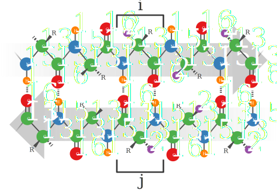

Structure Calculation
=====================

The experimental restraints used for the structure calculation of OmpG exist of two types: torsion angle restraints that are predicted based on chemical shifts and distance restraints based on cross-peaks in through-space correlation spectra. This second group of restraints can in turn be subdivided into a group of distance restraints obtained from ^1^H-detected experiments and another group that is based on ^13^C-detected experiments. To automatically produce lists of distance restraints, peak positions are matched with chemical shifts. As described earlier, all ^1^H-detected experiments were performed on perdeuterated and back-exchanged samples, whereas all ^13^C-detected experiments were performed on fully protonated samples. Because of the large isotope shift between these two different samples, two different shift lists were used to produce the distance restraints. Also spectra of poor quality that were present in the CCPNMR Analysis project were excluded from shift averaging before starting the shift matching procedure. Because of chemical shift overlap, this peak matching procedure does not produce unambiguous restraints between two nuclei in the protein for most peaks. Therefor sets of ambiguous distance restraints (ADRs) are generated. Each ADR basically consists of a list of possible assignments of a cross-peak in the spectrum. These assignment options are referred to as restraint items, or short items. The ADRs were disambiguated using ARIA (Ambiguous Restraints for Iterative Assignment) [@linge_aria_2003][@rieping_aria2_2007]. This program calculates the structure in a number of iterations. In each iteration an ensemble of structures is calculated based on the ADRs. After each iteration the assignment options that are unlikely to be correct based on the average distances in the highest energy structures of this temporary ensemble are removed. As ADRs become less ambiguous the calculated structures converge and vice versa.
After a first round of structure calculations using ARIA, hydrogen bond restraints can be added between residues that are in the right conformation in the β-strands.

## Torsion Angle Restraints

128 φ/ψ torsion angles (256 in total) where predicted using the program TALOS+ [@cornilescu_protein_1999][@shen_talos_2009]. In figure {@fig:secondary_structure_and_topology_prediction} the secondary structure that corresponds to these torsion angles is shown along the OmpG sequence. As expected the largest part of the assigned residues are predicted to be in a β-sheet conformation. These results can be compared to a prediction of the topology done purely on the basis of the amino acid sequence by a program called PRED-TMBB [@bagos_predtmbb_2004]. This tool is specifically designed for β-barrels and predicts which part of the molecule is part of the transmembrane β-sheet, intra-cellular turn and extra-cellular loop. Because the algorithm is based on machine learning, we verified with the author of the program, that previously calculated OmpG structures were not part of the training data, which was not the case. It can be observed that the two predictions align fairly well. Where PRED-TMBB predicts a turn, the chemical shifts are more coil-like. In these turns also a lower random coil index (RCI) value can be observed, indicating a less ordered part of the molecule. As discussed before, the missing assignments cluster largely in the extra-cellular loops.

![Prediction of the secondary structure of OmpG by TALOS+ and PRED-TMBB. TALOS+ uses the secondary chemical shifts of assigned residues to search a database for triplets in the sequence of high resolution structures with similar secondary chemical shifts to predict φ/ψ torsion angles. PRED-TMBB is an algorithm that solely relies on the sequence and predicts which parts of the sequence are intra-cellular, extra-cellular and transmembrane given the molecule is a transmembrane β-barrel. Grey blocks in TALOS+ plots correspond to areas predicted as transmembrane by PRED-TMBB.](figures/secondary_structure_and_topology_prediction.svg){#fig:secondary_structure_and_topology_prediction}

## Restraints based on ^1^H-detected through-space correlation experiments

To obtain a set of distance restraints using ^1^H-detection, through-space experiments were recorded on the perdeuterated samples where the exchangeable sites were 100% back-exchanged for protons. Two spectra where recorded for this purpose: an hNHH and an hNhhNH, both using cross-polarization for transfers between proton and nitrogen and a 2 ms RFDR (radio frequency driven recoupling) mixing step to transfer magnetization between the protons. Also an extra hCANH was recorded in the same measurement block. The peaks in this spectrum were assigned (based on the previously made sequential assignment) to obtain a chemical shift list that corresponds well to the through-space spectra. This was necessary because for the moment it is hard to exactly control the temperature in fast spinning samples. These kind of slightly different experimental conditions always introduce small chemical shift differences, that are unfavorable for a correct outcome of the shift matching procedure.

![Pulse sequences of the hNHH (a) and hNhhNH (b) experiments. Diagrams above the pulse sequences illustrate the nuclei of which the chemical shift is measured. Blue and dark orange nuclei are measured, while the light orange ^1^H in the diagram of figure b is on the magnetization transfer pathway but not measured. Periods between square brackets are RFDR transfer blocks. Phase cycle: (a) φ1 = 1 3, φ2 = 1, φ6 = 0 0 2 2, φ12 = 1, φ7 =  1, φ8 = 2, φ9 =  0 0 0 0 1 1 1 1 2 2 2 2 3 3 3 3, φ16 = 0 1 0 1 1 0 1 0, φ11 = 1, φrec = 0 2 2 0 1 3 3 1 2 0 0 2 3 1 1 3; (b) φ1  = 1 3, φ3  = 1 1 3 3, φ6  = 1 1 1 1 3 3 3 3, φ16 = 1 1 1 1 1 1 1 1 3 3 3 3 3 3 3 3, φ15 = 1, φ18 = 0 1 0 1 1 0 1 0, φrec = 0 2 2 0 2 0 0 2 2 0 0 2 0 2 2 0. All other pulses have phase 0.](figures/pulse_sequences_hNHH_hNhhNH.svg){#fig:pulse_sequences_hNHH_hNhhNH}

Since most of the proton sites in the molecule are deuterated, most peaks present in the two through-space spectra are peaks correlating one amide group to another. In both spectra, strips can be drawn at the ^15^N and ^1^H chemical shifts of one amide group. In general such strips contain, besides a diagonal peak, one big and often one or two smaller cross-peaks. Since the correlation pathway of the hNhhNH experiment guarantees that both interacting protons are part of an NH-group this spectrum is a bit cleaner. If both spectra are evaluated together there are four peaks indicating the proximity of two NH groups. An example of such a set of four peaks correlating two amide groups is shown in figure {@fig:through_space_proton_detected_strips_Tyr76_Leu88}. In the case of an anti-parallel β-sheet, the strongest off-diagonal peak is almost always correlating two amide groups facing each other from neighboring strands in the sheet. These two residues are involved in two hydrogen bonds between one another's carbonyl-oxygens and amide protons. On average, these two amide protons are only 3.1 Å separated from one another, see figure {@fig:distances_in_antiparallel_betasheet}B. The smaller peaks are often correlations to the amide groups of the neighboring residues in the same strand or to the amide group of the residue following the directly hydrogen bonded residue in the opposing strand. As can be seen in figure {@fig:distances_in_antiparallel_betasheet}C, a very specific alternating pattern of cross-peaks between residues is expected, connecting two strands in the β-sheet, skipping residues in between which are facing towards the interface with other strands in the sheet. The mixing time of 2 ms is relatively short, so that it was possible to distinguish between the short (over-the-strand) distance and the correlations between more distant protons. The optimal mixing time was determined by recording several 2D hNhH spectra with different mixing times. Some peaks that are well separated in the NH correlation, like those of tryptophan 113 and glutamic acid 155, could be used to monitor the relative sizes of the main cross-peak (over-the-strand) and the additional smaller peaks. At longer mixing times the smaller cross-peaks increase in size, while the main cross-peak become smaller. Since the smaller cross-peaks are often sequential, and therefor of little structural value, we chose to run the 3D experiments with a mixing time that gave maximum intensity for the main cross-peaks.

{#fig:through_space_proton_detected_strips_Tyr76_Leu88}

### Matching peak dimensions to chemical shifts

To generate ADRs based on peak positions, a set of chemical shift tolerances has to be defined. These tolerances were set to 0.4 ppm for the ^15^N dimensions, 0.1 ppm for the indirectly detected ^1^H dimensions and 0.07 ppm for the directly detected ^1^H dimensions. The slightly smaller tolerance on the directly directed acquired dimension is possible because this dimension is better digitized. When using these tolerances directly, the window around the actual peak position in which assignments are accepted is square or cubical depending on the dimensionality. When considering the chemical shifts for each dimension together, in the corners of this square (such as the possition of D in {@fig:round_tolerance}) a combination of chemical shift that is still accepted as a possible assignment is further away from the actual peak position as a combination that is closer to one of the mid-lines of the square. In other words, when using tolerances like this on a multidimensional spectrum, some restraint items are created where all chemical shifts are really far away from the actual peak position. When assigning a peak by hand these kind of combinations would probably be discarded as they are less likely to be correct than a combination where only one of the dimensions is close to the edge of the tolerance. To reduce the number of unlikely assignment options, an extra rule was applied. In both the hNHH and the hNhhNH, 2 out of 3 dimensions directly correspond to one bonded ^15^N-^1^H pair, i.e. one peak in the ^15^N-^1^H correlation. Therefor these 2 chemical shifts can be considered together when mapping chemical shifts to peak positions. In practice the euclidean distance between the peak position and the combination of the ^15^N and ^1^H chemical shifts normalized by the shift tolerances is calculated. All assignment options that are closer than half of the distance between the center and the corner of the normalized tolerance square (i.e. $\sqrt{2}/2$) are accepted indiscriminately (A and B in figure {@fig:round_tolerance}). All assignment options that are outside of this circle are only accepted when there is not an assignment option that is twice closer to the actual peak position. Therefor option C in {@fig:round_tolerance} would only be accepted in the absence of option A. On the dimension of the through space correlated nucleus this rule was not applied. A similar technique is used by the CANDID routine in CYANA, where the likelihood of a peak assignment is made dependent on the closeness in chemical shift match [@herrmann_protein_2002]. In the case of CYANA this happens before every iteration of the structure determination/cross-peak assignment protocol. Here it is done only once before the ambiguous distance restraints enter the ARIA protocol.

![For the directly bonded ^1^H and ^15^N dimensions of the hNHH and hNhhNH spectra, the distance between the actual peak position (orange circle) and the combinations of ^15^N-^1^H chemical shifts of one amide group is calculated. These distances are normalized by the shift tolerances. Within the turquoise circle, corresponding to half of the distance between the peak position and the corners of the square, all possible assignments (A and B) are accepted. Outside of this circle assignment possibilities are only accepted in the absence of an assignment possibility twice closer to the peak position. For instance option C would only be accepted if A would not be present.](figures/round_tolerance.svg){#fig:round_tolerance}

### Using redundancy to disambiguate restraints

As detailed before there are in principle four cross-peaks forming a network that correlates the same two amide groups. This redundancy can be used to decrease the ambiguity of automatically generated ADRs, before the structure calculation. A CCPNMR macro script was used to determine for which items of each ADR all 4 peaks were present (giving rise to three other ADRs that also have the correlation between these amide hydrogens as one of their items). For restraints that had one or more of such items, all other items that had a 'symmetry' of 2 or less (instead of 4) were removed. In these cases all restraint items with a symmetry of 3 were preserved, as to not remove a possibly correct item just because one peak is missing. In figure {@fig:ambiguity_histograms_h_restraints} it can be seen that after applying this operation, the amount of restraints that become unambiguous or only have two items left is drastically increased while the amount of restraint with ten or more items decreases. When plotting the resulting restraints on a residue interaction matrix the pattern expected for β-sheets, lines of interactions perpendicular to the diagonal, can already be seen (figure {@fig:ambiguity_histograms_h_restraints}
). Based on this pattern the peak assignment could in principle be continued manually. However, we decided to give ARIA the task of further disambiguating the remaining ambiguous restraints. This procedure is similar to a feature present in the CANDID routine, where it is applied before every iteration of structure calculation in the protocol [@herrmann_protein_2002]. In the case here, it allows ARIA to find the correct global fold already in the first iteration of the protocol, which helps to disambiguate the more ambiguous restraints in the next iterations.

![Ambiguity of restraints based on the hNhhNH and hNHH spectra. Blue bars correspond to restraints that are automatically created by matching chemical shifts to peak dimensions. Red bars represent the same restraint set, but after applying a filter that selects restraints items for which all four expected peaks are present in the two spectra. This operation effectively decreases the amount of restraints with very high ambiguity and in both spectra about a third of the restraints becomes unambiguous (1 item per restraint). Light and dark color represent the hNhhNH and hNhhNH spectra, respectively.](figures/ambiguity_histograms_h_restraints.svg){#fig:ambiguity_histograms_h_restraints}

{#fig:ambiguity_it0H}

### Distance classes

In the dipolar-based transfer experiments used in solid-state NMR distances can not be extracted from peak volumes with the same amount of precision as in solution NMR [TODO:cite who?]. Therefor a very crude division into two upper bound distance classes was done. Peaks were sorted from high to low intensity. Starting from the most intense peaks in the list, peaks were classified to correspond to a short distance (3.5 Å) until the first peak was encountered that was not the largest in its strip (and therefore not corresponding to the shortest over-the-strand distance). All peaks with a intensity equal or lower to this peak are given a more generous upper bound of 5.5 Å. Lower bounds were set to 1.0 Å in both cases.

{#fig:beta_sheet_contacts}

![Average distances between C', Cα and Cβ nuclei (A), and between the amide protons in the backbone (B) between residues on positions -2 to 2 in the sequence relative to residues i and j, where i and j are the residues labeled as such in figure 6.6. The first column of B and C represent distances within the same strand, all other distances are between the two strands in the sheet. The shortest ^13^C-^13^C distance is between Cα~i-1~-Cα~j+1~ or Cα~j-1~-Cα~i+1~ which is 4.1 Å on average. The ^1^H-^1^H distances show a distinct pattern where smallest distance is between the amide protons of residue i and j (3.1 Å). The connection between residues i and to both j+1 and j+2 is a lot shorter than between i and j-1.](figures/distances_in_antiparallel_betasheet_matrices.svg){#fig:distances_in_antiparallel_betasheet}

## Restraints based on ^13^C-detected through-space correlation experiments

Another set of distance restraints was based on a set of five 2D 13^C^-^13^C correlations with 400 ms of DARR mixing. Only peaks in the aliphatic region of the spectra were picked. The reason for this is that the chemical shift assignment for this region is relatively complete in comparison to other regions of the spectra (at least for the resonances within assigned residues (91%), see table {@tbl:extend_of_assignment_table}). This is important since the biggest bottle-neck in structure calculation is incomplete resonance assignment. It has been shown in solution NMR studies that the resonance assignment should be at least 90% complete to produce reliable structures using automated NOE assignment [@jee_influence_2003]. The completeness of assignment over the whole sequence is far below that (57%) but, as argued before, inter-residual cross-peaks are expected to be absent for the unassigned parts of the sequence. Intra-residual peaks were avoided in the peak picking. This was done by comparing the used spectra with spectra that were recorded using a shorter mixing time complemented by knowledge of which regions in the spectra simply can not contain intra-residual cross-peaks, see figures {@fig:picked_peaks_13glycerol} and {@fig:picked_peaks_2glycerol}. As discussed weak intra-residual signals are present in the ^13^C-^13^C correlations corresponding to unassigned spin systems. By not picking the intra-residual signal set it is avoided that incorrect ADRs are generated based on these peaks.

ARIA can either use lists of ADRs as input or peak lists accompanied by a chemical shift list. In the last case ARIA performs the shift-matching itself. Here lists of ADRs were produced using CCPNMR Analysis because of the build-in support for labeling schemes. Restraints were produced by shift-matching with a tolerance of 0.4 ppm in both dimensions and only assignment possibilities were generating for which the co-labeling fraction of the two correlated carbons exceeded 0.1. All ADRs based on the ^13^C-detected spectra were put in a single distance class with a lower bound of 1.5 Å and an upper bound of 8.0 Å.

{#fig:picked_peaks_13glycerol}

{#fig:picked_peaks_2glycerol}

## Structure calculation protocol

For the structure calculation and disambiguation of the ADRs the standard ARIA protocol was used with a few alterations detailed below. As in the default protocol 9 iterations (0-8) were done, followed by a refinement in DMSO. In each iteration 192 structures were calculated and the 15 lowest energy subset of those structures was used to disambiguate the assignment of the ADRs for the next iteration. The new ramachandran potential included in new distributions of ARIA was employed to generate the structures using both torsion angle dynamics and cartesian dynamics. The relevant settings for the ARIA protocol and the structure generation steps that were used are shown in table {@tbl:aria_settings}.

The most challenging part of the current structure calculation was to reduce the effect of ADRs where a correct item is not present. These type of restraints can be generated if noise or artifacts are present in the peak lists on which the ADRs are based. In the case of this structure calculation, the most likely source of these restraints is the incompleteness of the resonance assignment. For instance, when a cross-peak is present to a nucleus that is not assigned and at the same frequency there are one or more other, incorrect, assignment possibilities, an ADR will be generated with several items except for the correct one. One such a distance restraint can already cause the calculation to converge to a wrong structure. This was not such an issue in the ^1^H detected spectra, since only a few ^15^N-^1^H combinations were left unassigned. Because the amount of peaks in the proton detected spectra is a lot smaller than in the ^13^V-detected spectra and there is exactly one strip per residue it is more straight-forward to detect which peaks correlate an unassigned nucleus. There are some unassigned side-chain protons left at exchangeable sides. However, their chemical shifts are often distinct and not overlapped by other chemical shifts. Therefor cross-peaks to these nuclei could be easily recognized and removed from the peak list.

In the ^13^C-detected spectra however, this problem is more severe. First of all, the amount of peaks in these spectra is larger. And second, there are missing ^13^C assignments even in the parts of the protein that are structured. In these cases the lack of assignment is not caused by missing signals but by the ambiguity in the spectra. The unassigned shifts do not differ in any way from the assigned ones, making it hard to remove the peaks giving rise to incorrect ADRs before the structure calculation.

Because the ^1^H-detected restraints between amide protons are very appropriate for constraining the backbone conformation of a protein that is almost entirely β-sheet, the first 4 iterations (0-3) of the protocol solely rely on these restraints. Already after the first iteration the lowest energy structures clearly show the the shape of the β-barrel, see figure {@fig:structures_per_aria_iteration}. Only starting from iteration 4 the ^13^C-^13^C distance restraints were added. All incorrect ADRs that not fit within the violation tolerance to at least half of the lowest energy structures in the previously calculated ensemble are then rejected by ARIA's violation analysis. The default violation tolerances for each iteration were used, which is 1.0 Å in iteration 4.

In addition, restraint combination was employed to reduce the destructive effect of the presence of incorrect ADRs. Restraint combination was first introduced in CYANA and later implemented in ARIA as well [@herrmann_protein_2002]. The basic idea behind this strategy is to combine the restraint items of the two ADRs stemming from two unrelated peaks into a single new ADR. Because the amount of erroneous ADRs is normally small compared to the amount of correct ADRs the chance that the newly generated ADR still does not contain at least one correct item is decreased. Two strategies for the combination of restraints are implemented in both CYANA and ARIA: combining two ADRs to create one new ADR, or combining four ADRs to create four new combined ADRs. The last option was chosen because it keeps the amount of restraints the same and it is the most widely used strategy. Restraint combination was only applied to the ^13^C-detected restraints and was enabled from the moment they enter the calculation (iteration 4) until iteration 6. In the last iterations (7 and 8) the violation tolerance is small by default (0.1 Å) effectively removing any of the restraints that do still not fit the previously calculated ensemble.

Because the structure already converged quite well in the very first iteration, the structure does not notably improve until iteration 7, see figure {@fig:structures_per_aria_iteration}. Because the partial assignment threshold is initially reduced very slowly, the algorithm only becomes more discriminatory between restraint items with similar average distances in the structural ensemble in the later iterations. The influence on the convergence of the OmpG structure of both the moment at which the ^13^C-^13^C restraints enter the protocol and the number of iterations in which restraint combination is applied should still be thoroughly studied.

\footnotesize

------------------------------------------- --------------
**structure generation**

    structure engine                                   CNS

    potential                                 ramachandran

    TAD high temperature                          20,000 K

    TAD time step factor                               9.0

    cartesian high temperature                      3000 K

    time step                                        0.003

    final temperature cool stage 1                  1000 K

    steps in cool stage 1                          100,000

    final temperature cool stage 2                    50 K

    steps in cool stage 2                          100,000

    high temperature steps                          20,000

    refine steps                                      8000

**protocol**

    number of iterations                                 9

    number of structures calculated                    192
    per iteration

    number of lowest energy                             15
    structures used

    first iteration with ^1^H-^1^H restraints            0

    first iteration with ^13^C-^13^C restraints          4

    4 to 4 restraint combination on                    4-6
    ^13^C-^13^C restraints in iterations

    Merging method all other                      standard
    restraints/iterations

    final refinement                                  DMSO
------------------------------------------- --------------

Table: Settings used in ARIA for the structure calculation of OmpG. For a detailed overview of the used restraints, see figure @fig:structure_table. {#tbl:aria_settings}

\normalsize

{#fig:structures_per_aria_iteration}

## Hydrogen Bond Restraints

No hydrogen bond restraints were added in the initial structure calculations of OmpG. This was done because no experiments were performed to directly observe hydrogen bonds. However, after an initial structure is obtained, the hydrogen bonding pattern in the β-sheet is obvious and these type of restraints can be added. Co-linear hydrogen bond restraints were created between every two residues for which the predicted dihedral angles indicated beta-sheet and for which cross-peaks appear in the ^1^H-detected spectra. Co-linear hydrogen bond restraints are basically distance restraints, one between the H and O and one between the N and the O. This makes these restraints very powerful, as they effectively constraint the HN bond vector. Every two residues facing each other from opposite strands interact in two hydrogen bonds. For both of these two bonds a co-linear hydrogen bond restraint is introduced. 92 co-linear restraints (184 restraints in total) were produced using CCPN Analysis. The lower and upper bound for the H-O bound is 1.73 and 2.7 respectively. For the N-O distances these were 2.516 and 3.927. These are the default values.

## Structure

The calculated structure shows the expected 14-strand β-barrel, figure {@fig:ompg_structure_hbonds_ramachandran_potential}. The backbone rmsd of this structure was 1.6 Å in the β-sheet region and 4.9 Å for all residues. As there are no restraints present for a large parts of the extra-cellular residues, they form unstructured loops in this model. In table {@fig:structure_table} an overview is presented of the final assignment of the ADRs by ARIA and quality measures on the resulting ensemble of 15 structures. Almost all peaks in the ^1^H-detected spectra were unambiguously assigned by ARIA, while a large part of the ^13^C-^13^C restraints remain ambiguous. Exact counts for restraints stemming from different spectra are shown in this table. Because there are identical peaks on both sides of the diagonal and peaks in different spectra correlating the same nulcei (for instance the 2-glycerol and 2-TEMPQANDSG spectra), a count is given for the amount of unique restraints in the set. Over the whole dataset, there are 196 unique long-range distance restraints, from which 131 could be assigned unambiguously by ARIA. The classification of ambiguous restraints into distance ranges was based on the restraint item with the shortest range. Therefor there are also long-range contributions present for some of the restraints classified as medium and sequential restraints. In order to not over-represent certain restraints, ARIA merges restraints that are containing the same set of restraint items. Therefor the amount of unique restraints is the "true" set of restraints on which the structural models are based. In figures {@fig:ambiguity_it8H} and {@fig:ambiguity_it8C} the assignment of the ADRs are shown on an interaction matrix for the respectively the ^1^H-^1^H restraints and the ^13^C-^13^C restraints.

Some of the restraints in the ^13^C detected data were assigned to intra-residual correlations although the peak picking was performed in such a way to avoid intra-residual peaks. Peaks that were assigned as intra-residual were close to an intra-residual peak and therefor the shift-matching included this as one of the possibilities. To prevent this an extra filter could be applied during the shift-matching in future structure calculations, but was not done here yet. Although a few restraints were lost, the quality of the structure is not degraded as intra-residual distances are mostly well below the 8 Å upper bound independent of the local geometry.

Structure validation has been performed using the iCing server which analyses violations and runs several programs that check the normality of the structure [@doreleijers_nrgcing_2012]. One violation over 0.3 Å (0.31Å) was present in one of the 15 structures of the ensemble. It should be noted that the PROCHECK results, indicating how well the torsion angles in the structures fit to different regions in the ramachandran plot, are naturally almost perfect because a ramachandran potential has been used for the calculation of this structure. They have been included for completeness. The WHATIF RMS Z-scores show that there is a lower variability in the bond angles, side-chain planarity and amount of cis-conformations of the peptide bond (ω angles) than is expected from a database of high resolution x-ray structures. These are general problems in NMR structures and are caused by the way the force-field used for structure calculation operates and not so much by the dataset of this particular structure [@spronk_validation_2004]. The unusual inside/outside distribution can be explained by the fact OmpG is a membrane protein.

![The 15 lowest energy structures in iteration 8 of the ARIA procedure when adding hydrogen bond restraints and using the ramachandran potential. Figure produced using pymol [@delano_pymol_2002].](figures/ompg_structure_hbonds_ramachandran_potential.svg){#fig:ompg_structure_hbonds_ramachandran_potential}

\renewcommand{\figurename}{Table}

![Statistics on the restraints and quality metrics on the 15 lowest energy structures. All quality measures correspond to the structure refined in DMSO. Structure validation was performed using the iCing server [@doreleijers_nrgcing_2012] from which the PROCHECK [@laskowski_aqua_1996] and WHATIF [@vriend_what_1990] were obtained. More precise counts for specific restraint subsets were obtained using a CCPNMR Analysis macro. a) Numbers are over the complete ensemble. 1 violation was present in 1 of the 15 models. b)Alignment of models within the ensemble and with structures 2IWW and 2IWV [@yildiz_structure_2006], 2F1C [@subbarao_crystal_2006] and 2JQY [@liang_structure_2007] were calculated using biopython [@cock_biopython_2009]. β-sheet residues are 8-16, 34-41, 44-51, 70-78, 85-95, 110-122, 127-139, 151-161, 167-175, 194-202, 205-211, 238-244, 249-255 and 274-280. Turn residues are 42-43, 79-84, 123-126, 162-166, 203-204 and 245-248.](figures/structure_table.svg){#fig:structure_table}

\renewcommand{\figurename}{Figure}

{#fig:ambiguity_it8H}

{#fig:ambiguity_it8C}

### Remaining ambiguity of the ^13^C-^13^C restraints

488 of the restraints based on the peaks in the ^13^C-^13^C correlation spectra remained ambiguous at the end of ARIA protocol. In figure {@fig:left_over_C_ambiguity} the distribution of ^13^C-^13^C restraints over the different types of samples and their ambiguity is shown. The number of ADRs that remain ambiguously is relatively large. The remaining level of ambiguity for most ADRs is only 2, 3 or 4 though. The number of ambiguously assigned cross-peaks could potentially be reduced by manual inspection. However, it is hard to define solid criteria on which basis to do this. Furthermore, for overlapped peaks, an ambiguous assignment is actually the correct assignment as there are multiple contributions to these peaks. Since there is a relatively high degree of peak overlap in these spectra, the large number of ADRs that remain ambiguous reflects the data.

{#fig:left_over_C_ambiguity}

### Rejected restraints

In total 155 ADRs were rejected during the ARIA protocol, which is about 10% of the total number of ADRs (see table {@fig:structure_table}). There is no assignment for the corresponding peaks that fits the calculated structure. As argued before, it is very clear that the major reason for the absence of a correct restraint item is directly caused by missing assignments. In this perspective, the number of rejected peaks is actually lower than would be expected purely from statistics: with 10% of unassigned resonances in the aliphatic region, one would expect about 20% of the peaks to be rejected because one of the dimensions can not be correctly assigned.

In addition, a second explanation for these unexplained peaks is the potential presence of inter-molecular contacts, since the packing of protein in the sample is relatively dense (with a protein to lipid ratio of 2:1 in terms of weight). Since the ambiguity of the restraints that were rejected is relatively high, it is difficult to find out whether this is indeed the case or not. To illustrate this, in figure {@fig:rejected_interaction_plot} a residue interaction matrix is shown for the rejected ADRs. As can be seen, no specific regions in this matrix are represented stronger than would be expected, and therefore it is hard to tell whether there are specific parts in the structure in close proximity of a neighboring OmpG molecule. Also most inter-molecular contacts would be expected between the large side-chains of the aromatic residues. Because only the aliphatic part of the spectra was used for the structure calculation, these contacts are largely absent from the calculation.

{#fig:rejected_interaction_plot}

### Comparison to crystal and solution NMR structures

As can be seen in table {@fig:structure_table}, the β-sheet region of the structure calculated here is in fairly good agreement with the structures determined by x-ray crystallography and solutions NMR, with a rmsd of around 2.3 Å. In contrast, the current structure strongly deviates from the crystal structures in the extra-cellular part of the molecule. Whereas here flexible loops are found, in the crystal structures the β-sheet continues almost entirely from the bottom to the top of the barrel. As discussed in the introduction this is likely caused by crystallization artifacts.

The solid state NMR structure is very similar to the solution NMR structure. The extend of the β-sheet is almost identical for most strands. The largest difference between the solid and solution structure is shown in figure {@fig:solid_vs_solution}: between strands 9 and 10 an additional set of NOE's between two pairs of NH groups could be observed in the liquid state. Hence, also two extra hydrogen bond restraints were added. In the solid state however, the corresponding stretch of residues (191 Thr, 192 Gln and 193 Glu) in strand 10 was not assigned. Therefore, no restraints are present between residues pairs 191 Thr-175 Glu and 193 Glu-173 Tyr. Thr 191 is one of the two unassigned threonines shown in figures {@fig:thr_and_leu_dotplots} and {@fig:assignment_on_topology}. Because threonines are in general easy to assign, because of their distinct finger print pattern, it is clear that the signal pattern necessary for the assignment was really absent. The result of these missing assignments and restraints is that the β-sheet extends less far on strand 10 in the solid state structure.

![Overlay of aligned average solid-state (blue) and solution (red) NMR structures. The largest difference between the two structures is shown in the foreground. The beta-sheet is extended further in the solution model. An additional two long range hydrogen bonds are present in the solution structure. A stretch of three residues (191 Thr, 192 Gln, 193 Glu) showing these connections to the preceding strand in the solution spectra could not be assigned in the solid state. Figure produced using pymol [@delano_pymol_2002].](figures/solid_vs_solution2.png){#fig:solid_vs_solution}

